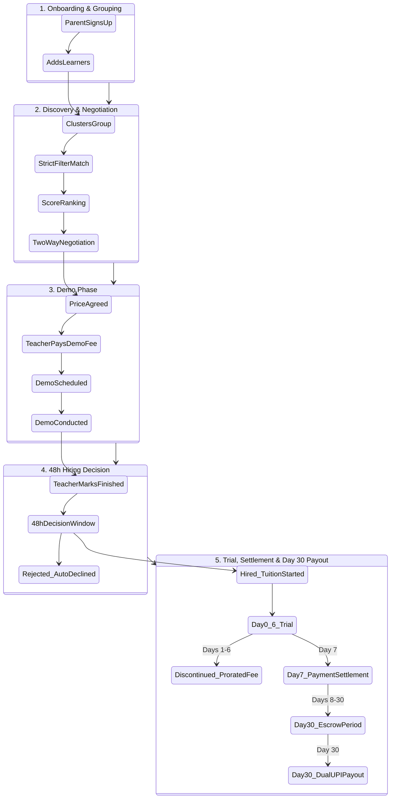
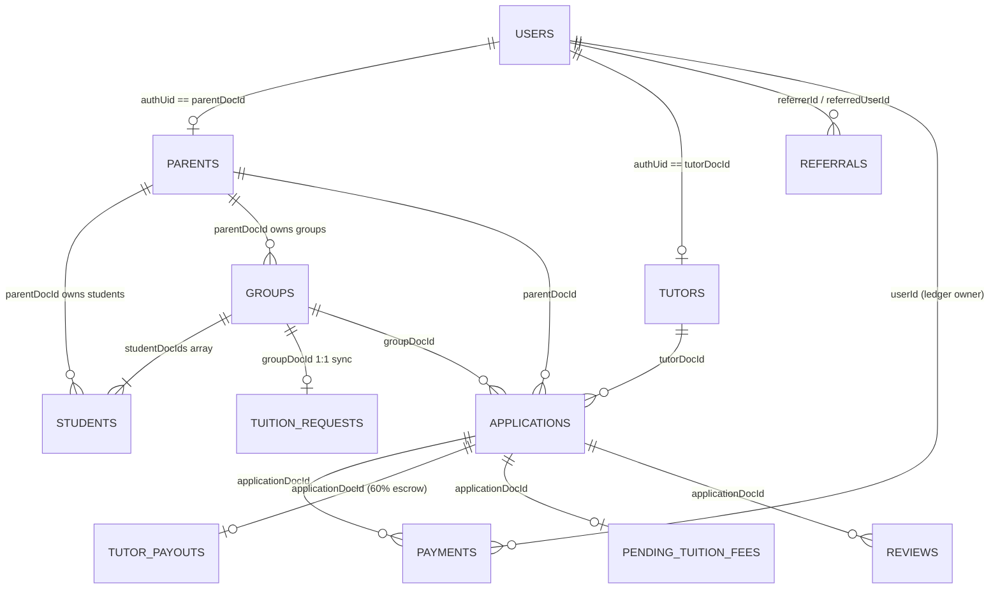

# Mi-Tutora — Platform Business & Technical Architecture

Welcome to the **Mi-Tutora** codebase. Mi-Tutora is an advanced ed-tech marketplace connecting **Students/Parents** with verified **Home & Online Tutors** across School Academics, Competitive Exams, Programming, and Spoken Languages.

This master documentation serves as the comprehensive architectural overview of the entire platform, consolidating the core principles, state machines, financial mathematics, anti-spam protections, and database models defined across the specification documents in the [`docs/`](./docs) directory.

---

## Table of Contents
1. [The Big Picture: 5-Phase Lifecycle](#1-the-big-picture-5-phase-lifecycle)
2. [Student Onboarding & 1:N Grouping Architecture](#2-student-onboarding--1n-grouping-architecture)
3. [Matchmaking & Ranking Engine](#3-matchmaking--ranking-engine)
4. [Discovery, Token Quotas & Pro Subscriptions](#4-discovery-token-quotas--pro-subscriptions)
5. [Trust & Safety: Aadhar KYC Verification](#5-trust--safety-aadhar-kyc-verification)
6. [Real-time 2-Way Negotiation](#6-real-time-2-way-negotiation)
7. [Demo Class Scheduling & 48-Hour Decision Window](#7-demo-class-scheduling--48-hour-decision-window)
8. [The 7-Day Trial & Mandatory Fee Settlement](#8-the-7-day-trial--mandatory-fee-settlement)
9. [First-Month Tuition Escrow & Automated Day 30 Payouts](#9-first-month-tuition-escrow--automated-day-30-payouts)
10. [Referral & Rewards Engine (Automated UPI Deposition)](#10-referral--rewards-engine-automated-upi-deposition)
11. [Review & Rating Engine](#11-review--rating-engine)
12. [Anti-Spam & Rate Limiting Rules](#12-anti-spam--rate-limiting-rules)
13. [Database Architecture & Entity-Relationship Model](#13-database-architecture--entity-relationship-model)
14. [Master Documentation Index](#14-master-documentation-index)

---

## 1. The Big Picture: 5-Phase Lifecycle

At its core, Mi-Tutora operates on a **First-Month Intermediation Model**. The platform guarantees quality, trial safety, and escrow protection during onboarding and the initial month of tuition. Subsequent months (Month 2+) transition directly between parents and tutors offline without platform deductions.



---

## 2. Student Onboarding & 1:N Grouping Architecture
*Full Specification: [`docs/Student_Grouping_Architecture.md`](./docs/Student_Grouping_Architecture.md)*

*   **The Group Concept:** Every student registered under a parent account belongs to a **Group** (`groups` collection).
    *   **Single Learner:** Created in an individual group (`isGroup: false`).
    *   **Multiple Learners:** A parent can cluster siblings or friends into a shared tuition group (`isGroup: true`) with unified scheduling and budget.
*   **Why Groups?** Educators do not bid on individual children; they apply to the **Group**. This allows batch-teaching and group pricing discounts while preserving individual learner performance tracking.

---

## 3. Matchmaking & Ranking Engine
*Full Specification: [`docs/Ranking_System_Architecture.md`](./docs/Ranking_System_Architecture.md)*

When a student group is posted, teachers are sorted using a rigorous two-layer matchmaking algorithm:

### Layer 1: Strict Boolean Filter (`isStrictMatch`)
A teacher is completely hidden unless **100% of strict conditions match**:
1. **Teaching Category:** Must match (`'school'`, `'competitive'`, `'programming'`, `'languages'`).
2. **Board:** Must match student board (CBSE, ICSE, State, etc.) for school categories.
3. **Class Level:** Teacher must support student's grade level.
4. **Gender Preference:** If parent specified Male/Female, teacher must match.
5. **Subject Coverage:** Teacher must offer **100%** of subjects requested by the student group.

### Layer 2: Suitability Scoring Matrix (Max 200+ Points)
Eligible teachers are ranked dynamically based on weighted parameters:
*   **+50 points per matching subject**
*   **+30 points for exact class level match**
*   **+20 points for board match**
*   **Up to +30 points for budget match:** Calculated as `30 * (1 - |TeacherFee - StudentBudget| / StudentBudget)`.
*   **+20 points Trust Boost for Verified Aadhar KYC**
*   **+20 points Visibility Boost for Active Pro Subscription**

---

## 4. Discovery, Token Quotas & Pro Subscriptions
*Full Specification: [`docs/Subscription_Architecture.md`](./docs/Subscription_Architecture.md)*

To prevent lead exhaustion and maintain high application quality, teachers operate under a weekly proposal token quota:
*   **Free Tier:** 5 tokens per week.
*   **Pro Tier (₹399 / month):** 15 tokens per week, +20 ranking algorithm boost, and a Pro badge.
*   **Weekly Rollover:** Quotas reset every **Monday at 00:00 UTC**.
*   **Anti-Clock Spoofing:** Expiry timestamps are strictly enforced server-side via Firebase Admin SDK `Timestamp.now()`, rendering client clock manipulation ineffective.

---

## 5. Trust & Safety: Aadhar KYC & Educational Document Verification
*Full Specifications: [`docs/Aadhar_Verification_Badge.md`](./docs/Aadhar_Verification_Badge.md), [`docs/Document_Verification.md`](./docs/Document_Verification.md)*

### A. Aadhar Identity KYC
*   **Live Gov API Integration:** Integrates with Sandbox.co.in OTP verification API.
*   **Secure Masking:** Only the last 4 digits (`XXXX-XXXX-1234`) are retained in Firestore for display; full Aadhar numbers are never permanently stored.
*   **Trust Badge & Algorithm Boost:** Verified educators receive the green verified shield badge and an automatic **+20 ranking boost**.

### B. Compulsory Educational Document Verification
*   **Dynamic Qualification Mapping:** The required verification documents are dynamically determined by the teacher's selected highest qualification (e.g., 10th marksheet for 10th; 10th + 12th for 12th; 10th + 12th + degree certificate for bachelor degrees; master certificates for post-graduates).
*   **Strict PDF Restrictions:** Frontend and Firebase Storage rules physically restrict uploads strictly to **PDF format** (`.pdf`) capped at **5MB** per file.
*   **Secure Firebase Storage Scheme:** Files are stored under `tutor_documents/{userId}/{docId}_{timestamp}_{fileName}` with owner-only write permissions.
*   **Proposal Sending Lockout:** Tutors cannot submit tuition proposals (`make_offer` or direct demo requests) without first submitting all required educational marksheets and degree certificates.

---

## 6. Real-time 2-Way Negotiation
*Full Specification: [`docs/Negotiation_Architecture.md`](./docs/Negotiation_Architecture.md)*

*   **Unified Counter-Offer Ledger:** Both Student and Teacher dashboards synchronize on a single `applications.currentOffer` field.
*   **2-Way Haggling:** Either party can submit counter-offers with price bounds (₹100 to ₹100,000) or propose alternate class timing slots.
*   **Instant Acceptance:** When either party clicks "Accept Offer", the agreed figure locks into `finalPrice`, moving the state immediately to the Demo Phase.

---

## 7. Demo Class Scheduling & 48-Hour Decision Window
*Full Specification: [`docs/Demo_Completion_Hiring_Architecture.md`](./docs/Demo_Completion_Hiring_Architecture.md), [`docs/Link_Validation_Demo_Architecture.md`](./docs/Link_Validation_Demo_Architecture.md)*

1. **Commitment Demo Fee:** To eliminate frivolous applications, the teacher pays a nominal demo platform fee (₹99 to ₹299 based on category) to schedule the trial class.
2. **Link Validation:** Video links (Google Meet, Zoom) are strictly sanitized and validated against official regex patterns before saving.
3. **Explicit Completion:** After the trial class occurs, the teacher explicitly clicks "Mark Demo as Finished", setting `status: 'waiting_for_parent_decision'`.
4. **The 48-Hour Decision Clock:** The parent has exactly **48 hours** to click **"Hire"** or **"Decline"**. If inactive for 48 hours, the system auto-declines to free the teacher's schedule.

---

## 8. The 7-Day Trial & Mandatory Fee Settlement
*Full Specification: [`docs/Student_Fee_Payment_Architectrue.md`](./docs/Student_Fee_Payment_Architectrue.md), [`docs/Payment_Architecture.md`](./docs/Payment_Architecture.md)*

When the parent clicks "Hire", tuition officially starts (`tuition_started`). A 7-day live trial countdown begins:
*   **Cancellation on Days 1 to 6 (Prorated Fee):** If dissatisfied before Day 7, the parent can discontinue by paying only for the exact days utilized:
    $$\text{Prorated Fee} = \left(\frac{\text{Monthly Fee}}{30}\right) \times \text{Days Elapsed}$$
*   **Mandatory Settlement on Day 7:** On Day 7, the parent pays the full 100% first-month tuition fee via Razorpay.
*   **Strict Zero-Refund Policy:** Once the Day 7 fee is paid, **no refunds are permitted**. If the parent disconnects after Day 7, the full fee is retained to protect teacher earnings.

---

## 9. First-Month Tuition Escrow & Automated Day 30 Payouts
*Full Specification: [`docs/First_Month_Tuition_Escrow_Payout_Architecture.md`](./docs/First_Month_Tuition_Escrow_Payout_Architecture.md)*

On Day 7, the full tuition payment is atomically split and placed in custody:
$$\text{Gross Tuition Fee } (G) = \text{100\% Paid on Day 7 (e.g. ₹6,000)}$$
$$\text{Platform Commission } (P) = G \times 0.40 = \text{₹2,400 (40\%)}$$
$$\text{Tutor Escrow Share } (T) = G \times 0.60 = \text{₹3,600 (60\% locked in } \texttt{tutor\_payouts}\text{)}$$
$$\text{Referral Escrow Reward } (R) = P \times 0.25 = \text{₹600 (25\% of platform cut locked in } \texttt{referrals}\text{)}$$
$$\text{Platform Net Retained Margin } = P - R = \text{₹1,800 (30\%)}$$

```
Day 7 (Payment)                Days 8–30 (Escrow)              Day 30 (Automated Payout)
┌───────────────────────┐      ┌─────────────────────────┐     ┌────────────────────────────────┐
│ Parent pays ₹6,000    │ ───► │ Platform holds ₹3,600   │ ──► │ Automated RazorpayX Transfer:  │
│ via Razorpay Checkout │      │ in tutor escrow & ₹600  │     │ • ₹3,600 to Tutor's UPI ID     │
└───────────────────────┘      │ in referral escrow      │     │ • ₹600 to Referrer's UPI ID    │
                               └─────────────────────────┘     │ • Platform keeps ₹1,800 net    │
                                                               └────────────────────────────────┘
```

*   **Automated Day 30 Dual-Payout Engine (`/api/payouts/process`):** On Day 30 (`startDate + 30 days`), a scheduled runner automatically transfers both the **60% Tutor Share** and the **25% Referral Cash** directly to their respective UPI IDs via the Razorpay Payouts API.
*   **Missing UPI Safety Fallback:** If either party has not configured their UPI ID, the system flags `action_required_missing_upi` independently without blocking the other disbursement.
*   **Admin Bulk CSV Fallback (`/api/admin/payouts/export-csv`):** Enables admins to download a banking-ready CSV listing all pending tutor and referrer payouts for manual corporate netbanking.

---

## 10. Referral & Rewards Engine (Automated UPI Deposition)
*Full Specification: [`docs/Referral_System_Architecture.md`](./docs/Referral_System_Architecture.md)*

*   **Attribution:** Every user receives an alphanumeric referral code (e.g. `KRIS-XT3GNB`).
*   **Role-Based Rewards (Based on who joins):**
    *   **When a Student Joins:** Referrer (Student or Teacher) earns **25% of company margin (₹600 on ₹6,000 tuition)**.
    *   **When a Teacher Joins:** Referrer earns **+1 Banked Token** to unlock proposals.
*   **Zero Threshold & No WhatsApp:** The legacy manual WhatsApp withdrawal and ₹1,000 threshold have been abolished. Referral cash is automatically deposited directly to the user's UPI on Day 30.

---

## 11. Review & Rating Engine
*Full Specification: [`docs/Review_Architecture.md`](./docs/Review_Architecture.md)*

*   **Eligibility:** Only parents who have an active or completed tuition agreement with a tutor can submit reviews.
*   **Weighted Historical Average:** Ratings (1 to 5 stars) are computed server-side via atomic transactions:
    $$\text{New Average} = \frac{(\text{Current Average} \times \text{Review Count}) + \text{New Rating}}{\text{Review Count} + 1}$$
*   **Trust Display:** The resulting rating and review count are publicly showcased across discovery cards and tutor profiles.

---

## 12. Anti-Spam & Rate Limiting Rules
*Full Specification: [`docs/Student_Queue_Architecture.md`](./docs/Student_Queue_Architecture.md)*

To ensure a fair marketplace and prevent spam, strict architectural limits are enforced:
1. **Concurrent Request Limit:** A student group can have a maximum of **5 concurrent pending requests/offers** at any one time.
2. **2-Demo Anti-Spam Limit:** A student group can have at most **2 active demos** within any 7-day sliding window.
3. **7-Day Post-Decline Lockout:** If a parent declines a tutor's offer, that tutor is locked from submitting another offer to that same student group for **7 days**.
4. **Auto-Declining Competing Leads:** The instant a student hires a tutor, all competing applications for that group are automatically declined with `reason: 'student_hired_another_tutor'`.

---

## 13. Database Architecture & Entity-Relationship Model
*Full Specification: [`docs/Database_Architecture.md`](./docs/Database_Architecture.md)*

The platform is backed by **Google Cloud Firestore**. The high-level entity relationships connecting users, learners, applications, payments, and payouts are modeled below:



### Active Firestore Collections Summary

| # | Collection Name | Purpose & Security Scope | Primary Key (`doc.id`) | Full Documentation Link |
| :-: | :--- | :--- | :--- | :--- |
| 1 | `users` | Auth accounts, RBAC roles, `upiId`, and referral codes. | Auth UID | [`docs/Database_Architecture.md#21-collection-users`](./docs/Database_Architecture.md) |
| 2 | `parents` | Parent profiles, phone/WhatsApp contacts. | Auth UID | [`docs/Database_Architecture.md#22-collection-parents`](./docs/Database_Architecture.md) |
| 3 | `tutors` | Teacher profiles, categories, fees, `upiId`, tokens, KYC, `verificationDocs`, `verificationStatus`. | Auth UID | [`docs/Database_Architecture.md#23-collection-tutors`](./docs/Database_Architecture.md) |
| 4 | `students` | Individual learners, grade levels, boards, subjects. | Auto ID | [`docs/Database_Architecture.md#24-collection-students`](./docs/Database_Architecture.md) |
| 5 | `groups` | Multi-student learning clusters and joint budgets. | Auto ID | [`docs/Database_Architecture.md#25-collection-groups`](./docs/Database_Architecture.md) |
| 6 | `tuition_requests` | Real-time marketplace listings created from groups. | Auto ID | [`docs/Database_Architecture.md#26-collection-tuition_requests`](./docs/Database_Architecture.md) |
| 7 | `applications` | 2-way negotiations, demo scheduling, tuition states. | Auto ID | [`docs/Database_Architecture.md#27-collection-applications`](./docs/Database_Architecture.md) |
| 8 | `payments` | Incoming payment records (demo fees, tuition, pro plans). | Auto ID | [`docs/Database_Architecture.md#28-collection-payments`](./docs/Database_Architecture.md) |
| 9 | `pending_tuition_fees` | Fallback ledger for pending Day 7 trial completions. | Auto ID | [`docs/Database_Architecture.md#29-collection-pending_tuition_fees`](./docs/Database_Architecture.md) |
| 10 | `referrals` | Referral tracking, Day 30 cash escrow, banked tokens. | Auto ID | [`docs/Database_Architecture.md#210-collection-referrals`](./docs/Database_Architecture.md) |
| 11 | `reviews` | Star ratings and student feedback on completed tuitions. | Auto ID | [`docs/Database_Architecture.md#211-collection-reviews`](./docs/Database_Architecture.md) |
| 12 | `marketplace_pricing` | Dynamic demo fee pricing rules by category. | Auto ID | [`docs/Database_Architecture.md#212-collection-marketplace_pricing`](./docs/Database_Architecture.md) |
| 13 | `global_config` | Platform maintenance flags and global settings. | Fixed Doc | [`docs/Database_Architecture.md#213-collection-global_config`](./docs/Database_Architecture.md) |
| 14 | `tutor_payouts` | Month 1 60% tuition escrow holding & Day 30 disbursements. | Auto ID | [`docs/Database_Architecture.md#216-collection-tutor_payouts`](./docs/Database_Architecture.md) |

---

## 14. Master Documentation Index

For detailed deep-dives into specific platform subsystems, refer to the corresponding documents in the [`docs/`](./docs) folder:

| Subsystem / Feature Area | Detailed Architecture Specification |
| :--- | :--- |
| **Complete Database Schema & ER Model** | 👉 [`docs/Database_Architecture.md`](./docs/Database_Architecture.md) |
| **Educational Document Verification Architecture** | 👉 [`docs/Document_Verification.md`](./docs/Document_Verification.md) |
| **Escrow & Day 30 Automated Razorpay Payouts** | 👉 [`docs/First_Month_Tuition_Escrow_Payout_Architecture.md`](./docs/First_Month_Tuition_Escrow_Payout_Architecture.md) |
| **Referrals, Banked Tokens & Automated UPI Rewards** | 👉 [`docs/Referral_System_Architecture.md`](./docs/Referral_System_Architecture.md) |
| **Student Tuition Payment & Zero-Refund Policy** | 👉 [`docs/Student_Fee_Payment_Architectrue.md`](./docs/Student_Fee_Payment_Architectrue.md) |
| **Payment Gateway & Webhook Verification** | 👉 [`docs/Payment_Architecture.md`](./docs/Payment_Architecture.md) |
| **Matchmaking & Ranking Algorithm** | 👉 [`docs/Ranking_System_Architecture.md`](./docs/Ranking_System_Architecture.md) |
| **Subscriptions, Pro Plan & Weekly Quota Rollover** | 👉 [`docs/Subscription_Architecture.md`](./docs/Subscription_Architecture.md) |
| **Anti-Spam Limits & Student Queue Management** | 👉 [`docs/Student_Queue_Architecture.md`](./docs/Student_Queue_Architecture.md) |
| **Demo Class Completion & 48-Hour Decision Window** | 👉 [`docs/Demo_Completion_Hiring_Architecture.md`](./docs/Demo_Completion_Hiring_Architecture.md) |
| **Two-Way Price & Time Negotiation** | 👉 [`docs/Negotiation_Architecture.md`](./docs/Negotiation_Architecture.md) |
| **Student Grouping & Batch Clustering** | 👉 [`docs/Student_Grouping_Architecture.md`](./docs/Student_Grouping_Architecture.md) |
| **Aadhar KYC OTP Verification & Masking** | 👉 [`docs/Aadhar_Verification_Badge.md`](./docs/Aadhar_Verification_Badge.md) |
| **Tutor Ratings & Reviews Calculation** | 👉 [`docs/Review_Architecture.md`](./docs/Review_Architecture.md) |
| **Video Meeting Link Validation** | 👉 [`docs/Link_Validation_Demo_Architecture.md`](./docs/Link_Validation_Demo_Architecture.md) |
| **Authentication & RBAC Routing** | 👉 [`docs/Authentication.md`](./docs/Authentication.md) |
| **Custom ID Generation (`MTT`, `MTP`, `MTS`, `MTG`)** | 👉 [`docs/Document_ID.md`](./docs/Document_ID.md) |

---

## Test Suite & Verification

The architecture and business rules are protected by an automated end-to-end test suite in [`web/tests/`](./web/tests):

```bash
# Run all 14 test suites (123 unit & integration tests)
cd web
npx playwright test

# Check TypeScript type safety
npx tsc --noEmit
```

*All 123 automated tests pass with 0 errors, validating the mathematical split, escrow lifecycle, matching logic, and anti-fraud protections.*
