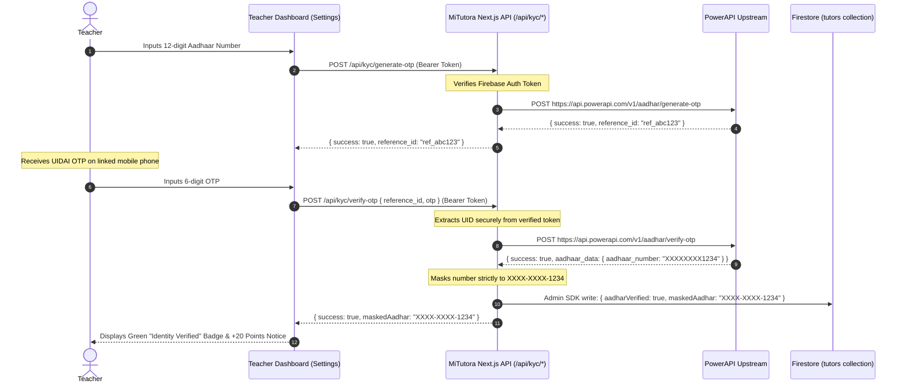

# Aadhar Verification Badge Architecture (PowerAPI)

This document outlines the technical architecture, database fields, upstream API integration, and UI lifecycle for the Aadhaar Verification feature built into the MiTutora platform. This system allows teachers to verify their government identity, earning an "Identity Verified" trust badge and an algorithmic matchmaking boost.

---

## 1. Current Status & Company License Dependency

> [!NOTE]
> **Operational Status: Temporarily Deactivated in Teacher Settings**
> * **Reason**: The official **PowerAPI** integration requires an approved company business license, which is currently undergoing regulatory processing.
> * **Mock Code Removal**: All legacy simulation code, mock OTP bypasses (`123456`), and synthetic reference IDs have been **completely removed** from the codebase to ensure zero vulnerability or accidental bypass.
> * **Teacher Profile Settings**: The verification UI card in `web/src/app/dashboard/teacher/page.tsx` is temporarily commented out so new teachers cannot attempt unconfigured verifications.
> * **API Safeguard**: The backend endpoints (`/api/kyc/generate-otp` and `/api/kyc/verify-otp`) strictly check for `process.env.POWERAPI_KEY`. If the key is not set, they return `503 Service Unavailable` with a descriptive message.
> * **Existing / Legacy Users**: Legacy teachers who already have `aadharVerified: true` in Firestore continue to display their badges across headers, profile cards, and student search results with full matchmaking ranking boosts preserved.

### How to Re-Activate Once Company License is Acquired:
1. **Configure Environment Variable**:
   In your production `.env` (or Vercel / Cloud Run environment variables), set:
   ```env
   POWERAPI_KEY=your_live_powerapi_production_key_here
   ```
2. **Uncomment Teacher Profile Settings UI**:
   In [`web/src/app/dashboard/teacher/page.tsx`](file:///c:/Users/Dell/Desktop/mushi/web/src/app/dashboard/teacher/page.tsx), locate the comment block:
   ```tsx
   {/* ========================================================================= */}
   {/* TRUST & SAFETY VERIFICATION (AADHAAR KYC)                                */}
   {/* ========================================================================= */}
   ```
   Remove the wrapping `{/*` and `*/}` around the `hasProfile && (...)` block. The handlers (`handleGenerateOTP` and `handleVerifyOTP`) and state variables are already fully wired to the production API contracts.
3. **Verify Deployment**:
   Run `cd web && npx playwright test tests/kyc.spec.ts` to validate payload contracts and masking.

---

## 2. The Big Picture: User Flow



1. **Input Phase:** A teacher opens Profile Settings and enters their 12-digit Aadhaar number.
2. **OTP Generation:** The frontend calls `/api/kyc/generate-otp`, which proxies securely to the upstream PowerAPI server.
3. **OTP Verification:** The teacher receives a 6-digit OTP on their UIDAI-registered mobile number and submits it to `/api/kyc/verify-otp`.
4. **Database Lock-in:** The backend validates the OTP with PowerAPI. Upon confirmation, it securely extracts or masks the Aadhaar (e.g., `XXXX-XXXX-1234`), saves it to the `tutors` collection in Firestore via the Firebase Admin SDK, and sets `aadharVerified: true`.
5. **Platform-Wide Reward:** The teacher instantly receives a green "Identity Verified" badge across the platform (header dropdown, profile cards, preview modals) and an organic `+20 points` boost in the matchmaking algorithm.

---

## 3. Database Schema (Firestore)

To keep database reads fast (\(O(1)\) complexity) and avoid expensive sub-collection queries, the verification status is saved directly on the root document of the `tutors` collection.

**Collection:** `tutors`  
**Document ID:** Teacher Firebase Auth UID (`decodedToken.uid`)

| Field | Type | Description | Legal & Privacy Strategy |
| :--- | :--- | :--- | :--- |
| `aadharVerified` | Boolean | `true` if the Aadhaar OTP was verified successfully via PowerAPI. | Used for UI badge rendering and matchmaking ranking. |
| `maskedAadhar` | String | Formatted as `"XXXX-XXXX-1234"`. | We **never** store raw 12-digit Aadhaar numbers. Storing only the masked version satisfies UIDAI compliance and eliminates the need for an Aadhaar Data Vault license. |
| `kycUpdatedAt` | Timestamp | Server timestamp of successful verification. | Audit trail tracking. |

---

## 4. Backend API Routes (Next.js Edge / Node Runtime)

The backend exposes two specialized routes for KYC verification under `web/src/app/api/kyc/`. Both routes authenticate the caller via Firebase Admin SDK ID token verification.

### A. `POST /api/kyc/generate-otp`
- **Path:** [`web/src/app/api/kyc/generate-otp/route.ts`](file:///c:/Users/Dell/Desktop/mushi/web/src/app/api/kyc/generate-otp/route.ts)
- **Headers:** `Authorization: Bearer <Firebase_ID_Token>`
- **Request Body:**
  ```json
  {
    "aadharNumber": "123456789012"
  }
  ```
- **Validation:**
  - Enforces valid Bearer token via `adminAuth.verifyIdToken(token)`.
  - Cleans whitespace and strictly checks `/^\d{12}$/`.
  - Verifies presence of `process.env.POWERAPI_KEY`. If missing:
    - Returns `503 Service Unavailable`:
      ```json
      { "error": "Aadhaar KYC service is temporarily unavailable pending company license activation." }
      ```
- **Upstream Call:**
  - `POST https://api.powerapi.com/v1/aadhar/generate-otp`
  - Headers: `Authorization: Bearer ${POWERAPI_KEY}`
  - Body: `{ "aadhar_number": "123456789012" }`
- **Response:**
  ```json
  {
    "success": true,
    "reference_id": "ref_powerapi_987654321",
    "message": "OTP sent successfully."
  }
  ```

---

### B. `POST /api/kyc/verify-otp`
- **Path:** [`web/src/app/api/kyc/verify-otp/route.ts`](file:///c:/Users/Dell/Desktop/mushi/web/src/app/api/kyc/verify-otp/route.ts)
- **Headers:** `Authorization: Bearer <Firebase_ID_Token>`
- **Request Body:**
  ```json
  {
    "reference_id": "ref_powerapi_987654321",
    "otp": "654321"
  }
  ```
- **Security & Authorization:**
  - Token is decoded to obtain `decodedToken.uid`. This UID is used to target the Firestore tutor document, preventing cross-user impersonation.
- **Validation:**
  - Requires `reference_id` and `otp`.
  - Checks for `process.env.POWERAPI_KEY` (returns `503` if unconfigured).
- **Upstream Call:**
  - `POST https://api.powerapi.com/v1/aadhar/verify-otp`
  - Headers: `Authorization: Bearer ${POWERAPI_KEY}`
  - Body: `{ "reference_id": "ref_powerapi_987654321", "otp": "654321" }`
- **Database Persistence:**
  - Extracts the verified Aadhaar from `data.aadhaar_data?.aadhaar_number` or `data.masked_aadhaar`.
  - Formats mask as `XXXX-XXXX-${last4}`.
  - Updates Firestore `tutors/${tutorDocId}`:
    ```typescript
    await tutorRef.set({
      aadharVerified: true,
      maskedAadhar: maskedAadhar,
      kycUpdatedAt: new Date()
    }, { merge: true });
    ```
- **Response:**
  ```json
  {
    "success": true,
    "message": "Aadhar Verified successfully",
    "maskedAadhar": "XXXX-XXXX-1234"
  }
  ```

---

## 5. Frontend UI Integration

The verification badge and process are integrated across multiple portals:

### A. Teacher Portal
- **Profile Settings (`web/src/app/dashboard/teacher/page.tsx`):**
  - Section is commented out pending company license.
  - When re-enabled, provides a 2-step interactive form (Aadhaar Input -> OTP submission) transforming into a permanent green "Identity Verified" badge card displaying `XXXX-XXXX-1234` and "+20 Match Points".
- **Top Navigation (`DashboardHeader.tsx`):**
  - A green `ShieldCheck` icon (from Lucide React) dynamically renders over their circular avatar and directly next to their name in the profile dropdown menu whenever `aadharVerified === true`.

### B. Student Portal (Visibility)
- **Teacher Cards (`web/src/app/dashboard/student/page.tsx`):**
  - When students browse tutors in "All" or "Recommended" tabs, an emerald `ShieldCheck` icon appears alongside the tutor's name for verified teachers.
- **Expanded Profile (`TutorViewModal.tsx`):**
  - Displays an "Identity Verified" badge with experience and qualifications, boosting parent trust.

---

## 6. Matchmaking Algorithm Impact

Verified teachers receive an algorithmic advantage in student matchmaking:

- **Implementation:**
  - Frontend: [`web/src/utils/matching.ts`](file:///c:/Users/Dell/Desktop/mushi/web/src/utils/matching.ts)
  - Cloud Functions: [`functions/src/utils/matchingEngine.ts`](file:///c:/Users/Dell/Desktop/mushi/functions/src/utils/matchingEngine.ts)
- **Scoring Logic:**
  ```typescript
  if (teacher.aadharVerified === true) {
    score += 20;
  }
  ```
- **Philosophy:**
  Provides an organic nudge. Academic subject matching, class grade compatibility, and locality remain foundational; however, when two teachers are academically comparable, the verified teacher wins the tie-breaker and ranks higher on the student's dashboard.

---

## 7. Relation to Educational Document Verification

While Aadhaar verification guarantees government identity validation and grants a matchmaking algorithm boost (+20 pts) along with a green badge, **Educational Document Verification** is a separate, compulsory trust layer required for sending tuition proposals.

- See the complete specification in [Document_Verification.md](file:///c:/Users/Dell/Desktop/mushi/docs/Document_Verification.md).
- **Identity verification (`aadharVerified`)**: Optional, rewards verified tutors with trust badges and a +20 ranking boost.
- **Educational document verification (`verificationDocs`, `verificationStatus`)**: Mandatory during onboarding; blocks teachers from proposing demo sessions until degree certificates or student IDs are submitted.

