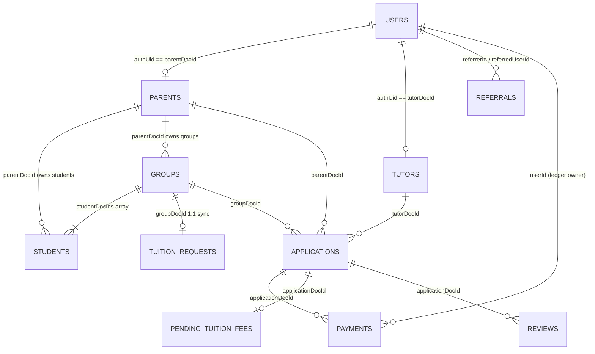

# Database Architecture & Firestore Schema Specification

This document provides a comprehensive reference for the Cloud Firestore database architecture supporting the Mi-Tutora platform. It details all 14 active collections, primary key strategies, data types, field constraints, expected values, business logic dependencies, and cross-references with the application codebase.

---

## 1. High-Level Entity-Relationship Model

---

## 2. Collections & Schema Specifications

### 2.1 Collection: `users`
- **Purpose**: System-wide authentication and identity registry mapping Firebase Auth users to platform roles and referral relationships.
- **Document ID (`doc.id`)**: Firebase Authentication UID (`auth.currentUser.uid`).
- **Security Rule**: Read/write restricted to authenticated owner (`request.auth.uid == userId`).

| Field Name | Type | Expected Values / Format | Description & Business Rules | Codebase Reference |
| :--- | :--- | :--- | :--- | :--- |
| `id` | `string` | Firebase Auth UID | Redundant internal copy of document ID. | `web/src/context/AuthContext.tsx` |
| `email` | `string` | Valid email string | User email retrieved from Firebase Auth provider. | `web/src/context/AuthContext.tsx` |
| `name` | `string` | Full name string | Display name of user. | `web/src/context/AuthContext.tsx` |
| `roles` | `string[]` | `['student']`, `['teacher']`, or `['admin']` | RBAC authorization array governing route access. | `web/src/context/AuthContext.tsx`, `web/src/app/dashboard/*` |
| `hasProfile` | `boolean` | `true` \| `false` | Tracks onboarding completion. If `false`, redirects to profile setup wizard. | `web/src/context/AuthContext.tsx` |
| `referralCode` | `string` | Regex: `^[A-Z]{4}-[A-Z0-9]{6}$` | User's unique personal referral code generated via `generateReferralCode()`. | `web/src/utils/referral.ts`, `web/src/context/AuthContext.tsx` |
| `referredBy` | `string` | Referral code or empty string `""` | Referral code entered during registration. Used to link referrals. | `web/src/context/AuthContext.tsx` |
| `referrerName` | `string` | Referrer's name or empty string `""` | Denormalized display name of user who referred this account. | `web/src/context/AuthContext.tsx` |

---

### 2.2 Collection: `parents`
- **Purpose**: Parent/guardian profiles who manage student enrollments, create tuition groups, and hire tutors.
- **Document ID (`doc.id`)**: Firebase Auth UID of the parent.
- **Security Rule**: Read/write restricted to authenticated users.

| Field Name | Type | Expected Values / Format | Description & Business Rules | Codebase Reference |
| :--- | :--- | :--- | :--- | :--- |
| `parentDocId` | `string` | Firebase Auth UID | Primary key matching Firestore document ID. | `web/src/app/dashboard/student/page.tsx` |
| `authUid` | `string` | Firebase Auth UID | Redundant link to user authentication record. | `web/src/app/dashboard/student/page.tsx` |
| `parentId` | `string` | `MTP` + 6 uppercase alphanumeric (`MTPXXXXXX`) | Human-readable public support identifier. | `web/src/utils/idGenerator.ts` |
| `name` | `string` | Parent's full legal name | Display name across student dashboard and applications. | `web/src/app/dashboard/student/page.tsx` |
| `email` | `string` | Valid email address | Communication and Razorpay receipt email. | `web/src/app/api/create-order/route.ts` |
| `phone` | `string` | 10-digit mobile string | Primary contact telephone number. | `web/src/app/dashboard/student/page.tsx` |
| `whatsapp` | `string` | 10-digit mobile string | WhatsApp contact number for scheduling notifications. | `web/src/app/dashboard/student/page.tsx` |

---

### 2.3 Collection: `tutors`
- **Purpose**: Verified teacher/tutor profiles storing academic credentials, matchmaking preferences, weekly tokens, subscription tier, and KYC badges.
- **Document ID (`doc.id`)**: Firebase Auth UID of the tutor.
- **Security Rule**: Public read for active discovery; write restricted to authenticated profile owner.

| Field Name | Type | Expected Values / Format | Description & Business Rules | Codebase Reference |
| :--- | :--- | :--- | :--- | :--- |
| `authUid` | `string` | Firebase Auth UID | Matching Firestore document ID. | `web/src/app/dashboard/teacher/page.tsx` |
| `tutorId` | `string` | `MTT` + 6 uppercase alphanumeric (`MTTXXXXXX`) | Human-readable public teacher identifier. | `web/src/utils/idGenerator.ts` |
| `name` | `string` | Teacher's full name | Display name across listings, proposals, and chats. | `web/src/app/dashboard/teacher/page.tsx` |
| `email` | `string` | Valid email address | Teacher's contact and billing email. | `web/src/app/dashboard/teacher/page.tsx` |
| `phone` / `whatsapp` | `string` | 10-digit phone strings | Direct and WhatsApp contact numbers. | `web/src/app/dashboard/teacher/page.tsx` |
| `gender` | `string` | `'Male'` \| `'Female'` \| `'Other'` | Checked against parent `teacherGenderPreference` during strict matchmaking. | `web/src/utils/matching.ts:L133` |
| `category` | `string` | `'school'`, `'competitive'`, `'programming'`, `'languages'` | Primary teaching domain. Strict match criteria in ranking engine. | `web/src/utils/matching.ts:L114` |
| `qualification` | `string` | Educational degree (e.g. `'B.E / B.Tech'`, `'M.Sc'`) | Displayed on profile card. | `web/src/app/dashboard/teacher/page.tsx` |
| `experience` | `string` | Experience string (e.g. `'Fresher'`, `'3-5 Years'`) | Teacher experience tier. | `web/src/app/dashboard/teacher/page.tsx` |
| `subjects` | `string[]` | Array of subjects (e.g. `['Mathematics', 'Science']`) | Subjects taught. Scored at +50 pts per subject in ranking. | `web/src/utils/matching.ts:L36` |
| `classes` | `string[]` | Array of class levels (e.g. `['6th - 8th', '9th - 10th']`) | Target student grades. Scored at +30 pts in ranking. | `web/src/utils/matching.ts:L49` |
| `boards` | `string[]` | Array of education boards (e.g. `['CBSE', 'ICSE']`) | Educational boards. Scored at +20 pts in ranking. | `web/src/utils/matching.ts:L66` |
| `technologies` | `string[]` | Programming languages/frameworks | Used when category is `programming`. +50 pts per match. | `web/src/utils/matching.ts:L78` |
| `languagesTaught` | `string[]` | Spoken/written languages taught | Used when category is `languages`. +50 pts per match. | `web/src/utils/matching.ts:L85` |
| `feeRange` | `string` \| `number` | Monthly tuition rate in INR (e.g. `"8000"`, `8000`) | Proximity to student budget scores up to +30 pts in ranking. | `web/src/utils/matching.ts:L89` |
| `mode` | `string` | `'Online'` \| `'Offline'` \| `'Both'` | Tuition delivery preference. | `web/src/app/dashboard/teacher/page.tsx` |
| `weeklyQuota` | `map` | `{ weekStartDate: string, tokensUsed: number, lastUpdated: Timestamp }` | Quota engine: 5 tokens/week (Free) or 15 tokens/week (Pro). Resets on Monday. | `web/src/app/api/transactions/request/route.ts` |
| `isSubscribed` | `boolean` | `true` \| `false` | Legacy boolean for Pro membership. | `web/src/utils/matching.ts:L101` |
| `subscriptionPlan` | `string` | `'free'` \| `'pro'` | Active subscription tier. Pro awards +20 ranking boost. | `web/src/utils/matching.ts:L101` |
| `subscriptionExpiry` | `number` | Epoch timestamp in milliseconds | Timestamp when Pro plan expires. Verified before awarding Pro boosts. | `web/src/utils/matching.ts:L102` |
| `aadharVerified` | `boolean` | `true` \| `false` | Trust & Safety badge. Awards +20 ranking boost. | `web/src/utils/matching.ts:L96` |
| `maskedAadhar` | `string` | `XXXX-XXXX-` + 4 digits (`XXXX-XXXX-5661`) | Safe display format of verified Aadhar ID. | `web/src/app/api/kyc/verify-otp/route.ts` |
| `rating` | `number` | Float (1.0 to 5.0) | Weighted average star rating computed from `reviews`. | `web/src/app/api/submit-review/route.ts` |
| `reviewCount` | `number` | Non-negative integer | Total count of submitted reviews. | `web/src/app/api/submit-review/route.ts` |

---

### 2.4 Collection: `students`
- **Purpose**: Individual learners registered under a parent account.
- **Document ID (`doc.id`)**: Auto-generated Firestore ID (`MTS...` stored in `studentId`).
- **Security Rule**: Read/write restricted to authenticated owner parent.

| Field Name | Type | Expected Values / Format | Description & Business Rules | Codebase Reference |
| :--- | :--- | :--- | :--- | :--- |
| `id` | `string` | Auto-generated Firestore ID | Primary document key. | `web/src/app/dashboard/student/page.tsx` |
| `studentId` | `string` | `MTS` + 6 alphanumeric (`MTSXXXXXX`) | Public student registration ID. | `web/src/utils/idGenerator.ts` |
| `parentDocId` | `string` | Parent's Auth UID | Foreign key pointing to `parents` collection. | `web/src/utils/groupUtils.ts` |
| `groupDocId` | `string` | Group Firestore ID or empty `""` | Foreign key linking student to an active learning group. | `web/src/utils/groupUtils.ts:L24` |
| `name` | `string` | Student's full name | Learner display name. | `web/src/utils/groupUtils.ts:L32` |
| `gender` | `string` | `'Male'` \| `'Female'` \| `'Other'` | Student's gender. | `web/src/app/dashboard/student/page.tsx` |
| `category` | `string` | `'school'`, `'competitive'`, `'programming'`, `'languages'` | Domain of study. | `web/src/utils/pricing.ts:L5` |
| `studentType` | `string` | `'School Student'`, `'College Student'`, etc. | Descriptive academic type. | `web/src/app/dashboard/student/page.tsx` |
| `classLevel` | `string` | e.g. `'6th Standard'`, `'8th Standard'`, `'Class 10'` | Academic grade. Used in matchmaking and demo fee pricing. | `web/src/utils/pricing.ts:L8` |
| `board` | `string` | e.g. `'CBSE'`, `'ICSE'`, `'State Board'` | Educational syllabus board. | `web/src/utils/matching.ts:L119` |
| `subjects` | `string[]` | Array of requested subjects | Academic subjects needed by this student. | `web/src/utils/groupUtils.ts:L35` |
| `technologies` | `string[]` | Array of coding languages | Required when category is `programming`. | `web/src/utils/groupUtils.ts:L36` |
| `languages` | `string[]` | Array of spoken languages | Required when category is `languages`. | `web/src/utils/groupUtils.ts:L37` |
| `budget` | `number` | Monthly allocation in INR | Individual contribution towards total tuition budget. | `web/src/utils/groupUtils.ts:L38` |
| `isAvailable` | `boolean` | `true` \| `false` | Concurrency lock. Flipped to `false` when active in an ongoing tuition/demo. | `web/src/utils/studentAvailability.ts:L26` |
| `pendingRequests`| `string[]` | Array of application IDs | Active application references for queue enforcement. | `web/src/app/dashboard/student/page.tsx` |

---

### 2.5 Collection: `groups`
- **Purpose**: Represents learning clusters created by parents (supports single-child or multi-sibling groups).
- **Document ID (`doc.id`)**: Auto-generated Firestore ID (`MTG...` stored in `groupId`).
- **Security Rule**: Read/write restricted to authenticated owner parent.

| Field Name | Type | Expected Values / Format | Description & Business Rules | Codebase Reference |
| :--- | :--- | :--- | :--- | :--- |
| `groupDocId` | `string` | Auto-generated Firestore ID | Matches document ID. | `web/src/utils/groupUtils.ts:L5` |
| `groupId` | `string` | `MTG` + 6 alphanumeric (`MTGXXXXXX`) | Public group identifier. | `web/src/utils/idGenerator.ts` |
| `parentDocId` | `string` | Parent's Auth UID | Foreign key identifying group creator. | `web/src/utils/groupUtils.ts:L60` |
| `studentDocIds` | `string[]` | Array of `students.id` | List of student foreign keys belonging to this group. | `web/src/utils/groupUtils.ts:L13` |
| `mode` | `string` | `'Online'` \| `'Offline'` \| `'Both'` | Delivery mode requested for group. | `web/src/utils/groupUtils.ts:L62` |
| `daysPerWeek` | `string` | e.g. `'5 Days/Week'`, `'3 Days/Week'` | Frequency of tuition classes. | `web/src/utils/groupUtils.ts:L69` |
| `specificDays` | `string[]` | e.g. `['Monday', 'Tuesday', ...]` | Specified schedule days. | `web/src/utils/groupUtils.ts:L70` |
| `preferredTimeRange`| `string` | e.g. `'Evening (4 PM - 8 PM)'` | Preferred time window for sessions. | `web/src/utils/groupUtils.ts:L68` |
| `teacherGenderPreference`| `string`| `'No Preference'`, `'Male'`, `'Female'` | Filter applied during teacher recommendation. | `web/src/utils/groupUtils.ts:L67` |
| `status` | `string` | `'active'` \| `'closed'` | Lifecycle of the group. | `web/src/utils/groupUtils.ts` |

---

### 2.6 Collection: `tuition_requests`
- **Purpose**: Public marketplace broadcast document automatically synthesized from a `group` via `syncTuitionRequestForGroup()`.
- **Document ID (`doc.id`)**: Auto-generated Firestore ID (`REQ...` stored in `requestId`).
- **Security Rule**: Authenticated tutors can query open requests.

| Field Name | Type | Expected Values / Format | Description & Business Rules | Codebase Reference |
| :--- | :--- | :--- | :--- | :--- |
| `groupDocId` | `string` | Foreign key to `groups.groupDocId` | 1:1 relationship with parent group. | `web/src/utils/groupUtils.ts:L59` |
| `parentId` | `string` | Parent's Auth UID | Creator of the request. | `web/src/utils/groupUtils.ts:L60` |
| `category` | `string` | `'school'`, `'competitive'`, etc. | Aggregated category from member students. | `web/src/utils/groupUtils.ts:L61` |
| `combinedSubjects` | `string[]` | Deduplicated subject set | Union of all subjects across group members. | `web/src/utils/groupUtils.ts:L72` |
| `combinedTechnologies` | `string[]` | Deduplicated technology set | Union of all technologies across group members. | `web/src/utils/groupUtils.ts:L73` |
| `combinedLanguages` | `string[]` | Deduplicated language set | Union of all languages across group members. | `web/src/utils/groupUtils.ts:L74` |
| `combinedBudget` | `number` | Numeric sum in INR | Total aggregated monthly budget for tutor. | `web/src/utils/groupUtils.ts:L75` |
| `studentsDetails` | `object[]` | Array of student snapshot summaries | Cached snapshot of student details for fast tutor browsing. | `web/src/utils/groupUtils.ts:L71` |
| `status` | `string` | `'open'` \| `'accepted'` \| `'closed'` | Open for tutor applications or filled. | `web/src/utils/groupUtils.ts:L76` |
| `acceptedTutorId`| `string` | Tutor Auth UID or empty `""` | Assigned tutor once request is closed. | `web/src/utils/groupUtils.ts:L77` |
| `createdAt` | `number` | Epoch millisecond timestamp | Creation date of request. | `web/src/utils/groupUtils.ts:L84` |

---

### 2.7 Collection: `applications`
- **Purpose**: Core platform state machine tracking proposal negotiations, demo scheduling, trial status, and tuition hire.
- **Document ID (`doc.id`)**: Auto-generated Firestore ID (`MTA...` stored in `applicationId`).
- **Security Rule**: Read/write restricted to participant tutor (`tutorDocId`) or parent (`parentDocId`).

| Field Name | Type | Expected Values / Format | Description & Business Rules | Codebase Reference |
| :--- | :--- | :--- | :--- | :--- |
| `applicationDocId` | `string` | Matches Firestore document ID | Primary transaction key. | `web/src/app/api/transactions/*` |
| `applicationId` | `string` | `MTA` + 6 alphanumeric (`MTAXXXXXX`) | Customer-facing transaction tracking ID. | `web/src/utils/idGenerator.ts` |
| `tutorDocId` | `string` | Tutor's Auth UID | Foreign key to `tutors` collection. | `web/src/app/api/transactions/*` |
| `tutorName` | `string` | Tutor's full name | Denormalized display name. | `web/src/app/dashboard/student/page.tsx` |
| `parentDocId` | `string` | Parent's Auth UID | Foreign key to `parents` collection. | `web/src/app/api/transactions/*` |
| `groupDocId` | `string` | Group Firestore ID | Foreign key to `groups` collection. | `web/src/utils/constants.ts` |
| `studentDocId` | `string` | Primary Student ID | Target student (or primary group student). | `web/src/utils/studentAvailability.ts` |
| `studentDocIds` | `string[]` | Array of student IDs | All enrolled students in this tuition. | `web/src/utils/studentAvailability.ts` |
| `studentName` | `string` | Student or group summary label | e.g. `'Group: Alice, Bob'`. | `web/src/app/dashboard/teacher/page.tsx` |
| `initialBudget` | `number` | Numeric amount in INR | Baseline price negotiated from. | `web/src/tests/negotiation.spec.ts` |
| `currentOffer` | `number` | Numeric amount in INR | Most recent counter-offer proposed. | `web/src/tests/negotiation.spec.ts` |
| `finalPrice` | `number` | Numeric amount in INR | Agreed monthly tuition fee upon deal closing. | `web/src/app/api/transactions/hire/route.ts` |
| `absoluteMin` | `number` | 60% of initial budget | Hard negotiation floor for student. | `web/src/tests/negotiation.spec.ts` |
| `absoluteMax` | `number` | 140% of initial budget | Hard negotiation ceiling for teacher. | `web/src/tests/negotiation.spec.ts` |
| `initiator` | `string` | `'student'` \| `'teacher'` | Entity that made the initial proposal. | `web/src/app/api/transactions/request/route.ts` |
| `lastUpdatedBy` | `string` | `'student'` \| `'teacher'` | Entity that took the latest action. | `web/src/app/api/transactions/request/route.ts` |
| `status` | `string` | Enums defined in `constants.ts`: `APP_STATUS_PENDING`, `APP_STATUS_ACTIVE` | Current state of negotiation / demo / tuition. | `web/src/utils/constants.ts` |
| `demoPaymentPaid` | `boolean` | `true` \| `false` | True when platform demo fee has been paid via Razorpay. | `web/src/app/api/verify-payment/route.ts` |
| `demoDate` / `demoTime` | `string` | Format: `YYYY-MM-DD` / `HH:mm` | Scheduled date and start time for demo session. | `web/src/app/api/save-demo-link/route.ts` |
| `gmeetLink` | `string` | Valid Google Meet, Zoom, or Teams URL | Meeting link submitted by tutor. Locked until 5 min before demo. | `web/src/app/api/save-demo-link/route.ts` |
| `feePaid` | `boolean` | `true` \| `false` | Indicates whether first month tuition fee is settled. | `web/src/app/api/transactions/hire/route.ts` |
| `startDate` | `Timestamp` | Firestore Timestamp | Hire date when 7-day post-trial tuition starts. | `web/src/app/api/transactions/hire/route.ts` |

---

### 2.8 Collection: `payments`
- **Purpose**: Authoritative, tamper-proof financial transaction ledger for Razorpay checkout sessions and verification.
- **Document ID (`doc.id`)**: Auto-generated Firestore ID.
- **Security Rule**: Read restricted to payment owner; creation and verification managed strictly by backend APIs.

| Field Name | Type | Expected Values / Format | Description & Business Rules | Codebase Reference |
| :--- | :--- | :--- | :--- | :--- |
| `razorpayOrderId` | `string` | `order_` + alphanumeric | Razorpay official order identifier. Used as lookup key in payment verification. | `web/src/app/api/verify-payment/route.ts:L33` |
| `razorpayPaymentId` | `string` | `pay_` + alphanumeric | Razorpay payment confirmation receipt ID. | `web/src/app/api/verify-payment/route.ts:L45` |
| `userId` | `string` | Firebase Auth UID | Payer's user identity. Verified against `decodedToken.uid`. | `web/src/app/api/create-order/route.ts:L62` |
| `applicationDocId`| `string` | Application ID or empty string | Target application for demo/tuition payments. Sole authority for payment attribution. | `web/src/app/api/verify-payment/route.ts:L41` |
| `amount` | `number` | Numeric amount in INR | Transacted amount. Derived on server to prevent price tampering. | `web/src/app/api/create-order/route.ts:L78` |
| `currency` | `string` | `'INR'` | Platform settlement currency. | `web/src/app/api/create-order/route.ts:L79` |
| `type` | `string` | `'demo'`, `'tuition'`, `'subscription'` | Nature of payment determining post-payment state transitions. | `web/src/app/api/verify-payment/route.ts:L42` |
| `isRemoval` | `boolean` | `true` \| `false` | Indicates student-side cancellation fee. | `web/src/app/api/verify-payment/route.ts:L43` |
| `status` | `string` | `'created'` \| `'paid'` \| `'failed'` | Payment state. `'paid'` checks prevent replay attacks. | `web/src/app/api/verify-payment/route.ts:L37` |
| `createdAt` | `Timestamp` | Firestore Timestamp | Record creation timestamp. | `web/src/app/api/create-order/route.ts:L80` |
| `updatedAt` | `Timestamp` | Firestore Timestamp | Payment settlement timestamp. | `web/src/app/api/verify-payment/route.ts:L46` |

---

### 2.9 Collection: `pending_tuition_fees`
- **Purpose**: Stores due tuition payments unlocked after a successful demo trial.
- **Document ID (`doc.id`)**: Matches `applicationDocId`.
- **Security Rule**: Managed by backend transaction APIs (`/api/transactions/hire`).

| Field Name | Type | Expected Values / Format | Description & Business Rules | Codebase Reference |
| :--- | :--- | :--- | :--- | :--- |
| `applicationDocId` | `string` | Foreign key to `applications` | The tuition agreement document ID. | `web/src/app/api/transactions/hire/route.ts:L62` |
| `studentDocId` | `string` | Parent's Auth UID | The payer responsible for the monthly fee. | `web/src/app/api/transactions/hire/route.ts:L63` |
| `tutorDocId` | `string` | Tutor's Auth UID | The receiving educator. | `web/src/app/api/transactions/hire/route.ts:L64` |
| `amount` | `number` | Monthly tuition rate in INR | Agreed fee (`finalPrice`). | `web/src/app/api/transactions/hire/route.ts:L66` |
| `status` | `string` | `'pending'` \| `'paid'` | Status of the first month's payment due in 7 days. | `web/src/app/api/transactions/hire/route.ts:L65` |
| `startDate` | `Timestamp` | Firestore Timestamp | Start date of tuition. First billing due date = `startDate + 7 days`. | `web/src/app/api/transactions/hire/route.ts:L67` |

---

### 2.10 Collection: `referrals`
- **Purpose**: Tracks referral attributions and calculates reward incentives upon successful tuition settlement.
- **Document ID (`doc.id`)**: Auto-generated Firestore ID.
- **Security Rule**: Read accessible to participant referrer.

| Field Name | Type | Expected Values / Format | Description & Business Rules | Codebase Reference |
| :--- | :--- | :--- | :--- | :--- |
| `referralCode` | `string` | Format: `^[A-Z]{4}-[A-Z0-9]{6}$` | Referral code redeemed during registration. | `web/src/utils/referral.ts` |
| `referrerId` | `string` | User Auth UID of referrer | The user eligible for reward credit. | `web/src/context/AuthContext.tsx` |
| `referrerName` | `string` | Referrer full name | Denormalized display name. | `web/src/context/AuthContext.tsx` |
| `referredUserId` | `string` | User Auth UID of referee | The new user who signed up. | `web/src/context/AuthContext.tsx` |
| `referredUserName`| `string` | Referee full name | Denormalized referee name. | `web/src/context/AuthContext.tsx` |
| `referralType` | `string` | `'student'` \| `'teacher'` | Role of referred user governing reward type. | `web/src/tests/referral.spec.ts` |
| `estimatedReward`| `number` | Numeric amount in INR | Projected 25% reward from tuition fee. | `web/src/tests/referral.spec.ts` |
| `status` | `string` | `'pending'` \| `'qualified'` | Moves to `'qualified'` on first tuition settlement. | `web/src/tests/referral.spec.ts` |
| `createdAt` | `number` | Epoch timestamp in milliseconds | Date referred user signed up. | `web/src/context/AuthContext.tsx` |

---

### 2.11 Collection: `reviews`
- **Purpose**: Public ratings and testimonials submitted by parents upon tuition completion.
- **Document ID (`doc.id`)**: Auto-generated Firestore ID.
- **Security Rule**: Submissions verified via backend API (`/api/submit-review`).

| Field Name | Type | Expected Values / Format | Description & Business Rules | Codebase Reference |
| :--- | :--- | :--- | :--- | :--- |
| `tutorDocId` | `string` | Tutor's Auth UID | Target teacher receiving the review. | `web/src/app/api/submit-review/route.ts:L33` |
| `parentDocId` | `string` | Parent's Auth UID | Reviewer ID. Verified against authenticated session token. | `web/src/app/api/submit-review/route.ts:L34` |
| `applicationDocId`| `string` | Application Firestore ID | Verified tuition agreement justifying the review. | `web/src/app/api/submit-review/route.ts:L35` |
| `rating` | `number` | Integer `1` to `5` | Star rating contributing to tutor weighted average. | `web/src/app/api/submit-review/route.ts:L36` |
| `comment` | `string` | Non-empty feedback string | Written review text displayed on tutor profile. | `web/src/app/api/submit-review/route.ts:L37` |
| `createdAt` | `number` | Epoch timestamp in milliseconds | Submission timestamp. | `web/src/app/api/submit-review/route.ts:L38` |

---

### 2.12 Collection: `marketplace_pricing`
- **Purpose**: Centralized pricing catalog defining platform demo fees and baseline tuition rates per class and subject category.
- **Document ID (`doc.id`)**: Explicit tier key (e.g. `school_class_10`, `competitive_neet`, `programming_beginner`, `general`).
- **Security Rule**: Public read; write restricted to platform admin.

| Field Name | Type | Expected Values / Format | Description & Business Rules | Codebase Reference |
| :--- | :--- | :--- | :--- | :--- |
| `price` | `number` | Positive integer (e.g. `100`, `250`, `350`) | Standard fee amount in INR for the tier. | `web/src/utils/pricing.ts:L37` |
| `displayName` | `string` | e.g. `'Class 10 School Tuition'`, `'NEET Preparation'` | Human-readable service label. | `web/src/utils/pricing.ts:L35` |
| `currency` | `string` | `'INR'` | Currency denomination. | `web/src/utils/pricing.ts` |
| `enabled` | `boolean` | `true` \| `false` | Whether this pricing rule is currently active. | `web/src/utils/pricing.ts` |
| `updatedBy` | `string` | Admin Auth UID | Audit tracking ID of last modifying admin. | `db_analyzer/load_data.js` |
| `updatedAt` | `Timestamp` | Firestore Timestamp | Modification timestamp. | `db_analyzer/load_data.js` |

---

### 2.13 Collection: `global_config`
- **Purpose**: Singleton platform control panel document (`app`) containing kill-switches and system flags.
- **Document ID (`doc.id`)**: Always `'app'`.
- **Security Rule**: Public read for maintenance checks; write restricted to platform admin.

| Field Name | Type | Expected Values / Format | Description & Business Rules | Codebase Reference |
| :--- | :--- | :--- | :--- | :--- |
| `appEnabled` | `boolean` | `true` \| `false` | Master platform kill-switch. | `web/src/app/dashboard/*` |
| `maintenanceMode` | `boolean` | `true` \| `false` | Puts application into maintenance banner mode. | `web/src/app/dashboard/*` |
| `paymentsEnabled` | `boolean` | `true` \| `false` | Toggles Razorpay checkout availability. | `web/src/app/api/create-order/route.ts` |
| `referralsEnabled` | `boolean` | `true` \| `false` | Toggles referral code redemption and rewards. | `web/src/utils/referral.ts` |
| `verificationEnabled`| `boolean`| `true` \| `false` | Toggles Aadhar KYC verification module. | `web/src/app/api/kyc/*` |
| `marketplaceEnabled` | `boolean`| `true` \| `false` | Toggles discovery of open tuition requests. | `web/src/app/dashboard/teacher/page.tsx` |
| `minSupportedVersionCode`| `number`| Integer (e.g. `1`) | Mobile/web app version requirement. | `db_analyzer/load_data.js` |
| `latestVersionName` | `string` | e.g. `'1.0'` | Release version tag. | `db_analyzer/load_data.js` |

---

### 2.14 Collection: `admin_activity`
- **Purpose**: Immutable audit log of administrative actions (tutor suspensions, pricing updates, config toggles).
- **Document ID (`doc.id`)**: Auto-generated Firestore ID.
- **Security Rule**: Read/write restricted to platform admins.

| Field Name | Type | Expected Values / Format | Description & Business Rules | Codebase Reference |
| :--- | :--- | :--- | :--- | :--- |
| `type` | `string` | `'PRICING_UPDATED'`, `'TUTOR_SUSPENDED'`, `'PLATFORM_CONFIG_CHANGED'` | Category of administrative action. | `db_analyzer/load_data.js` |
| `message` | `string` | Descriptive log message | Human-readable event summary. | `db_analyzer/load_data.js` |
| `entityType` | `string` | `'tutor'`, `'pricing'`, `'platform_config'` | Target domain of change. | `db_analyzer/load_data.js` |
| `entityId` | `string` | ID of affected entity | Foreign key to affected document. | `db_analyzer/load_data.js` |
| `adminUid` | `string` | Admin's Auth UID | Identification of admin who executed action. | `db_analyzer/load_data.js` |
| `adminEmail` | `string` | Admin's email address | Email audit trail. | `db_analyzer/load_data.js` |
| `timestamp` | `Timestamp` | Firestore Timestamp | Audit log entry creation timestamp. | `db_analyzer/load_data.js` |

---

## 3. Foreign Key & Entity Reference Matrix

| Source Collection | Foreign Key Field | Target Collection | Cardinality | Purpose |
| :--- | :--- | :--- | :---: | :--- |
| `students` | `parentDocId` | `parents` | N:1 | Identifies the parent who registered the student. |
| `students` | `groupDocId` | `groups` | N:1 | Associates student with an active learning cluster. |
| `groups` | `parentDocId` | `parents` | N:1 | Identifies parent who created the group. |
| `groups` | `studentDocIds` | `students` | 1:N | List of students bundled in this group. |
| `tuition_requests`| `groupDocId` | `groups` | 1:1 | The underlying group represented by this broadcast request. |
| `applications` | `tutorDocId` | `tutors` | N:1 | The teacher assigned or negotiating the tuition. |
| `applications` | `parentDocId` | `parents` | N:1 | The parent party in the negotiation. |
| `applications` | `groupDocId` | `groups` | N:1 | The group of students being taught. |
| `payments` | `applicationDocId` | `applications` | N:1 | The tuition/demo transaction this payment settles. |
| `payments` | `userId` | `users` | N:1 | The authenticated user who initiated the checkout. |
| `pending_tuition_fees` | `applicationDocId` | `applications` | 1:1 | The agreement requiring 7-day post-trial payment. |
| `referrals` | `referrerId` | `users` | N:1 | The user eligible for 25% reward. |
| `referrals` | `referredUserId` | `users` | 1:1 | The newly onboarded user. |
| `reviews` | `tutorDocId` | `tutors` | N:1 | The educator receiving feedback. |
| `reviews` | `applicationDocId` | `applications` | 1:1 | Proof of completed tuition. |

---

## 4. Security Rules Summary (`firestore.rules`)

1. **`users`**: Only authenticated users where `request.auth.uid == userId` can read or write their own identity document.
2. **`parents`**: Requires authentication (`request.auth != null`) for read and write to prevent directory scraping.
3. **`tutors`**: Public read allowed for active tutors for matching and profile cards; update allowed only if `request.auth.uid == tutorId`.
4. **`students`**: Only the parent who owns the student (`resource.data.parentDocId == request.auth.uid`) can modify.
5. **`groups` & `tuition_requests`**: Managed by parents; readable by authenticated tutors for discovering tuition requests.
6. **`applications`**: Read and write restricted strictly to `tutorDocId == request.auth.uid` OR `parentDocId == request.auth.uid`.
7. **`payments`**: Client can read own payments; mutations strictly guarded via backend Next.js API routes with Firebase Admin token verification.
8. **`global_config` & `marketplace_pricing`**: Publicly readable; administrative write only.
