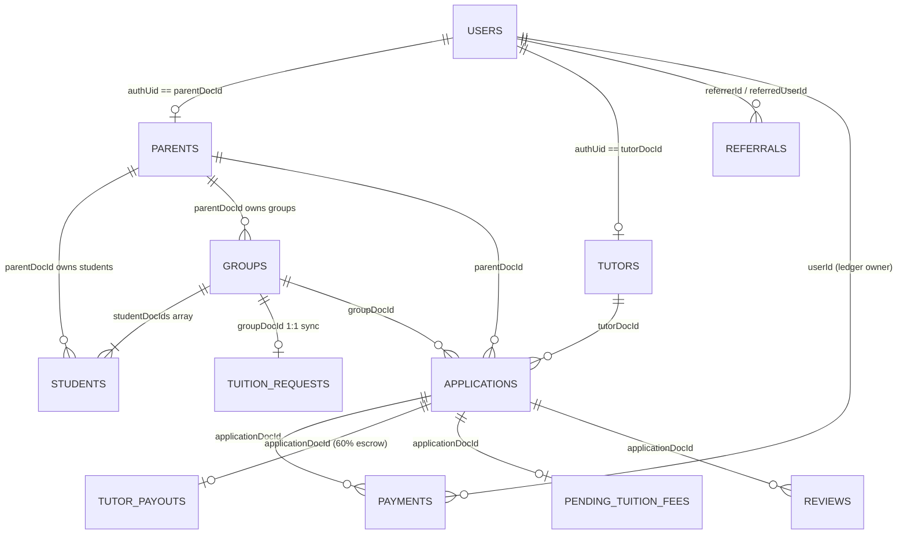

# Database Architecture & Firestore Schema Specification

This document provides a comprehensive reference for the Cloud Firestore database architecture supporting the Mi-Tutora platform. It details all 14 active collections, primary key strategies, data types, field constraints, expected values, business logic dependencies, and cross-references with the application codebase.

---

## 1. High-Level Entity-Relationship Model

---

## 2. Collections & Schema Specifications

### 2.1 Collection: `users`
- **Purpose**: System-wide authentication and identity registry mapping Firebase Auth users to platform roles and referral relationships.
- **Document ID (`doc.id`)**: Firebase Authentication UID (`auth.currentUser.uid`).
- **Security Rule**: Read/write restricted to authenticated owner (`request.auth.uid == userId`).

| Field Name | Type | Expected Values / Format | Description & Business Rules | Codebase Reference |
| :--- | :--- | :--- | :--- | :--- |
| `id` | `string` | Firebase Auth UID | Redundant internal copy of document ID. | `web/src/context/AuthContext.tsx` |
| `email` | `string` | Valid email string | User email retrieved from Firebase Auth provider. | `web/src/context/AuthContext.tsx` |
| `name` | `string` | Full name string | Display name of user. | `web/src/context/AuthContext.tsx` |
| `role` | `string` | `'student'` \| `'teacher'` \| `'admin'` | Primary role string controlling dashboard redirection and capabilities. | `web/src/context/AuthContext.tsx` |
| `roles` | `string[]` | `['student']`, `['teacher']`, or `['admin']` | RBAC authorization array governing route access. | `web/src/context/AuthContext.tsx`, `web/src/app/dashboard/*` |
| `hasProfile` | `boolean` | `true` \| `false` | Tracks onboarding completion. If `false`, redirects to profile setup wizard. | `web/src/context/AuthContext.tsx` |
| `referralCode` | `string` | Regex: `^[A-Z]{4}-[A-Z0-9]{6}$` | User's unique personal referral code generated via `generateReferralCode()`. | `web/src/utils/referral.ts`, `web/src/context/AuthContext.tsx` |
| `referredBy` | `string` | Referral code or empty string `""` | Referral code entered during registration. Used to link referrals. | `web/src/context/AuthContext.tsx` |
| `referrerName` | `string` | Referrer's name or empty string `""` | Denormalized display name of user who referred this account. | `web/src/context/AuthContext.tsx` |
| `upiId` | `string` | Valid UPI ID (e.g. `user@okhdfcbank`) | Destination UPI address for automated referral cash payouts. | `web/src/app/dashboard/student/page.tsx` |
| `walletBalance` | `number` | Numeric amount in INR (default: `0`) | User's accumulated credit/reward balance in platform wallet. Canonical casing. | `web/src/types/models.ts` |
| `walletbalance` | `number` | Numeric amount in INR | **Casing alias** of `walletBalance` present in some records due to legacy writes. Code references both (`models.ts:L156`). Treat as the same field — prefer `walletBalance` for all new writes. | `web/src/types/models.ts` |
| `dismissedNotifications` | `string[]` | Array of notification/banner IDs | IDs of dismissed in-app announcements or alerts. | `db_analyzer/data_analysis.md` |
| `fcmToken` | `string` | FCM registration token or empty string `""` | Device push notification token for instant alert delivery. | `web/src/types/models.ts` |
| `createdAt` | `Timestamp` | Firestore Timestamp | Account creation timestamp. | `functions/src/triggers/onUserCreated.ts` |

---

### 2.2 Collection: `parents`
- **Purpose**: Parent/guardian profiles who manage student enrollments, create tuition groups, and hire tutors.
- **Document ID (`doc.id`)**: Firebase Auth UID of the parent.
- **Security Rule**: Read/write restricted to authenticated users.

| Field Name | Type | Expected Values / Format | Description & Business Rules | Codebase Reference |
| :--- | :--- | :--- | :--- | :--- |
| `parentDocId` | `string` | Firebase Auth UID | Primary key matching Firestore document ID. | `web/src/app/dashboard/student/page.tsx` |
| `authUid` | `string` | Firebase Auth UID | Redundant link to user authentication record. | `web/src/app/dashboard/student/page.tsx` |
| `parentId` | `string` | `MTP` + 6 uppercase alphanumeric (`MTPXXXXXX`) | Human-readable public support identifier. | `web/src/utils/idGenerator.ts` |
| `name` | `string` | Parent's full legal name | Display name across student dashboard and applications. | `web/src/app/dashboard/student/page.tsx` |
| `email` | `string` | Valid email address | Communication and Razorpay receipt email. | `web/src/app/api/create-order/route.ts` |
| `phone` | `string` | 10-digit mobile string | Primary contact telephone number. | `web/src/app/dashboard/student/page.tsx` |
| `whatsapp` | `string` | 10-digit mobile string | WhatsApp contact number for scheduling notifications. | `web/src/app/dashboard/student/page.tsx` |
| `area` / `city` / `pincode` | `string` | Neighborhood / City / Postal code | Optional home residence location for offline tuition matching. | `web/src/components/DemoForm.tsx` |
| `dailyUsage` | `map` | `{ date: string, count: number, lastUpdated: Timestamp }` | Anti-spam daily rate-limiting counter for demo requests and applications. | `web/src/types/models.ts` |
| `createdAt` | `Timestamp` \| `number` | Firestore Timestamp or epoch ms | Parent profile registration timestamp. | `web/src/context/AuthContext.tsx` |

---

### 2.3 Collection: `tutors`
- **Purpose**: Verified teacher/tutor profiles storing academic credentials, matchmaking preferences, weekly tokens, subscription tier, and KYC badges.
- **Document ID (`doc.id`)**: Firebase Auth UID of the tutor.
- **Security Rule**: Public read for active discovery; write restricted to authenticated profile owner.

| Field Name | Type | Expected Values / Format | Description & Business Rules | Codebase Reference |
| :--- | :--- | :--- | :--- | :--- |
| `authUid` | `string` | Firebase Auth UID | Matching Firestore document ID. | `web/src/app/dashboard/teacher/page.tsx` |
| `tutorId` | `string` | `MTT` + 6 uppercase alphanumeric (`MTTXXXXXX`) | Human-readable public teacher identifier. | `web/src/utils/idGenerator.ts` |
| `name` | `string` | Teacher's full name | Display name across listings, proposals, and chats. | `web/src/app/dashboard/teacher/page.tsx` |
| `email` | `string` | Valid email address | Teacher's contact and billing email. | `web/src/app/dashboard/teacher/page.tsx` |
| `phone` | `string` | 10-digit mobile string | Direct contact phone number. | `web/src/app/dashboard/teacher/page.tsx` |
| `whatsapp` | `string` | 10-digit mobile string | WhatsApp contact number for class coordination. | `web/src/app/dashboard/teacher/page.tsx` |

| `gender` | `string` | `'Male'` \| `'Female'` \| `'Other'` | Checked against parent `teacherGenderPreference` during strict matchmaking. | `web/src/utils/matching.ts:L133` |
| `category` | `string` | `'school'`, `'competitive'`, `'programming'`, `'languages'` | Primary teaching domain. Strict match criteria in ranking engine. | `web/src/utils/matching.ts:L114` |
| `qualification` | `string` | Educational degree (e.g. `'B.E / B.Tech'`, `'M.Sc'`) | Displayed on profile card. | `web/src/app/dashboard/teacher/page.tsx` |
| `experience` | `string` | Experience string (e.g. `'Fresher'`, `'3-5 Years'`) | Teacher experience tier. | `web/src/app/dashboard/teacher/page.tsx` |
| `subjects` | `string[]` | Array of subjects (e.g. `['Mathematics', 'Science']`) | Subjects taught. Scored at +50 pts per subject in ranking. | `web/src/utils/matching.ts:L36` |
| `classes` | `string[]` | Array of class levels (e.g. `['6th - 8th', '9th - 10th']`) | Target student grades. Scored at +30 pts in ranking. | `web/src/utils/matching.ts:L49` |
| `boards` | `string[]` | Array of education boards (e.g. `['CBSE', 'ICSE']`) | Educational boards. Scored at +20 pts in ranking. | `web/src/utils/matching.ts:L66` |
| `technologies` | `string[]` | Programming languages/frameworks | Used when category is `programming`. +50 pts per match. | `web/src/utils/matching.ts:L78` |
| `languagesTaught` | `string[]` | Spoken/written languages taught | Used when category is `languages`. +50 pts per match. | `web/src/utils/matching.ts:L85` |
| `feeRange` | `string` \| `number` | Monthly tuition rate in INR (e.g. `"8000"`, `8000`) | Proximity to student budget scores up to +30 pts in ranking. | `web/src/utils/matching.ts:L89` |
| `mode` | `string` | `'Online'` \| `'Offline'` | Tuition delivery preference (Programming & Languages enforced as `'Online'`). | `web/src/components/TeacherForm.tsx` |
| `preferredLocations` | `string` | Comma-separated locality names | Specific neighborhoods/localities where the tutor conducts in-person classes. Displayed on tutor cards and `TutorViewModal`. | `web/src/components/TeacherForm.tsx`, `web/src/components/dashboard/TutorViewModal.tsx` |
| `travelDistance` | `string` \| `number` | Numeric radius in km (e.g. `"5"`, `"10"`, `5`) | Maximum travel radius the tutor is willing to commute for offline tuitions. Displayed on `TutorViewModal`. | `web/src/components/TeacherForm.tsx`, `web/src/components/dashboard/TutorViewModal.tsx` |
| `area` | `string` | Neighborhood / street (e.g. `'Indiranagar'`) | Locality of tutor. Populated via BigDataCloud reverse geocode. | `web/src/components/TeacherForm.tsx` |
| `city` | `string` | City name (e.g. `'Bengaluru'`) | City of tutor residence. | `web/src/components/TeacherForm.tsx` |
| `pincode` | `string` | 6-digit postal code (e.g. `'560038'`) | Locality pincode. | `web/src/components/TeacherForm.tsx` |
| `latitude` | `number` | Float (e.g. `12.9716`) or `0.0` | GPS latitude. Used for Haversine proximity scoring (+10 to +30 pts). `0.0` for online-only. | `web/src/utils/matching.ts` |
| `longitude` | `number` | Float (e.g. `77.5946`) or `0.0` | GPS longitude. Used for Haversine proximity scoring (+10 to +30 pts). `0.0` for online-only. | `web/src/utils/matching.ts` |
| `price` | `number` | Numeric fee in INR (default: `0`) | Redundant/legacy numeric monthly fee representation alongside `feeRange`. | `web/src/types/models.ts` |
| `occupation` | `string` | Professional title (e.g. `'Software Engineer'`) | Tutor's primary current occupation. | `web/src/components/TeacherForm.tsx` |
| `teachingApproach`| `string` | Pedagogical description | Free-form methodology and teaching style summary. | `web/src/components/TeacherForm.tsx` |
| `studentCount` | `string` | e.g. `'1-5 Students'`, `'5-10 Students'` | Typical batch or student capacity handled. | `web/src/components/TeacherForm.tsx` |
| `knownLanguages` | `string[]` | Array of spoken languages | Languages spoken/understood by teacher for communication. | `web/src/components/TeacherForm.tsx` |
| `preferredTimeRange`| `string` | e.g. `'Evening (4 PM - 8 PM)'` | Preferred daily availability window. | `web/src/components/TeacherForm.tsx` |
| `weeklyQuota` | `map` | `{ weekStartDate: string, tokensUsed: number, lastUpdated: Timestamp }` | Quota engine: 5 tokens/week (Free) or 15 tokens/week (Pro). Resets on Monday. | `web/src/app/api/transactions/request/route.ts` |
| `bankedTokens` | `number` | Non-negative integer (default: `0`) | Accumulated banked proposal tokens earned by referring other teachers. Redeemable via `functions/src/callable/redeemToken.ts`. | `web/src/app/api/verify-payment/route.ts` |
| `isSubscribed` | `boolean` | `true` \| `false` | Legacy boolean for Pro membership. | `web/src/utils/matching.ts:L101` |
| `subscriptionPlan` | `string` | `'free'` \| `'pro'` | Active subscription tier. Pro awards +20 ranking boost. | `web/src/utils/matching.ts:L101` |
| `subscriptionExpiry` | `number` | Epoch timestamp in milliseconds | Timestamp when Pro plan expires. Verified before awarding Pro boosts. | `web/src/utils/matching.ts:L102` |
| `subscriptionUpdatedAt` | `Timestamp` | Firestore Timestamp | Timestamp when subscription tier was last purchased, upgraded, or renewed. | `web/src/app/api/verify-payment/route.ts` |
| `aadharVerified` | `boolean` | `true` \| `false` | Trust & Safety badge. Awards +20 ranking boost. | `web/src/utils/matching.ts:L96` |
| `maskedAadhar` | `string` | `XXXX-XXXX-` + 4 digits (`XXXX-XXXX-5661`) | Safe display format of verified Aadhar ID. | `web/src/app/api/kyc/verify-otp/route.ts` |
| `kycUpdatedAt` | `Timestamp` | Firestore Timestamp | Timestamp when Aadhar KYC OTP verification was completed. | `web/src/app/api/kyc/verify-otp/route.ts` |
| `rating` | `number` | Float (1.0 to 5.0) | Weighted average star rating computed from `reviews`. | `web/src/app/api/submit-review/route.ts` |
| `reviewCount` | `number` | Non-negative integer | Total count of submitted reviews. | `web/src/app/api/submit-review/route.ts` |
| `pendingRequests` | `string[]` | Array of application IDs | Active application references currently requiring tutor response. | `web/src/app/dashboard/teacher/page.tsx` |
| `dailyUsage` | `map` | `{ count: number, date: string }` | Daily rate limiting counter for proposal creation. | `web/src/types/models.ts` |
| `upiId` | `string` | Valid UPI ID (e.g. `teacher@okhdfcbank`) | Destination UPI address for automated 60% first-month tuition fee disbursements on Day 30 and student referral cash rewards. | `web/src/app/dashboard/teacher/page.tsx` |
| `hasProfile` | `boolean` | `true` \| `false` | Indicates whether onboarding and profile submission is finalized. | `web/src/context/AuthContext.tsx` |
| `resume` | `map` | `{ url: string, fileName: string, uploadedAt: number }` | Compulsory resume/CV document metadata and secure Firebase Storage download URL uploaded during onboarding. Must be present to unlock tuition proposals. | `web/src/components/TeacherForm.tsx` |
| `resumeUrl` | `string` | Valid download URL string | Redundant direct download URL for the teacher's compulsory resume/CV. | `web/src/components/TeacherForm.tsx` |
| `verificationDocs` | `map` | `Record<string, { url: string, fileName: string, uploadedAt: number }>` | Optional Firebase Storage download URLs and file metadata for supplementary educational certificates (10th marksheet, 12th marksheet, degree certificates, etc.). | `web/src/components/TeacherForm.tsx` |
| `verificationStatus` | `string` | `'pending'` \| `'verified'` \| `'rejected'` \| `'unsubmitted'` | Optional educational document review state. Note: platform trust badge and ranking boost are driven by `aadharVerified`. | `web/src/app/dashboard/teacher/page.tsx` |
| `verificationSubmittedAt` | `number` | Epoch timestamp in milliseconds | Millisecond timestamp when optional verification documents were uploaded and saved. | `web/src/components/TeacherForm.tsx` |
| `createdAt` | `number` | Epoch timestamp in milliseconds | Teacher registration and profile record creation timestamp. | `web/src/components/TeacherForm.tsx` |
| `accountStatus` | `string` | `'active'` \| `'suspended'` | Admin-controlled account state. Suspended tutors are hidden from discovery and cannot accept new proposals. | `web/src/types/models.ts:L99` |

> [!NOTE]
> **Runtime-Only Fields (never stored in Firestore):** The following fields exist on the `Tutor` TypeScript interface (`models.ts`) but are computed server-side by the ranking engine and injected into API responses — they are **not persisted** in Firestore documents:
> - `suitabilityScore` — weighted ranking score computed by `matchingEngine.ts` per search query.
> - `minFee` — derived lower bound of tutor fee range used during budget scoring.
> - `rank` — ordinal position in the sorted result set returned to the dashboard client.

---

### 2.4 Collection: `students`
- **Purpose**: Individual learners registered under a parent account.
- **Document ID (`doc.id`)**: Auto-generated Firestore ID (`MTS...` stored in `studentId`).
- **Security Rule**: Read/write restricted to authenticated owner parent.

| Field Name | Type | Expected Values / Format | Description & Business Rules | Codebase Reference |
| :--- | :--- | :--- | :--- | :--- |
| `id` | `string` | Auto-generated Firestore ID | Primary document key. | `web/src/app/dashboard/student/page.tsx` |
| `studentId` | `string` | `MTS` + 6 alphanumeric (`MTSXXXXXX`) | Public student registration ID. | `web/src/utils/idGenerator.ts` |
| `parentDocId` | `string` | Parent's Auth UID | Foreign key pointing to `parents` collection (aliased as `parentId` in legacy models). | `web/src/utils/groupUtils.ts` |
| `groupDocId` | `string` | Group Firestore ID or empty `""` | Foreign key linking student to an active learning group (aliased as `groupId` in legacy models). | `web/src/utils/groupUtils.ts:L24` |
| `name` | `string` | Student's full name | Learner display name. | `web/src/utils/groupUtils.ts:L32` |
| `gender` | `string` | `'Male'` \| `'Female'` \| `'Other'` | Student's gender. | `web/src/app/dashboard/student/page.tsx` |
| `guardianName` | `string` | Legal guardian/parent name | Direct guardian contact person name. | `db_analyzer/data_analysis.md`, `web/src/types/models.ts` |
| `phoneNumber` | `string` | 10-digit mobile string | Learner or parent contact mobile number. | `db_analyzer/data_analysis.md`, `web/src/types/models.ts` |
| `whatsappNumber` | `string` | 10-digit mobile string | WhatsApp notification and session coordination number. | `db_analyzer/data_analysis.md`, `web/src/types/models.ts` |
| `email` | `string` | Valid email string | Contact email address for class schedules and reports. | `db_analyzer/data_analysis.md`, `web/src/types/models.ts` |
| `dob` | `string` | Date string (e.g. `YYYY-MM-DD`) | Student date of birth. | `db_analyzer/data_analysis.md`, `web/src/types/models.ts` |
| `category` | `string` | `'school'`, `'competitive'`, `'programming'`, `'languages'` | Domain of study. | `web/src/utils/pricing.ts:L5` |
| `studentType` | `string` | `'School Student'`, `'College Student'`, etc. | Descriptive academic type. | `web/src/app/dashboard/student/page.tsx` |
| `classLevel` | `string` | e.g. `'6th Standard'`, `'8th Standard'`, `'Class 10'` | Academic grade. Used in matchmaking and demo fee pricing. | `web/src/utils/pricing.ts:L8` |
| `board` | `string` | e.g. `'CBSE'`, `'ICSE'`, `'State Board'` | Educational syllabus board. | `web/src/utils/matching.ts:L119` |
| `subjects` | `string[]` | Array of requested subjects | Academic subjects needed by this student. | `web/src/utils/groupUtils.ts:L35` |
| `technologies` | `string[]` | Array of coding languages | Required when category is `programming`. | `web/src/utils/groupUtils.ts:L36` |
| `languages` | `string[]` | Array of spoken languages | Required when category is `languages`. | `web/src/utils/groupUtils.ts:L37` |
| `learningGoal` | `string` | Free-form objective | Specific academic focus or exam targets. | `web/src/types/models.ts` |
| `specialRequirements`| `string` | Free-form notes | Special learning accommodations or notes for educator. | `web/src/types/models.ts` |
| `budget` | `number` | Monthly allocation in INR | Individual contribution towards total tuition budget. | `web/src/utils/groupUtils.ts:L38` |
| `hoursPerDay` | `string` | e.g. `'1 Hour'`, `'1.5 Hours'` | Preferred duration per teaching session. | `web/src/types/models.ts` |
| `preferredTimeRange`| `string` | e.g. `'Evening (4 PM - 8 PM)'` | Daily preferred study window. | `web/src/types/models.ts` |
| `isAvailable` | `boolean` | `true` \| `false` | Concurrency lock. Flipped to `false` when active in an ongoing tuition/demo. | `web/src/utils/studentAvailability.ts:L26` |
| `pendingRequests`| `string[]` | Array of application IDs | Active application references for queue enforcement. | `web/src/app/dashboard/student/page.tsx` |
| `createdAt` | `number` | Epoch timestamp in milliseconds | Student profile registration timestamp. | `web/src/types/models.ts` |

---

### 2.5 Collection: `groups`
- **Purpose**: Represents learning clusters created by parents (supports single-child or multi-sibling groups).
- **Document ID (`doc.id`)**: Auto-generated Firestore ID (`MTG...` stored in `groupId`).
- **Security Rule**: Read/write restricted to authenticated owner parent.

| Field Name | Type | Expected Values / Format | Description & Business Rules | Codebase Reference |
| :--- | :--- | :--- | :--- | :--- |
| `groupDocId` | `string` | Auto-generated Firestore ID | Matches document ID. | `web/src/utils/groupUtils.ts:L5` |
| `groupId` | `string` | `MTG` + 6 alphanumeric (`MTGXXXXXX`) | Public group identifier. | `web/src/utils/idGenerator.ts` |
| `parentDocId` | `string` | Parent's Auth UID | Foreign key identifying group creator. | `web/src/utils/groupUtils.ts:L60` |

| `parentId` | `string` | Parent's Auth UID | Alias for `parentDocId` stored in Firestore records for backwards compatibility. | `db_analyzer/data_analysis.md`, `web/src/types/models.ts` |
| `studentDocIds` | `string[]` | Array of `students.id` | List of student foreign keys belonging to this group. | `web/src/utils/groupUtils.ts:L13` |
| `studentIds` | `string[]` | Array of `students.id` | Alias for `studentDocIds` stored in legacy records. | `web/src/types/models.ts` |

| `mode` | `string` | `'Online'` \| `'Offline'` | Delivery mode requested for group. | `web/src/utils/groupUtils.ts:L62` |
| `area` | `string` | Address string (e.g. `'Indiranagar'`) | Physical home address for offline classes. Blank for online. | `web/src/components/DemoForm.tsx` |
| `city` | `string` | City name or postal locality | Tuition city. | `web/src/components/DemoForm.tsx` |
| `addressStreet` | `string` | Street address string | Physical street line for in-person classes. | `web/src/types/models.ts` |
| `addressFlat` | `string` | House/Apartment number | Apartment, flat, or villa number for home tutoring. | `web/src/types/models.ts` |
| `addressPincode`| `string` | 6-digit postal PIN | Locality postal code. | `web/src/types/models.ts` |
| `latitude` | `number` \| `null` | Float (e.g. `12.9716`) or `null` | GPS latitude. Used for Haversine proximity scoring (+10 to +30 pts). `null` for online. | `web/src/utils/matching.ts` |
| `longitude` | `number` \| `null` | Float (e.g. `77.5946`) or `null` | GPS longitude. Used for Haversine proximity scoring (+10 to +30 pts). `null` for online. | `web/src/utils/matching.ts` |
| `daysPerWeek` | `string` | e.g. `'5 Days/Week'`, `'3 Days/Week'` | Frequency of tuition classes. | `web/src/utils/groupUtils.ts:L69` |
| `specificDays` | `string[]` | e.g. `['Monday', 'Tuesday', ...]` | Specified schedule days. | `web/src/utils/groupUtils.ts:L70` |
| `preferredTimeRange`| `string` | e.g. `'Evening (4 PM - 8 PM)'` | Preferred time window for sessions. | `web/src/utils/groupUtils.ts:L68` |
| `teacherGenderPreference`| `string`| `'No Preference'`, `'Male'`, `'Female'` | Filter applied during teacher recommendation. | `web/src/utils/groupUtils.ts:L67` |
| `totalBudget` | `number` | Aggregated monthly budget in INR | Sum of all member students' budgets. | `web/src/types/models.ts` |
| `isGroup` | `boolean` | `true` \| `false` | `true` if group contains multiple students (> 1), `false` for single-learner groups. | `web/src/components/DemoForm.tsx` |
| `status` | `string` | `'active'` \| `'closed'` | Lifecycle of the group. | `web/src/utils/groupUtils.ts` |
| `createdAt` | `number` | Epoch timestamp in milliseconds | Group creation timestamp. | `web/src/types/models.ts` |
| `updatedAt` | `number` | Epoch timestamp in milliseconds | Group last modification timestamp. | `web/src/types/models.ts` |

> [!NOTE]
> **Automatic Empty Group Cleanup:** When a student is removed from the dashboard and they are the last remaining member of their group (`newStudentIds.length === 0`), the empty group document and all associated `tuition_requests` records are automatically deleted in the same atomic batch to prevent orphaned ghost groups.

---

### 2.6 Collection: `tuition_requests`
- **Purpose**: Public marketplace broadcast document automatically synthesized from a `group` via `syncTuitionRequestForGroup()`.
- **Document ID (`doc.id`)**: Auto-generated Firestore ID (`REQ...` stored in `requestId`).
- **Security Rule**: Authenticated tutors can query open requests.

| Field Name | Type | Expected Values / Format | Description & Business Rules | Codebase Reference |
| :--- | :--- | :--- | :--- | :--- |
| `requestId` | `string` | `REQ` + 6 uppercase alphanumeric (`REQU7TXSS`) | Public customer tracking identifier. | `db_analyzer/data_analysis.md` |
| `groupDocId` | `string` | Foreign key to `groups.groupDocId` | 1:1 relationship with parent group. | `web/src/utils/groupUtils.ts:L59` |
| `parentDocId` | `string` | Parent's Auth UID | Foreign key identifying group creator. | `web/src/utils/groupUtils.ts:L60` |

| `parentId` | `string` | Parent's Auth UID | Denormalized alias for `parentDocId` in Firestore. | `db_analyzer/data_analysis.md` |

| `category` | `string` | `'school'`, `'competitive'`, etc. | Aggregated category from member students. | `web/src/utils/groupUtils.ts:L61` |
| `mode` | `string` | `'Online'` \| `'Offline'` | Delivery mode requested for group. | `web/src/utils/groupUtils.ts:L62` |
| `area` | `string` | Address string | Physical locality for offline classes. | `web/src/components/DemoForm.tsx` |
| `city` | `string` | City name | City of tuition. | `web/src/components/DemoForm.tsx` |
| `latitude` | `number` \| `null` | Float or `null` | Aggregated GPS latitude for proximity scoring. | `web/src/components/DemoForm.tsx` |
| `longitude` | `number` \| `null` | Float or `null` | Aggregated GPS longitude for proximity scoring. | `web/src/components/DemoForm.tsx` |
| `daysPerWeek` | `string` | e.g. `'3 Days/Week'`, `'5 Days/Week'` | Preferred weekly frequency of lessons. | `web/src/components/DemoForm.tsx` |
| `specificDays` | `string[]` | e.g. `['Monday', 'Wednesday', 'Friday']` | Requested weekdays for tuition sessions. | `web/src/components/DemoForm.tsx` |
| `preferredTimeRange`| `string` | e.g. `'Afternoon (12 PM - 4 PM)'` | Target timing slot for lessons. | `web/src/components/DemoForm.tsx` |
| `teacherGenderPreference`| `string`| `'No Preference'`, `'Male'`, `'Female'` | Student/Parent filter preference for tutor gender. | `web/src/components/DemoForm.tsx` |
| `combinedSubjects` | `string[]` | Deduplicated subject set | Union of all subjects across group members. | `web/src/utils/groupUtils.ts:L72` |
| `combinedTechnologies` | `string[]` | Deduplicated technology set | Union of all technologies across group members. | `web/src/utils/groupUtils.ts:L73` |
| `combinedLanguages` | `string[]` | Deduplicated language set | Union of all languages across group members. | `web/src/utils/groupUtils.ts:L74` |
| `combinedBudget` | `number` | Numeric sum in INR | Total aggregated monthly budget for tutor. | `web/src/utils/groupUtils.ts:L75` |
| `studentsDetails` | `object[]` | Array of student snapshot summaries | Cached snapshot of student details for fast tutor browsing. | `web/src/utils/groupUtils.ts:L71` |
| `status` | `string` | `'open'` \| `'accepted'` \| `'closed'` | Open for tutor applications or filled. | `web/src/utils/groupUtils.ts:L76` |
| `acceptedTutorId`| `string` | Tutor Auth UID or empty `""` | Assigned tutor once request is closed. | `web/src/utils/groupUtils.ts:L77` |
| `createdAt` | `number` | Epoch millisecond timestamp | Creation date of request. | `web/src/utils/groupUtils.ts:L84` |

---

### 2.7 Collection: `applications`
- **Purpose**: Core platform state machine tracking proposal negotiations, demo scheduling, trial status, and tuition hire.
- **Document ID (`doc.id`)**: Auto-generated Firestore ID (`MTA...` stored in `applicationId`).
- **Security Rule**: Read/write restricted to participant tutor (`tutorDocId`) or parent (`parentDocId`).

| Field Name | Type | Expected Values / Format | Description & Business Rules | Codebase Reference |
| :--- | :--- | :--- | :--- | :--- |
| `applicationDocId` | `string` | Matches Firestore document ID | Primary transaction key. | `web/src/app/api/transactions/*` |
| `applicationId` | `string` | `MTA` + 6 alphanumeric (`MTAXXXXXX`) | Customer-facing transaction tracking ID. | `web/src/utils/idGenerator.ts` |
| `tutorDocId` | `string` | Tutor's Auth UID | Foreign key to `tutors` collection. | `web/src/app/api/transactions/*` |
| `tutorName` | `string` | Tutor's full name | Denormalized display name. | `web/src/app/dashboard/student/page.tsx` |
| `parentDocId` | `string` | Parent's Auth UID | Foreign key to `parents` collection. | `web/src/app/api/transactions/*` |
| `groupDocId` | `string` | Group Firestore ID | Foreign key to `groups` collection. | `web/src/utils/constants.ts` |
| `studentDocId` | `string` | Primary Student ID | Target student (or primary group student). | `web/src/utils/studentAvailability.ts` |
| `studentDocIds` | `string[]` | Array of student IDs | All enrolled students in this tuition. | `web/src/utils/studentAvailability.ts` |
| `studentName` | `string` | Student or group summary label | e.g. `'Group: Alice, Bob'`. | `web/src/app/dashboard/teacher/page.tsx` |
| `initialBudget` | `number` | Numeric amount in INR | Baseline price negotiated from. | `web/src/tests/negotiation.spec.ts` |
| `currentOffer` | `number` | Numeric amount in INR | Most recent counter-offer proposed. | `web/src/tests/negotiation.spec.ts` |
| `finalPrice` | `number` | Numeric amount in INR | Agreed monthly tuition fee upon deal closing. | `web/src/app/api/transactions/hire/route.ts` |
| `absoluteMin` | `number` | 60% of initial budget | Hard negotiation floor for student. | `web/src/tests/negotiation.spec.ts` |
| `absoluteMax` | `number` | 140% of initial budget | Hard negotiation ceiling for teacher. | `web/src/tests/negotiation.spec.ts` |
| `initiator` | `string` | `'student'` \| `'teacher'` | Entity that made the initial proposal. | `web/src/app/api/transactions/request/route.ts` |
| `lastUpdatedBy` | `string` | `'student'` \| `'teacher'` | Entity that took the latest action. | `web/src/app/api/transactions/request/route.ts` |
| `mode` | `string` | `'Online'` \| `'Offline'` | Class delivery mode negotiated for this agreement. | `db_analyzer/data_analysis.md`, `web/src/types/models.ts` |
| `category` | `string` | `'school'`, `'competitive'`, `'programming'`, `'languages'` | Domain category of tuition subject. | `db_analyzer/data_analysis.md`, `web/src/types/models.ts` |
| `demoHours` | `string` | e.g. `'Flexible'`, `'1 Hour'` | Proposed duration or flexibility note for demo session. | `db_analyzer/data_analysis.md`, `web/src/types/models.ts` |
| `source` | `string` | `'direct'` \| `'marketplace'` | Whether proposal originated from teacher profile card or public tuition request. | `db_analyzer/data_analysis.md`, `web/src/types/models.ts` |
| `requestDocId` | `string` | Firestore ID or empty `""` | Foreign key linking application back to originating `tuition_requests` document. | `db_analyzer/data_analysis.md`, `web/src/types/models.ts` |
| `proposedDate` | `string` | Format: `YYYY-MM-DD` | Date slot actively proposed during date/time negotiation phase. | `web/src/components/ActionModal.tsx`, `web/src/app/dashboard/*` |
| `proposedTime` | `string` | Format: `HH:mm` (e.g. `"20:34"`) | 24-hour time slot actively proposed. Rendered in UI via 12-hour AM/PM segmented picker (`ActionModal.tsx`). | `web/src/utils/timeFormat.ts`, `web/src/components/ActionModal.tsx` |
| `demoDate` | `string` | Format: `YYYY-MM-DD` | Finalized locked date for scheduled demo class. | `web/src/app/api/transactions/accept/route.ts` |
| `demoTime` | `string` | Format: `HH:mm` (e.g. `"17:30"`) | Finalized locked 24-hour start time for scheduled demo (displayed as 12-hour AM/PM on dashboard cards). | `web/src/utils/timeFormat.ts`, `web/src/app/api/transactions/accept/route.ts` |
| `status` | `string` | Enums: `demo_requested_by_student`, `demo_requested_by_teacher`, `negotiating`, `demo_scheduled`, `waiting_for_parent_decision`, `tuition_started`, `declined`, `completed` | Lifecycle state machine status of the tuition proposal. | `web/src/utils/constants.ts` |
| `reason` | `string` | Reason string or code (e.g. `'parent_48h_decision_window_elapsed'`, `'student_hired_another_tutor'`) | Reason for proposal rejection, auto-decline, or cancellation. | `functions/src/scheduled/expireDemos.ts`, `functions/src/triggers/onApplicationWritten.ts` |
| `declinedAt` | `Timestamp` | Firestore Timestamp | Timestamp recorded when application enters `'declined'` status. | `functions/src/scheduled/expireDemos.ts` |
| `expiredAt` | `Timestamp` | Firestore Timestamp | Timestamp when 48h decision window or demo expired without action. | `functions/src/scheduled/expireDemos.ts` |
| `expiredReason` | `string` | e.g. `'parent_48h_decision_window_elapsed'` | Specific expiration reason stamped by Cloud Scheduler runner. | `functions/src/scheduled/expireDemos.ts` |
| `demoCompletedAt`| `Timestamp` | Firestore Timestamp | Stamped when demo is marked finished (or auto-completed after 24h) unlocking 48h parent hiring window. | `functions/src/scheduled/expireDemos.ts:L50` |
| `demoPaymentPaid` | `boolean` | `true` \| `false` | True when platform demo fee has been paid via Razorpay. | `web/src/app/api/verify-payment/route.ts` |
| `gmeetLink` | `string` | Valid Google Meet, Zoom, or Teams URL | Meeting link submitted by tutor. Stored redundantly or in `privateData`. Locked until 5 min before demo. | `web/src/app/api/save-demo-link/route.ts` |
| `feePaid` | `boolean` | `true` \| `false` | Indicates whether first month tuition fee is settled. | `web/src/app/api/transactions/hire/route.ts` |
| `startDate` | `Timestamp` | Firestore Timestamp | Hire date when 7-day post-trial tuition starts. | `web/src/app/api/transactions/hire/route.ts` |
| `createdAt` | `Timestamp` | Firestore Timestamp | Initial application proposal creation timestamp. | `web/src/app/api/transactions/request/route.ts` |
| `updatedAt` | `Timestamp` | Firestore Timestamp | Timestamp of most recent negotiation, schedule, or status change. | `web/src/app/api/transactions/*` |
| `studentIds` | `string[]` | Array of student IDs | **Legacy alias** for `studentDocIds` present in older application records. Read both fields defensively; write only `studentDocIds` for new records. | `web/src/types/models.ts:L24` |
| `groupId` | `string` | Group Firestore ID | **Legacy alias** for `groupDocId` present in older application records. Read both fields defensively; write only `groupDocId` for new records. | `web/src/types/models.ts:L13` |

> [!NOTE]
> **Frontend-Only Shape Fields (never stored in Firestore):** The following fields appear on the `Application` TypeScript interface (`models.ts`) but are assembled client-side for UI rendering — they are **not Firestore document fields**:
> - `students` — nested array of student objects built in-memory for display purposes.
> - `paymentHistory` — aggregated payment history array constructed from the `payments` collection at query time.
> - `subsequentPayments` — month 2+ payment records joined client-side; not stored on the application document.

#### 2.7.1 Subcollection: `applications/{applicationDocId}/privateData`
- **Purpose**: Secure time-locked vault for online video conference links. By isolating meeting URLs inside this protected subcollection, students cannot read or scrape the Google Meet / Zoom link directly from the client before the allowed time window.
- **Document ID (`doc.id`)**: `'meeting'`.
- **Security Rule**: Tutor can write anytime; student read is denied at Firestore rule level and strictly governed by server API (`/api/get-demo-link`) enforcing the **5-minute pre-class unlock window**.

| Field Name | Type | Expected Values / Format | Description & Business Rules | Codebase Reference |
| :--- | :--- | :--- | :--- | :--- |
| `meetingLink` | `string` | Google Meet, Zoom, or Teams URL | The video meeting room URL submitted by the educator. | `web/src/app/api/save-demo-link/route.ts:L78` |
| `demoDate` | `string` | Format: `YYYY-MM-DD` | Scheduled demo date used for server-side timelock validation. | `web/src/app/api/save-demo-link/route.ts:L79` |
| `demoTime` | `string` | Format: `HH:mm` (24-hour) | Scheduled start time used for server-side timelock validation. | `web/src/app/api/save-demo-link/route.ts:L80` |
| `setBy` | `string` | Tutor's Auth UID | Authentication UID of educator who supplied link. | `web/src/app/api/save-demo-link/route.ts:L81` |
| `updatedAt` | `Timestamp` | Firestore Timestamp | Timestamp when meeting link was created or rescheduled. | `web/src/app/api/save-demo-link/route.ts:L82` |

---

### 2.8 Collection: `payments`
- **Purpose**: Authoritative, tamper-proof financial transaction ledger for Razorpay checkout sessions and verification.
- **Document ID (`doc.id`)**: Auto-generated Firestore ID.
- **Security Rule**: Read restricted to payment owner; creation and verification managed strictly by backend APIs.

| Field Name | Type | Expected Values / Format | Description & Business Rules | Codebase Reference |
| :--- | :--- | :--- | :--- | :--- |
| `razorpayOrderId` | `string` | `order_` + alphanumeric | Razorpay official order identifier. Used as lookup key in payment verification. | `web/src/app/api/verify-payment/route.ts:L33` |
| `razorpayPaymentId` | `string` | `pay_` + alphanumeric | Razorpay payment confirmation receipt ID. | `web/src/app/api/verify-payment/route.ts:L45` |
| `razorpaySignature` | `string` | Hex signature string | HMAC SHA-256 signature generated by Razorpay for server-side verification. | `web/src/app/api/verify-payment/route.ts` |
| `userId` | `string` | Firebase Auth UID | Payer's user identity. Verified against `decodedToken.uid`. | `web/src/app/api/create-order/route.ts:L62` |
| `applicationDocId`| `string` | Application ID or empty string | Target application for demo/tuition payments. Sole authority for payment attribution. | `web/src/app/api/verify-payment/route.ts:L41` |
| `amount` | `number` | Numeric amount in INR | Transacted amount. Derived on server to prevent price tampering. | `web/src/app/api/create-order/route.ts:L78` |
| `currency` | `string` | `'INR'` | Platform settlement currency. | `web/src/app/api/create-order/route.ts:L79` |
| `walletDiscountApplied`| `number`| Numeric amount in INR (default: `0`) | Amount deducted from user's wallet credit to subsidize fee. | `db_analyzer/data_analysis.md`, `web/src/types/models.ts` |
| `type` | `string` | `'demo'`, `'tuition'`, `'subscription'` | Nature of payment determining post-payment state transitions. | `web/src/app/api/verify-payment/route.ts:L42` |
| `isRemoval` | `boolean` | `true` \| `false` | Indicates student-side cancellation fee. | `web/src/app/api/verify-payment/route.ts:L43` |
| `status` | `string` | `'created'` \| `'paid'` \| `'failed'` | Payment state. `'paid'` checks prevent replay attacks. | `web/src/app/api/verify-payment/route.ts:L37` |
| `verifiedVia` | `string` | `'client'` \| `'webhook'` | Settlement pathway: client-initiated verification or background server webhook. | `db_analyzer/data_analysis.md` |
| `verifiedAt` | `Timestamp` | Firestore Timestamp | Exact moment payment signature was verified and cleared. | `db_analyzer/data_analysis.md` |
| `createdAt` | `Timestamp` | Firestore Timestamp | Record creation timestamp. | `web/src/app/api/create-order/route.ts:L80` |
| `updatedAt` | `Timestamp` | Firestore Timestamp | Payment settlement timestamp. | `web/src/app/api/verify-payment/route.ts:L46` |

---

### 2.9 Collection: `pending_tuition_fees`
- **Purpose**: Stores due tuition payments unlocked after a successful demo trial.
- **Document ID (`doc.id`)**: Matches `applicationDocId`.
- **Security Rule**: Managed by backend transaction APIs (`/api/transactions/hire`).

| Field Name | Type | Expected Values / Format | Description & Business Rules | Codebase Reference |
| :--- | :--- | :--- | :--- | :--- |
| `applicationDocId` | `string` | Foreign key to `applications` | The tuition agreement document ID. | `web/src/app/api/transactions/hire/route.ts:L62` |
| `studentDocId` | `string` | Parent's Auth UID | The payer responsible for the monthly fee. | `web/src/app/api/transactions/hire/route.ts:L63` |
| `tutorDocId` | `string` | Tutor's Auth UID | The receiving educator. | `web/src/app/api/transactions/hire/route.ts:L64` |
| `amount` | `number` | Monthly tuition rate in INR | Agreed fee (`finalPrice`). | `web/src/app/api/transactions/hire/route.ts:L66` |

| `feeAmount` | `number` | Monthly tuition rate in INR | Redundant field alias for `amount` in Firestore. | `db_analyzer/data_analysis.md` |

| `status` | `string` | `'pending'` \| `'paid'` \| `'overdue'` | Status of the first month's payment due in 7 days. | `web/src/app/api/transactions/hire/route.ts:L65` |
| `paymentId` | `string` | Razorpay payment ID (`pay_...`) or empty | Linked payment confirmation record once settled. | `web/src/app/api/verify-payment/route.ts` |
| `startDate` | `Timestamp` | Firestore Timestamp | Start date of tuition. First billing due date = `startDate + 7 days`. | `web/src/app/api/transactions/hire/route.ts:L67` |
| `day7DueDate` | `Timestamp` | Firestore Timestamp | Exact milestone deadline when student fee must be settled. | `web/src/app/dashboard/student/page.tsx` |
| `day10LockDate` | `Timestamp` | Firestore Timestamp | Grace period expiration date when student account locks if unpaid. | `web/src/app/dashboard/student/page.tsx` |
| `day30ReleaseDate`| `Timestamp` | Firestore Timestamp | Day 30 maturity date when tutor 60% escrow is released to UPI. | `web/src/app/dashboard/teacher/page.tsx` |
| `paidAt` | `Timestamp` | Firestore Timestamp | Exact timestamp when student completed payment. | `db_analyzer/data_analysis.md` |

---

### 2.10 Collection: `referrals`
- **Purpose**: Tracks referral attributions and calculates reward incentives upon successful tuition settlement.
- **Document ID (`doc.id`)**: Auto-generated Firestore ID.
- **Security Rule**: Read accessible to participant referrer.

| Field Name | Type | Expected Values / Format | Description & Business Rules | Codebase Reference |
| :--- | :--- | :--- | :--- | :--- |
| `referralCode` | `string` | Format: `^[A-Z]{4}-[A-Z0-9]{6}$` | Referral code redeemed during registration. | `web/src/utils/referral.ts` |
| `referrerId` | `string` | User Auth UID of referrer | The user eligible for reward credit. | `web/src/context/AuthContext.tsx` |
| `referrerName` | `string` | Referrer full name | Denormalized display name. | `web/src/context/AuthContext.tsx` |
| `referredUserId` | `string` | User Auth UID of referee | The new user who signed up. | `web/src/context/AuthContext.tsx` |
| `referredUserName`| `string` | Referee full name | Denormalized referee name. | `web/src/context/AuthContext.tsx` |
| `referralType` | `string` | `'student'` \| `'teacher'` | Role of referred user governing reward type. | `web/src/tests/referral.spec.ts` |
| `estimatedReward`| `number` | Numeric amount in INR | Projected reward from tuition fee. | `web/src/tests/referral.spec.ts` |
| `status` | `string` | `'pending'` \| `'qualified'` | Moves to `'qualified'` on first tuition settlement. | `web/src/tests/referral.spec.ts` |
| `reward` | `number` | Positive integer (e.g. `600`) | Finalized reward amount ($P \times 0.25$). | `web/src/app/api/verify-payment/route.ts` |
| `rewardType` | `string` | `'wallet_cash'` \| `'banked_token'` | Cash reward for students vs. banked tokens for teachers. | `web/src/app/api/verify-payment/route.ts` |
| `payoutStatus` | `string` | `'escrow_held'`, `'ready_for_payout'`, `'processing'`, `'paid'`, `'action_required_missing_upi'` | Escrow and payout lifecycle state machine. | `web/src/app/api/verify-payment/route.ts` |
| `releaseEligibleAt`| `number` | Epoch milliseconds | Timestamp when funds unlock on Day 30 (`startDate + 30 days`). | `web/src/app/api/verify-payment/route.ts` |
| `payoutVpa` | `string` | Valid UPI ID | Target UPI address for automated disbursement. | `web/src/app/api/verify-payment/route.ts` |
| `razorpayPayoutId`| `string` | `pout_` + alphanumeric or `""` | Razorpay Payout transaction identifier. | `web/src/app/api/payouts/process/route.ts` |
| `utrNumber` | `string` | Bank UTR string or `""` | Bank transaction reference number for audit. | `web/src/app/api/payouts/process/route.ts` |
| `createdAt` | `number` | Epoch timestamp in milliseconds | Date referred user signed up. | `web/src/context/AuthContext.tsx` |
| `qualifiedAt` | `Timestamp` | Firestore Timestamp | Settlement timestamp when referee pays Day 7 tuition. | `web/src/app/api/verify-payment/route.ts` |
| `paidAt` | `Timestamp` | Firestore Timestamp or `null` | Date when funds successfully reached referrer's bank. | `web/src/app/api/payouts/process/route.ts` |

---

### 2.11 Collection: `reviews`
- **Purpose**: Public ratings and testimonials submitted by parents upon tuition completion.
- **Document ID (`doc.id`)**: Auto-generated Firestore ID.
- **Security Rule**: Submissions verified via backend API (`/api/submit-review`).

| Field Name | Type | Expected Values / Format | Description & Business Rules | Codebase Reference |
| :--- | :--- | :--- | :--- | :--- |
| `tutorDocId` | `string` | Tutor's Auth UID | Target teacher receiving the review. | `web/src/app/api/submit-review/route.ts:L33` |
| `parentDocId` | `string` | Parent's Auth UID | Reviewer ID. Verified against authenticated session token. | `web/src/app/api/submit-review/route.ts:L34` |
| `applicationDocId`| `string` | Application Firestore ID | Verified tuition agreement justifying the review. | `web/src/app/api/submit-review/route.ts:L35` |
| `rating` | `number` | Integer `1` to `5` | Star rating contributing to tutor weighted average. | `web/src/app/api/submit-review/route.ts:L36` |
| `comment` | `string` | Non-empty feedback string | Written review text displayed on tutor profile. | `web/src/app/api/submit-review/route.ts:L37` |
| `createdAt` | `number` | Epoch timestamp in milliseconds | Submission timestamp. | `web/src/app/api/submit-review/route.ts:L38` |

---

### 2.12 Collection: `marketplace_pricing`
- **Purpose**: Centralized pricing catalog defining platform demo fees and baseline tuition rates per class and subject category.
- **Document ID (`doc.id`)**: Explicit tier key (e.g. `school_class_10`, `competitive_neet`, `programming_beginner`, `general`).
- **Security Rule**: Public read; write restricted to platform admin.

| Field Name | Type | Expected Values / Format | Description & Business Rules | Codebase Reference |
| :--- | :--- | :--- | :--- | :--- |
| `price` | `number` | Positive integer (e.g. `100`, `250`, `350`) | Standard fee amount in INR for the tier. | `web/src/utils/pricing.ts:L37` |
| `displayName` | `string` | e.g. `'Class 10 School Tuition'`, `'NEET Preparation'` | Human-readable service label. | `web/src/utils/pricing.ts:L35` |
| `currency` | `string` | `'INR'` | Currency denomination. | `web/src/utils/pricing.ts` |
| `enabled` | `boolean` | `true` \| `false` | Whether this pricing rule is currently active. | `web/src/utils/pricing.ts` |
| `updatedBy` | `string` | Admin Auth UID | Audit tracking ID of last modifying admin. | `db_analyzer/load_data.js` |
| `updatedAt` | `Timestamp` | Firestore Timestamp | Modification timestamp. | `db_analyzer/load_data.js` |

---

### 2.13 Collection: `global_config`
- **Purpose**: Singleton platform control panel document (`app`) containing kill-switches and system flags.
- **Document ID (`doc.id`)**: Always `'app'`.
- **Security Rule**: Public read for maintenance checks; write restricted to platform admin.

| Field Name | Type | Expected Values / Format | Description & Business Rules | Codebase Reference |
| :--- | :--- | :--- | :--- | :--- |
| `appEnabled` | `boolean` | `true` \| `false` | Master platform kill-switch. | `web/src/app/dashboard/*` |
| `maintenanceMode` | `boolean` | `true` \| `false` | Puts application into maintenance banner mode. | `web/src/app/dashboard/*` |
| `paymentsEnabled` | `boolean` | `true` \| `false` | Toggles Razorpay checkout availability. | `web/src/app/api/create-order/route.ts` |
| `referralsEnabled` | `boolean` | `true` \| `false` | Toggles referral code redemption and rewards. | `web/src/utils/referral.ts` |
| `verificationEnabled`| `boolean`| `true` \| `false` | Toggles Aadhar KYC verification module. | `web/src/app/api/kyc/*` |
| `marketplaceEnabled` | `boolean`| `true` \| `false` | Toggles discovery of open tuition requests. | `web/src/app/dashboard/teacher/page.tsx` |
| `recommendationsEnabled`| `boolean`| `true` \| `false` | Toggles server-side algorithmic recommendations. | `db_analyzer/data_analysis.md` |
| `internationalLeadsEnabled`| `boolean`| `true` \| `false` | Controls whether international tuition leads are routed. | `db_analyzer/data_analysis.md` |
| `reportsEnabled` | `boolean`| `true` \| `false` | Toggles student/parent feedback and reporting module. | `db_analyzer/data_analysis.md` |
| `disabledTitle` | `string` | Alert header string | Headline displayed when platform is administratively disabled. | `db_analyzer/data_analysis.md` |
| `disabledMessage` | `string` | Alert body copy | Descriptive notice shown to users when application is disabled. | `db_analyzer/data_analysis.md` |
| `maintenanceTitle` | `string` | Maintenance header string | Headline displayed on platform maintenance modal. | `db_analyzer/data_analysis.md` |
| `maintenanceMessage`| `string` | Maintenance body copy | Explanatory maintenance timeframe and status copy. | `db_analyzer/data_analysis.md` |

| `minSupportedVersionCode`| `number`| Integer (e.g. `1`) | Mobile/web app version requirement. | `db_analyzer/load_data.js` |
| `recommendedVersionCode`| `number`| Integer (e.g. `1`) | Recommended client version. | `db_analyzer/data_analysis.md` |
| `latestVersionName` | `string` | e.g. `'1.0'` | Release version tag. | `db_analyzer/load_data.js` |
| `updatedBy` | `string` | Admin Auth UID | Audit tracking ID of last modifying admin. | `db_analyzer/data_analysis.md` |
| `updatedAt` | `Timestamp` | Firestore Timestamp | Timestamp of last platform config change. | `db_analyzer/data_analysis.md` |

---

### 2.14 Collection: `admin_activity`
- **Purpose**: Immutable audit log of administrative actions (tutor suspensions, pricing updates, config toggles).
- **Document ID (`doc.id`)**: Auto-generated Firestore ID.
- **Security Rule**: Read/write restricted to platform admins.

| Field Name | Type | Expected Values / Format | Description & Business Rules | Codebase Reference |
| :--- | :--- | :--- | :--- | :--- |
| `type` | `string` | `'PRICING_UPDATED'`, `'TUTOR_SUSPENDED'`, `'PLATFORM_CONFIG_CHANGED'` | Category of administrative action. | `db_analyzer/load_data.js` |
| `message` | `string` | Descriptive log message | Human-readable event summary. | `db_analyzer/load_data.js` |
| `entityType` | `string` | `'tutor'`, `'pricing'`, `'platform_config'` | Target domain of change. | `db_analyzer/load_data.js` |
| `entityId` | `string` | ID of affected entity | Foreign key to affected document. | `db_analyzer/load_data.js` |
| `adminUid` | `string` | Admin's Auth UID | Identification of admin who executed action. | `db_analyzer/load_data.js` |
| `adminEmail` | `string` | Admin's email address | Email audit trail. | `db_analyzer/load_data.js` |
| `timestamp` | `Timestamp` | Firestore Timestamp | Audit log entry creation timestamp. | `db_analyzer/load_data.js` |

---

### 2.15 Collection: `tutor_payouts`
- **Purpose**: Escrow tracking and disbursement ledger for the 60% tutor share of the first-month tuition fee, unlocked on Day 30 and paid via Razorpay Payouts.
- **Document ID (`doc.id`)**: Deterministic Firestore ID format `payout_${applicationId}` (to prevent duplicate escrow disbursements on retry or concurrency).
- **Security Rule**: Read allowed for authenticated users (`request.auth != null`); writes strictly backend-only via Firebase Admin SDK.

| Field Name | Type | Expected Values / Format | Description & Business Rules | Codebase Reference |
| :--- | :--- | :--- | :--- | :--- |
| `payoutDocId` | `string` | Deterministic `payout_${appId}` | Primary document key. | `web/src/app/api/verify-payment/route.ts`, `functions/src/webhooks/razorpayWebhook.ts` |
| `applicationDocId`| `string` | `app_` + alphanumeric | Foreign key to the tuition agreement in `applications`. | `web/src/app/api/verify-payment/route.ts` |
| `studentPaymentId`| `string` | `pay_` + alphanumeric | Razorpay payment confirmation receipt ID from Day 7. | `web/src/app/api/verify-payment/route.ts` |
| `tutorDocId` | `string` | User Auth UID | The educator entitled to the funds. | `web/src/app/api/verify-payment/route.ts` |
| `tutorName` | `string` | Full name string | Denormalized display name. | `web/src/app/api/verify-payment/route.ts` |
| `parentDocId` | `string` | User Auth UID | The parent who paid the tuition fee. | `web/src/app/api/verify-payment/route.ts` |
| `grossAmount` | `number` | Positive integer (e.g. `6000`) | Total tuition fee collected from student. | `web/src/app/api/verify-payment/route.ts` |
| `platformFeeRate` | `number` | `0.40` | Platform commission percentage (40%). | `web/src/app/api/verify-payment/route.ts` |
| `platformFeeAmount`| `number` | Positive integer (e.g. `2400`) | Platform fee deducted ($G \times 0.40$). | `web/src/app/api/verify-payment/route.ts` |
| `tutorShareRate` | `number` | `0.60` | Educator net percentage (60%). | `web/src/app/api/verify-payment/route.ts` |
| `tutorShareAmount`| `number` | Positive integer (e.g. `3600`) | Net funds payable to the tutor ($G \times 0.60$). | `web/src/app/api/verify-payment/route.ts` |
| `referralReward` | `number` | Positive integer (e.g. `600`) | Referral incentive paid from platform cut ($P \times 0.25$). | `web/src/app/api/verify-payment/route.ts` |
| `monthNumber` | `number` | `1` | Strictly denotes Month 1 trial settlement. | `web/src/app/api/verify-payment/route.ts` |
| `status` | `string` | `'escrow_held'`, `'ready_for_payout'`, `'processing'`, `'paid'`, `'action_required_missing_upi'` | Lifecycle state machine. | `web/src/app/api/verify-payment/route.ts` |
| `startDate` | `Timestamp` | Firestore Timestamp | Day 0 hire date. | `web/src/app/api/verify-payment/route.ts` |
| `paidByStudentAt` | `Timestamp` | Firestore Timestamp | Timestamp when student paid on Day 7. | `web/src/app/api/verify-payment/route.ts` |
| `releaseEligibleAt`| `number` | Epoch milliseconds | Timestamp when funds unlock (`startDate + 30 days`). | `web/src/app/api/verify-payment/route.ts` |
| `payoutMethod` | `string` | `'upi'` \| `'bank_transfer'` | Transfer rail used by Razorpay Payouts. | `web/src/app/api/verify-payment/route.ts` |
| `payoutVpa` | `string` | Valid UPI ID (e.g. `user@okhdfcbank`) | Target VPA address of the teacher. | `web/src/app/api/verify-payment/route.ts` |
| `razorpayPayoutId`| `string` | `pout_` + alphanumeric or `""` | Razorpay Payout transaction identifier. | `web/src/app/api/payouts/process/route.ts` |
| `utrNumber` | `string` | Bank UTR string or `""` | Bank transaction reference number for audit. | `web/src/app/api/payouts/process/route.ts` |
| `createdAt` | `Timestamp` | Firestore Timestamp | Escrow creation date. | `web/src/app/api/verify-payment/route.ts` |
| `paidAt` | `Timestamp` | Firestore Timestamp or `null` | Date when funds successfully reached tutor's bank. | `web/src/app/api/payouts/process/route.ts` |

---

## 3. Codebase vs. Live Dump Discrepancy & Latent Fields Analysis

When comparing the static documents dumped by `load_data.js` against the full production TypeScript codebase, several **latent fields and edge-case collections** exist in the code that were absent from the live database dump because specific user actions (e.g. withdrawals, cancellations, or referral payouts) had not yet occurred in that test environment.

### 3.1 Discovered Conditional / Latent Fields

| Collection | Field Name | Type | Why It Was Absent in DB Dump | Business Logic & Code Location |
| :--- | :--- | :--- | :--- | :--- |
| **`users`** | `walletBalance` | `number` | Absent when user has never earned referral cash rewards. | Incremented by 25% of first tuition fee upon referral qualification (`verify-payment/route.ts:L198`). Decremented on checkout discount (`verify-payment/route.ts:L135`) or withdrawal (`student/page.tsx:L1035`). |
| **`users`** | `dismissedNotifications`| `string[]` | Absent until user clicks to dismiss an in-app toast. | Stored via `arrayUnion` when a user clears notification toasts (`student/page.tsx:L837`, `teacher/page.tsx:L385`). |
| **`parents`** | `dailyUsage` | `map` | Absent until parent sends their first tuition request on the current day. | Enforces the 5-requests/day limit: `{ date: 'YYYY-MM-DD', count: 1..5, lastUpdated: Timestamp }` (`request/route.ts:L86-L117`). |
| **`tutors`** | `bankedTokens` | `number` | Absent until teacher referrer qualifies for a reward. | Teachers receive +1 banked token instead of cash upon successful referral (`verify-payment/route.ts:L189`). Decremented when used to unlock proposals (`teacher/page.tsx:L367`). |
| **`applications`**| `reason` | `string` | Only present when an application is rejected or cancelled. | Contains rejection rationale, e.g. `'student_hired_another_tutor'` during mutual exclusion auto-decline (`hire/route.ts:L116`, `verify-payment/route.ts:L227`). |
| **`applications`**| `declinedAt` | `Timestamp` | Only present on declined applications. | Timestamp used to enforce the 7-day post-decline lockout rule (`queue.spec.ts:L116`, `hire/route.ts:L117`). |
| **`applications`**| `gmeetLink` | `string` | Absent until tutor inputs a Google Meet, Zoom, or Teams URL. | Stored via `/api/save-demo-link` and locked until 5 minutes before scheduled demo time. |
| **`referrals`** | `reward` | `number` | Only set after referee's first tuition payment is settled. | Contains the finalized reward amount (`Math.round(fee * 0.25)`) (`verify-payment/route.ts:L194`). |
| **`referrals`** | `rewardType` | `string` | Only set after settlement. | Evaluates to `'wallet_cash'` (for student referrer) or `'banked_token'` (for teacher referrer) (`verify-payment/route.ts:L185`). |
| **`referrals`** | `qualifiedAt` | `Timestamp` | Only set after settlement. | Settlement timestamp when reward moves from `'pending'` to `'qualified'` (`verify-payment/route.ts:L186`). |
| **`pending_tuition_fees`** | `paidAt` | `Timestamp` | Only set after first month tuition payment succeeds. | Set during Razorpay tuition settlement (`verify-payment/route.ts:L159`). |
| **`payments`** | `walletDiscountApplied`| `number` | `0` unless user chose to redeem wallet credit. | Amount deducted from gross tuition/demo bill (`create-order/route.ts:L143`). |

### 3.2 Notes on Conditionally-Populated Collections

The following active collections may not appear in a fresh database snapshot because they are only created after specific lifecycle events have occurred:

- **`tutor_payouts`**: Created by `/api/verify-payment` only after a student's first-month tuition payment is verified. Absent in dumps where no tuition payment has been completed.
- **`referrals`**: Created by `onUserCreated` trigger only when a new user signs up with a valid referral code.
- **`pending_tuition_fees`**: Created by `/api/transactions/hire` only after a parent hires a tutor.
- **`reviews`**: Created by `/api/submit-review` only after a completed tuition.

---

## 4. Foreign Key & Entity Reference Matrix

| Source Collection | Foreign Key Field | Target Collection | Cardinality | Purpose |
| :--- | :--- | :--- | :---: | :--- |
| `students` | `parentDocId` | `parents` | N:1 | Identifies the parent who registered the student. |
| `students` | `groupDocId` | `groups` | N:1 | Associates student with an active learning cluster. |
| `groups` | `parentDocId` | `parents` | N:1 | Identifies parent who created the group. |
| `groups` | `studentDocIds` | `students` | 1:N | List of students bundled in this group. |
| `tuition_requests`| `groupDocId` | `groups` | 1:1 | The underlying group represented by this broadcast request. |
| `applications` | `tutorDocId` | `tutors` | N:1 | The teacher assigned or negotiating the tuition. |
| `applications` | `parentDocId` | `parents` | N:1 | The parent party in the negotiation. |
| `applications` | `groupDocId` | `groups` | N:1 | The group of students being taught. |
| `payments` | `applicationDocId` | `applications` | N:1 | The tuition/demo transaction this payment settles. |
| `payments` | `userId` | `users` | N:1 | The authenticated user who initiated the checkout. |
| `pending_tuition_fees` | `applicationDocId` | `applications` | 1:1 | The agreement requiring 7-day post-trial payment. |
| `referrals` | `referrerId` | `users` | N:1 | The user eligible for 25% reward. |
| `referrals` | `referredUserId` | `users` | 1:1 | The newly onboarded user. |
| `reviews` | `tutorDocId` | `tutors` | N:1 | The educator receiving feedback. |
| `reviews` | `applicationDocId` | `applications` | 1:1 | Proof of completed tuition. |
| `tutor_payouts` | `applicationDocId` | `applications` | 1:1 | The tuition agreement this escrow settles. |
| `tutor_payouts` | `tutorDocId` | `tutors` | N:1 | The educator receiving the 60% disbursement. |

---

## 5. Security Rules Summary (`firestore.rules`)

1. **`users`**: Any authenticated user can read; creation enforces valid roles array (`hasOnly(['student', 'teacher', 'parent'])`); role escalation blocked on updates; deletion locked to owner only.
2. **`parents`**: Requires authentication (`request.auth != null`) for read, create, and update. Update rule enforces `dailyUsage` counter can only increment by 1 per day (anti-spam, max 5/day) or reset to 1 on a new date.
3. **`tutors`**: Public read and create for authenticated users; delete locked to owner (`request.auth.uid == tutorId`); update rule prevents client-side `bankedTokens` manipulation and enforces weekly token quota limits (5 for free, 15 for pro).
4. **`students`**: Falls through to the wildcard catch-all rule — read, create, update allowed for any authenticated user; delete requires authentication.
5. **`groups` & `tuition_requests`**: Falls through to the wildcard catch-all rule — read, create, update allowed for any authenticated user; delete requires authentication.
6. **`applications`**: Any authenticated user can read (`request.auth != null`). Client updates are blocked from modifying `feePaid`, `demoPaymentPaid`, price fields after deal closure, or forcing a `tuition_started` / `demo_booking_phase` status directly. Deletions strictly restricted to server Admin SDK (`allow delete: if false`).
7. **`payments`**: Any authenticated user can read; all writes (`create`, `update`, `delete`) are strictly blocked client-side — managed exclusively by backend Next.js API routes via Firebase Admin SDK.
8. **`tutor_payouts`**: Any authenticated user can read; all writes blocked client-side — managed exclusively by Firebase Admin SDK.
9. **`reviews`**: Publicly readable (no auth required); all writes blocked client-side — managed via `/api/submit-review` backend route.
10. **`referrals`**: Any authenticated user can read; all writes blocked client-side.
11. **`pending_tuition_fees`**: Any authenticated user can read; all writes blocked client-side.
12. **`global_config` & `marketplace_pricing`**: Publicly readable; all writes blocked client-side.

