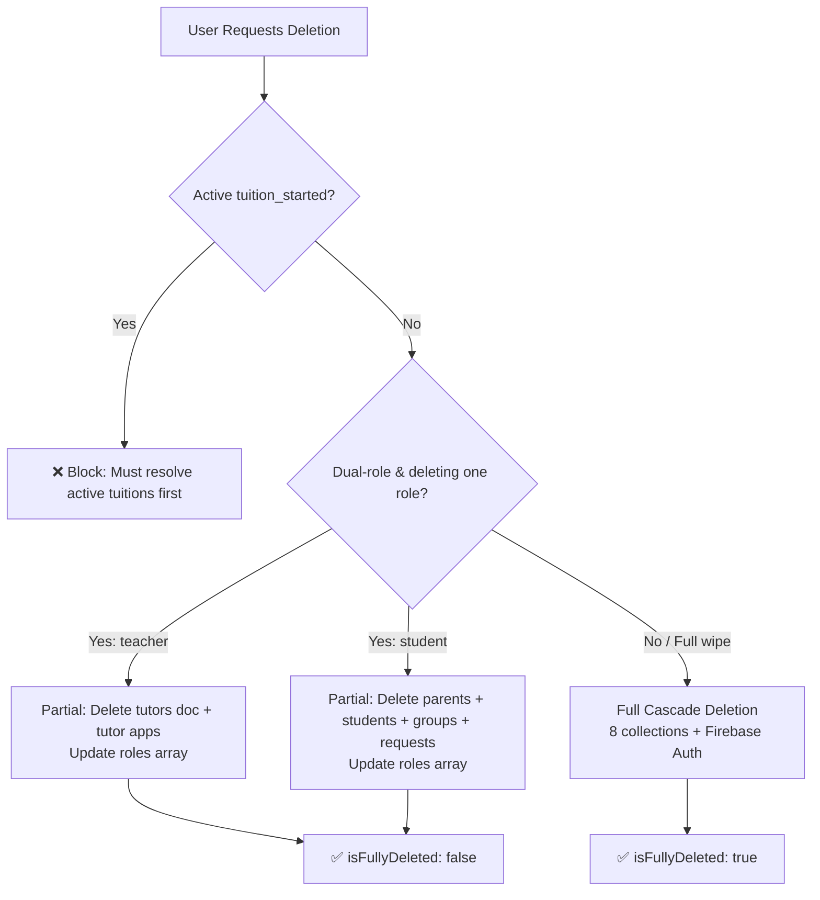

# Account Deletion Architecture

This document describes the complete account deletion system for Mi-Tutora, covering both deletion pathways, partial role deletion for dual-role users, the contract integrity guard, the full Firestore cascade order, and the escrow safety mechanism.

---

## 1. System Overview



---

## 2. Deletion Pathway

Account deletion is handled exclusively by the **`deleteUserAccount` Cloud Function** (`onCall`, 2nd Gen, region: `asia-south1`), called from both dashboards via `httpsCallable`.

| Entry Point | Type | Auth | Escrow Safety |
| :--- | :--- | :--- | :---: |
| `deleteUserAccount` callable | Cloud Function `onCall` (2nd Gen) | Firebase `onCall` — `request.auth` | ✅ Cancels `escrow_held` payouts |

Both the teacher dashboard ([`teacher/page.tsx`](../web/src/app/dashboard/teacher/page.tsx)) and the student dashboard ([`student/page.tsx`](../web/src/app/dashboard/student/page.tsx)) call this function via dynamic import:

```ts
const { functions } = await import('@/utils/firebase/client');
const { httpsCallable } = await import('firebase/functions');
const deleteAccount = httpsCallable(functions, 'deleteUserAccount');
const res = await deleteAccount({ role: 'teacher' | 'student' }); // role optional
```

**Request payload:**
```json
{ "role": "teacher" }   // Optional — omit for full account deletion
```

---

## 3. Contract Integrity Guard

Before any deletion proceeds, **both pathways** check for active tuition agreements:

```
applications WHERE parentDocId == uid AND status == 'tuition_started'
applications WHERE tutorDocId  == uid AND status == 'tuition_started'
```

If either query returns results → deletion is **hard-blocked** with:
- **Web route:** `400` — `"Cannot delete account while you have an active tuition agreement. Please complete or resolve ongoing tuitions first."`
- **Cloud Function:** `HttpsError('failed-precondition', ...)` with the same message

---

## 4. Dual-Role Partial Deletion

A user can hold both `student` and `teacher` roles simultaneously (stored in `users.roles[]`). The deletion system supports removing one role while preserving the other.

**Condition:** `targetRole` is provided AND `currentRoles.length > 1` AND `currentRoles.includes(targetRole)`

### 4.1 Delete Teacher Role Only

| Action | Detail |
| :--- | :--- |
| Delete | `tutors/{uid}` |
| Delete | All `applications` where `tutorDocId == uid` |
| Update | `users/{uid}` → `roles` array with `'teacher'` removed; `role` set to remaining role |
| Returns | `{ success: true, isFullyDeleted: false, remainingRoles: string[] }` |

### 4.2 Delete Student Role Only

| Action | Detail |
| :--- | :--- |
| Delete | `parents/{uid}` |
| Delete | All `students` where `parentDocId == uid` |
| Delete | All `groups` where `parentDocId == uid` |
| Delete | All `tuition_requests` where `parentDocId == uid` |
| Update | `users/{uid}` → `roles` array with `'student'` removed; `role` set to remaining role |
| Returns | `{ success: true, isFullyDeleted: false, remainingRoles: string[] }` |

All partial deletions use a **Firestore batch write** for atomicity.

---

## 5. Full Account Deletion Cascade

Triggered when `targetRole` is not provided, or the user only has a single role. Executed as a single **Firestore batch** across all collections simultaneously, followed by Firebase Auth deletion.

### 5.1 Cascade Order

| Step | Collection | Filter |
| :---: | :--- | :--- |
| 1 | `students` | `parentDocId == uid` |
| 2 | `groups` | `parentDocId == uid` |
| 3 | `applications` | `parentDocId == uid` |
| 4 | `applications` | `tutorDocId == uid` |
| 5 | `tuition_requests` | `parentDocId == uid` |
| 6 | `referrals` | `referrerId == uid` |
| 7 | `referrals` | `referredUserId == uid` |
| 8 | `parents/{uid}` | — |
| 9 | `tutors/{uid}` | — |
| 10 | `users/{uid}` | — |
| 11 | Firebase Auth | `admin.auth().deleteUser(uid)` |

All steps 1–10 are committed in a **single atomic batch**. Firebase Auth deletion (step 11) is executed after the batch commits, wrapped in a `try/catch` so a failure there does not roll back Firestore changes.

### 5.2 Returns

```json
{ "success": true, "isFullyDeleted": true }
```

---

## 6. Escrow Safety (Cloud Function Only)

When the `deleteUserAccount` Cloud Function runs a full deletion for a tutor, it additionally queries:

```
tutor_payouts WHERE tutorDocId == uid AND status == 'escrow_held'
```

Any matching documents are **updated** (not deleted) to:
```json
{
  "status": "cancelled_account_deleted",
  "updatedAt": ServerTimestamp
}
```

This prevents the `dailyPayouts` scheduled function from attempting a RazorpayX UPI transfer to a deleted account on Day 30.

> [!NOTE]
> Escrow records are updated, not deleted, to preserve the audit trail of the tuition payment that originally created them.

---

## 7. Codebase References

| File | Purpose |
| :--- | :--- |
| [`functions/src/callable/deleteAccount.ts`](../functions/src/callable/deleteAccount.ts) | Cloud Function — sole deletion implementation |
| [`web/src/app/dashboard/teacher/page.tsx`](../web/src/app/dashboard/teacher/page.tsx) | Teacher dashboard — calls `deleteUserAccount({ role: 'teacher' })` |
| [`web/src/app/dashboard/student/page.tsx`](../web/src/app/dashboard/student/page.tsx) | Student dashboard — calls `deleteUserAccount({ role: 'student' })` |
| [`web/src/utils/firebase/client.ts`](../web/src/utils/firebase/client.ts) | Exports `functions` instance with `asia-south1` region |

