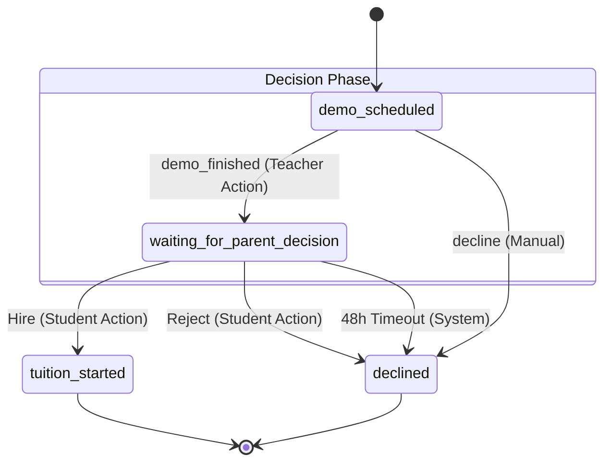

# Demo Completion & Hiring Architecture

This document outlines the architectural logic for what happens after a demo class is scheduled, covering the explicit confirmation of the demo by the teacher and the final hiring decision by the student.

---

## 1. The Big Picture: Transitioning from Demo to Tuition

To maintain strict state integrity and avoid assumptions based purely on the clock, the system relies on explicit user actions. The flow guarantees that a student only receives the prompt to "Hire" or "Reject" a teacher *after* the teacher confirms the demo has actually taken place.

---

## 2. The Hiring Loop & State Machine

Once the negotiation phase successfully ends with the `demo_scheduled` state, the following workflow activates:

### A. Teacher Confirmation
The application remains in `demo_scheduled` indefinitely until the teacher explicitly logs into their dashboard and clicks the **"Mark Demo as Finished"** button. This design prevents premature transitions in case the demo is delayed or the student refreshes their page during the meeting.

### B. State Transition
Clicking this button fires the `demo_finished` transaction action:
- The status immediately transitions from `demo_scheduled` to `waiting_for_parent_decision`.
- The `updatedAt` timestamp is recorded to mark the exact second the demo was logged as finished by the teacher.

### C. Student Decision
Once the status is `waiting_for_parent_decision`, the student's dashboard updates to present the final decision UI, unlocking the "Hire" and "Reject" buttons.
- **Hire:** The status advances to `tuition_started`.
- **Reject:** The status becomes `declined`.

### D. The 48-Hour Auto-Decline Timeout
To ensure that teachers are not left waiting indefinitely for a response, the system enforces a strict 48-hour timeout on the student's decision.
- The 48-hour clock begins ticking from the `updatedAt` timestamp (the moment the teacher clicked "Mark Demo as Finished").
- Every time the student or teacher dashboard fetches data via the API, it calculates `now - updatedAt`. 
- If 48 hours have passed and the student still hasn't made a decision, the API automatically transitions the state to `declined`, freeing up the teacher's schedule.

---

## 3. Example Flow

1.  **Scheduling Complete:** The student and teacher agree on a time, and the status becomes `demo_scheduled` for Tuesday at 5:00 PM.
2.  **Demo Execution (Teacher):** The demo finishes on Tuesday at 6:00 PM. The teacher clicks "Mark Demo as Finished". The status immediately becomes `waiting_for_parent_decision`.
3.  **Timeout Initiation:** The 48-hour timeout clock starts ticking on Tuesday at 6:00 PM.
4.  **Auto-Decline (System):** The student ignores their dashboard for 2 days. On Thursday at 6:01 PM, the system sees 48 hours have passed since the teacher marked it finished and automatically marks the status as `declined`.

---

## 4. State Machine Diagram

The following diagram maps the transition of the application status during this final phase.

