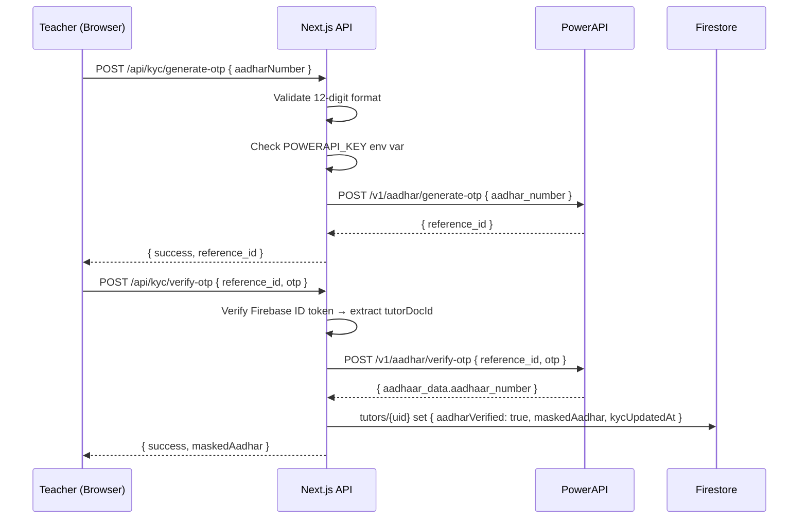

# Teacher Document Verification & Resume Architecture

This document outlines the business rules, security configurations, database schemas, and frontend integration for **Teacher Resumes and Optional Educational Document Attachments** built into the Mi-Tutora Teacher Portal.

---

## 1. System Overview

To balance platform trust and security with frictionless onboarding:
1. **Compulsory Resume / CV:** Every teacher on the Mi-Tutora platform must provide a professional Resume or CV (`.pdf`, `.doc`, `.docx`) capped at 5MB. Submitting tuition proposals (`make_offer` or `handleDirectRequestDemo`) requires a resume on file (`isResumeComplete()`).
2. **Optional Educational Certificates:** Teachers can optionally upload official marksheets and degree certificates in **PDF format** corresponding to their highest qualification to build parent trust. These documents are **optional attachments** (`required: false`) and do not block profile creation or proposal sending.

```mermaid
flowchart TD
    A[Teacher Enters Qualification & Onboarding] --> B[Compulsory Resume / CV Upload]
    B --> C{Resume Provided?}
    C -- No --> D[Block Proposal Submission]
    C -- Yes --> E[Proposal Sending Unlocked]

    A --> F[Optional Educational Documents Grid]
    F --> G{Teacher Chooses to Attach Docs?}
    G -- No --> H[Profile Saved without Attachments]
    G -- Yes --> I{Strict PDF & <= 5MB Check}
    I -- Valid --> J[Upload to Firebase Storage: tutor_documents/{uid}/...]
    I -- Invalid --> K[Alert Teacher: Only PDF under 5MB]
    J --> L[Saved to tutors.verificationDocs]
```

---

## 2. Dynamic Qualification Document Mapping (Optional Attachments)

The document matrix is dynamically resolved via `getRequiredDocuments(qualification)` in [`web/src/utils/documentVerification.ts`](../web/src/utils/documentVerification.ts). Every qualification defines the appropriate slots as optional attachments (`required: false`):

| Qualification | Suggested Document Slots | Description |
| :--- | :--- | :--- |
| **`10th`** | • 10th Standard Marksheet | Class 10 / SSLC / Matriculation marksheet or passing certificate |
| **`12th`** | • 10th Standard Marksheet<br>• 12th / PUC Marksheet | Class 12 / PUC / Intermediate / Diploma marksheet |
| **`B.E / B.Tech`** | • 10th Standard Marksheet<br>• 12th / PUC Marksheet<br>• B.E / B.Tech Degree Certificate | Engineering degree certificate, provisional certificate, or consolidated marksheet |
| **`B.Sc`** | • 10th Standard Marksheet<br>• 12th / PUC Marksheet<br>• B.Sc Degree Certificate | Bachelor of Science degree certificate or final marksheet |
| **`B.A`** | • 10th Standard Marksheet<br>• 12th / PUC Marksheet<br>• B.A Degree Certificate | Bachelor of Arts degree certificate or final marksheet |
| **`B.Com`** | • 10th Standard Marksheet<br>• 12th / PUC Marksheet<br>• B.Com Degree Certificate | Bachelor of Commerce degree certificate or final marksheet |
| **`M.Sc`** | • 10th Standard Marksheet<br>• 12th / PUC Marksheet<br>• Bachelor Degree Certificate<br>• M.Sc Degree Certificate | Master of Science degree certificate or final consolidated marksheet |
| **`M.A`** | • 10th Standard Marksheet<br>• 12th / PUC Marksheet<br>• Bachelor Degree Certificate<br>• M.A Degree Certificate | Master of Arts degree certificate or final consolidated marksheet |
| **`PhD`** | • 10th Standard Marksheet<br>• 12th / PUC Marksheet<br>• Master Degree Certificate<br>• Doctorate / PhD Certificate | Doctoral degree certificate or official provisional notification |
| **`Other`** | • 10th Standard Marksheet<br>• 12th / PUC Marksheet<br>• Highest Qualification Certificate | Official degree, diploma, or marksheet for highest qualification |

---

## 3. File Restrictions & Security Enforcements

To prevent storage abuse, prevent script injection, and ensure platform security:

1. **Strict Format Validation:** Only PDF documents (`.pdf`, `application/pdf`) are accepted. Image formats (`.jpg`, `.png`), Word documents (`.docx`), and executables (`.exe`) are strictly rejected by both client and storage rules.
2. **Strict Size Limit:** Every file is limited to a maximum of **5MB** (`MAX_DOCUMENT_SIZE_BYTES = 5 * 1024 * 1024`).
3. **Safe File Sanitization:** Uploaded file names are sanitized to prevent path traversal attacks:
   ```typescript
   const safeName = file.name.replace(/[^a-zA-Z0-9._-]/g, '_');
   ```

---

## 4. Firebase Storage Architecture & Security Rules

### Storage Path Scheme
Uploaded documents are isolated per authenticated tutor in Firebase Storage:
```
tutor_documents/{userId}/{docId}_{timestamp}_{safeFileName}
```
*Example:* `tutor_documents/abc123xyz/marksheet_10th_1788640000000_10th_marksheet.pdf`

### Storage Security Rules ([`storage.rules`](../storage.rules))
The bucket rules enforce authenticated ownership, MIME type verification, and file size limits server-side:

```javascript
rules_version = '2';
service firebase.storage {
  match /b/{bucket}/o {
    match /tutor_documents/{userId}/{fileName} {
      allow read: if request.auth != null;
      allow write: if request.auth != null 
                   && request.auth.uid == userId 
                   && request.resource.contentType == 'application/pdf'
                   && request.resource.size <= 5 * 1024 * 1024;
    }
    // User avatars/profile images (Images only, max 5MB, owner-only write)
    match /avatars/{userId}/{fileName} {
      allow read: if true;
      allow write: if request.auth != null 
                   && request.auth.uid == userId 
                   && request.resource.contentType.matches('image/.*')
                   && request.resource.size <= 5 * 1024 * 1024;
    }

    // Disallow arbitrary writes and require auth to read undefined paths
    match /{allPaths=**} {
      allow read: if request.auth != null;
      allow write: if false;
    }
  }
}
```

---

## 5. Database Schema (Firestore)

The resume, educational document records, and optional review states are stored directly on the tutor's root document in the `tutors` collection:

**Collection:** `tutors`

| Field Name | Type | Expected Values | Description & Purpose |
| :--- | :--- | :--- | :--- |
| `resume` | `map` | `{ url: string, fileName: string, uploadedAt: number }` | Compulsory resume/CV metadata and Firebase Storage download URL. Required to unlock proposal sending. |
| `resumeUrl` | `string` | Valid download URL string | Redundant direct download URL for the teacher's resume. |
| `verificationDocs` | `map` | `Record<string, DocumentRecord>` | Optional map keyed by document ID (`marksheet_10th`, `marksheet_12th`, etc.) containing download URL, original file name, and upload timestamp. |
| `verificationStatus` | `string` | `'pending'` \| `'verified'` \| `'rejected'` \| `'unsubmitted'` | Optional review lifecycle status for uploaded certificates. |
| `verificationSubmittedAt` | `number` | Epoch timestamp in ms | Millisecond timestamp when optional verification certificates were submitted. |

### Document Record Schema (`verificationDocs[docId]`)
```typescript
interface DocumentRecord {
  url: string;        // Firebase Storage download URL
  fileName: string;   // Original uploaded file name
  uploadedAt: number; // Date.now() timestamp
}
```

---

## 6. Frontend UI & Proposal Gating

### A. Profile Form Integration ([`TeacherForm.tsx`](../web/src/components/TeacherForm.tsx))
- **Compulsory Resume Slot:** Highlights resume upload as required during onboarding.
- **Dynamic Optional File Picker Grid:** Renders optional upload slots based on the selected `formData.qualification`.
- **Live State Badging:**
  - **Staged File:** Shows file name, size in MB, "Ready to upload" badge, and a remove button.
  - **Uploaded File:** Shows "✓ Uploaded", a "View" link opening the PDF in a new tab, and a "Replace" button.
- **Form Submission Lock:** Form submission checks `isResumeComplete()`. If a resume is provided (or previously uploaded), submission is allowed regardless of whether optional educational certificates are uploaded.

### B. Proposal Gating ([`dashboard/teacher/page.tsx`](../web/src/app/dashboard/teacher/page.tsx))
Sending tuition proposals (`handleMakeOffer`, `handleDirectRequestDemo`) requires a completed teacher profile with a resume on file. Educational certificates remain optional attachments and do not block proposal submission.

---

## 7. Automated Test Coverage

The feature is protected by 18 automated unit and integration tests in [`web/tests/document-verification.spec.ts`](../web/tests/document-verification.spec.ts):
1. **Dynamic Mapping Suite:** Verifies that all qualification categories return `required: false` for certificate slots.
2. **Strict PDF Validation Suite:** Tests rejection of non-PDFs, rejection of files > 5MB, and acceptance of valid PDFs.
3. **Resume Validation Suite:** Tests acceptance of `.pdf`, `.doc`, `.docx` for resumes and validates `isResumeComplete()`.
4. **Completeness Suite:** Tests that `isVerificationComplete()` returns `true` only when all qualification-mapped document slots have uploaded files. This controls the **profile completeness badge** — not proposal gating (which only uses `isResumeComplete()`).
5. **Proposal Gating Suite:** Tests proposal permission based on resume status.

---

## 8. Aadhar KYC via PowerAPI (Backend Ready, UI Pending)

> [!IMPORTANT]
> **Backend: Fully Implemented.** Both API routes are live and production-ready.
> **Teacher Portal UI: Commented out** in [`teacher/page.tsx`](../web/src/app/dashboard/teacher/page.tsx) (lines 3513–3590) pending official company PowerAPI license acquisition. To re-enable, uncomment the `TRUST & SAFETY VERIFICATION` block in the Settings tab and set `POWERAPI_KEY` in environment variables.

### 8.1 Overview

Aadhar identity verification is a two-step OTP flow powered by the **PowerAPI** external service. The backend routes are complete and production-ready. The teacher-facing Settings UI block has been temporarily commented out until the company's PowerAPI license is formally activated.



### 8.2 Step 1 — Generate OTP (`POST /api/kyc/generate-otp`)

| Property | Detail |
| :--- | :--- |
| **Auth** | Bearer token (Firebase ID token) — required |
| **Request Body** | `{ aadharNumber: string }` — 12-digit, whitespace stripped, validated against `/^\d{12}$/` |
| **Env Gate** | If `POWERAPI_KEY` is not set → returns `503` with message: *"Aadhaar KYC service is temporarily unavailable pending company license activation."* |
| **External Call** | `POST https://api.powerapi.com/v1/aadhar/generate-otp` with `{ aadhar_number }` and `Authorization: Bearer POWERAPI_KEY` |
| **Success Response** | `{ success: true, reference_id: string, message: 'OTP sent successfully.' }` |
| **Error Response** | `{ error: string }` with appropriate HTTP status |

### 8.3 Step 2 — Verify OTP (`POST /api/kyc/verify-otp`)

| Property | Detail |
| :--- | :--- |
| **Auth** | Bearer token required. `tutorDocId` is extracted from the **verified server-side token** — never trusted from the client body (tamper-proof). |
| **Request Body** | `{ reference_id: string, otp: string }` |
| **Env Gate** | If `POWERAPI_KEY` not set → returns `503` |
| **External Call** | `POST https://api.powerapi.com/v1/aadhar/verify-otp` with `{ reference_id, otp }` and `Authorization: Bearer POWERAPI_KEY` |
| **Aadhar Masking** | `rawAadhar = data.aadhaar_data?.aadhaar_number` → masked as `XXXX-XXXX-<last4>` |
| **Firestore Write** | `tutors/{uid}` — `set({ aadharVerified: true, maskedAadhar, kycUpdatedAt: new Date() }, { merge: true })` |
| **Success Response** | `{ success: true, message: 'Aadhar Verified successfully', maskedAadhar }` |

### 8.4 Client-Side State Machine (Live — UI Hidden)

The teacher dashboard maintains a three-state KYC machine, wired up and functional — only the UI rendering block is commented out:

| State | Trigger | UI Shown (when uncommented) |
| :--- | :--- | :--- |
| `'input'` | Default on load (if not yet verified) | Aadhar number input field + "Send OTP" button |
| `'otp'` | After `generate-otp` succeeds | OTP input field + "Verify" button |
| `'verified'` | After `verify-otp` succeeds OR `data.profile.aadharVerified === true` on load | Green "Identity Verified" banner + masked Aadhar + "+20 Match Points" badge |

**Relevant code in [`teacher/page.tsx`](../web/src/app/dashboard/teacher/page.tsx):**
- State declarations: lines 109–114
- `handleGenerateOTP` handler: lines ~260–290
- `handleVerifyOTP` handler: lines ~293–322
- Commented UI block: lines 3513–3590 (`TRUST & SAFETY VERIFICATION` section)

### 8.5 Environment Variable

| Variable | Purpose |
| :--- | :--- |
| `POWERAPI_KEY` | PowerAPI authentication key. Set in `.env.local` for development and in production environment variables. Both routes return a graceful `503` (no crash, no data loss) when this variable is absent. |

### 8.6 Effect on Platform When Verified

| Effect | Detail |
| :--- | :--- |
| **Ranking Boost** | `aadharVerified: true` grants **+20 suitability score** in [`matchingEngine.ts`](../functions/src/utils/matchingEngine.ts) |
| **Trust Badge** | `maskedAadhar` (`XXXX-XXXX-1234`) displayed on tutor profile and discovery cards |
| **Dashboard Badge** | Already live independently in the teacher dashboard (line 1338) — shows verified shield regardless of the commented UI block |
| **Firestore Fields Written** | `aadharVerified`, `maskedAadhar`, `kycUpdatedAt` on `tutors/{uid}` |

