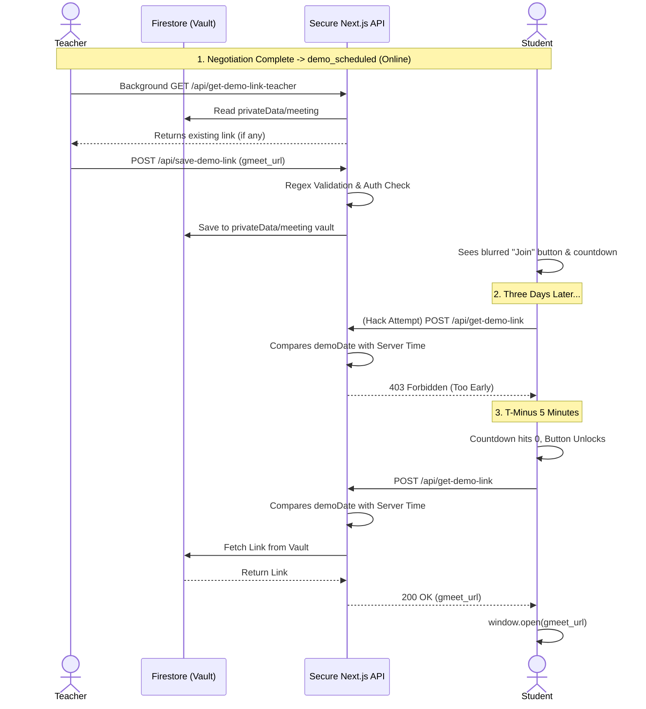

# Google Meet Link Validation & Security Architecture

This document outlines the complete architectural logic for how Google Meet links are securely managed, validated, and distributed for online demo classes between students and teachers.

---

## 1. The Big Picture: Just-In-Time Link Delivery

The core philosophy of this architecture is **absolute security**. To prevent tech-savvy students from inspecting network requests or reading the database to steal the meeting link before the scheduled time, the Google Meet link is physically separated from the main application data.

Instead of hiding the link with frontend CSS, the system uses a **Just-In-Time (JIT)** backend delivery system. The link physically does not exist on the student's computer until they are mathematically allowed to enter the room.

---

## 2. Trigger Conditions (When it happens)

The JIT delivery system and the teacher's input popup are only activated when two strict conditions are met on the `applications` document:
1.  **Status Match:** `status === 'demo_scheduled'` (Phase 1 and Phase 2 negotiations are complete).
2.  **Mode Match:** `mode === 'Online'` (Offline/in-person classes do not trigger this system).

---

## 3. The Architecture Components

### A. The Database Vault
Because Firestore sends entire documents to the frontend during a read or `onSnapshot` listener, storing the link in the main `applications/{id}` document would expose it to hackers. 

To solve this, the system uses a protected subcollection: `applications/{applicationId}/privateData/meeting`.
- The frontend **cannot** read this subcollection.
- Only secure backend API routes (using the Firebase Admin SDK) can read or write to this vault.

### B. Teacher Input, Retrieval & Validation
When the trigger conditions are met, the Teacher Portal displays an input field to add or edit the Google Meet link.
1.  **Background Sync (`/api/get-demo-link-teacher`):** As soon as the dashboard loads, the frontend silently calls this route to fetch any previously saved links from the vault, pre-filling the text box so the teacher knows exactly what they scheduled.
2.  **Submission:** The teacher pastes a new link and clicks "Save".
3.  **Strict Validation:** Both the frontend and backend validate the input using a strict Regex pattern: `/^https:\/\/meet\.google\.com\/[a-z0-9-]+$/`. This prevents accidental pasting of YouTube links, Zoom links, or malicious scripts.
4.  **Secure Write (`/api/save-demo-link`):** The frontend sends a POST request. The backend verifies the teacher's identity against the application's `tutorDocId` and saves the valid link into the database vault, instantly confirming the save in the UI without wiping the input box.

### C. UI Placement (The Demo Summary Cards)
To optimize the user experience, all of this UI is surfaced directly on the **Demo Classes** summary cards (and the Student's "Demo Teachers" tab) by accessing the nested `cls.app.mode` property. Teachers and students do not need to click "View Details" to access the meeting link; the input box and the live countdown timer are injected right above the "View Details" button for immediate access.

### D. Student JIT Retrieval (`/api/get-demo-link`)
When the trigger conditions are met, the Student Portal displays a "Join Demo Room" button and a live countdown timer.
1.  **The Lock:** If the current time is greater than 5 minutes before the demo, the button is blurred and disabled.
2.  **The Unlock:** At exactly **5 minutes before** the `demoDate` and `demoTime`, the countdown hits zero, and the button unlocks.
3.  **Secure Read:** The student clicks the button, sending a POST request to `/api/get-demo-link`.
4.  **Time Verification:** The backend API parses the `demoDate` and `demoTime` and compares it against the **secure server clock**. 
    - If the student hacked the frontend to click early, the server returns a `403 Forbidden` error.
    - If the time is valid, the server fetches the hidden link from the vault and sends it to the student.
5.  **Redirection:** The frontend instantly executes `window.open(link, '_blank')`, dropping the student seamlessly into the Google Meet room.

---

## 4. Sequence Diagram

The following diagram maps the flow of data between the Teacher, the Student, the Database, and the Secure JIT API.

