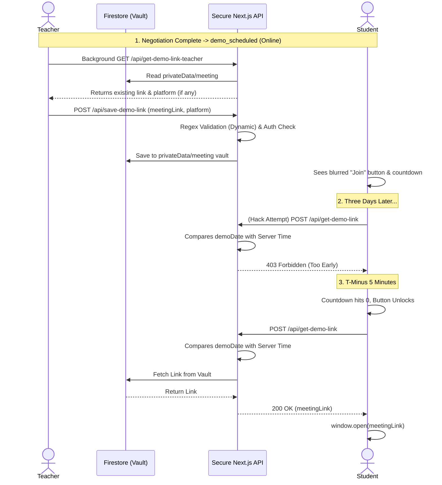

# Multi-Platform Meeting Link Validation & Security Architecture

This document outlines the complete architectural logic for how Meeting links (Google Meet, Zoom, MS Teams) are securely managed, validated, and distributed for online demo classes between students and teachers.

---

## 1. The Big Picture: Just-In-Time Link Delivery

The core philosophy of this architecture is **absolute security**. To prevent tech-savvy students from inspecting network requests or reading the database to steal the meeting link before the scheduled time, the meeting link is physically separated from the main application data.

Instead of hiding the link with frontend CSS, the system uses a **Just-In-Time (JIT)** backend delivery system. The link physically does not exist on the student's computer until they are mathematically allowed to enter the room.

---

## 2. Trigger Conditions (When it happens)

The JIT delivery system and the teacher's input popup are only activated when two strict conditions are met on the `applications` document:
1.  **Status Match:** `status === 'demo_scheduled'` (Phase 1 and Phase 2 negotiations are complete).
2.  **Mode Match:** `mode === 'Online'` (Offline/in-person classes do not trigger this system).

---

## 3. The Architecture Components

### A. The Database Vault
Because Firestore sends entire documents to the frontend during a read or `onSnapshot` listener, storing the link in the main `applications/{id}` document would expose it to hackers. 

To solve this, the system uses a protected subcollection: `applications/{applicationId}/privateData/meeting`.
- The frontend **cannot** read this subcollection.
- Only secure backend API routes (using the Firebase Admin SDK) can read or write to this vault.
- The vault securely stores two fields: `meetingLink` and `platform`.

### B. Teacher Input, Retrieval & Validation
When the trigger conditions are met, the Teacher Portal displays an input field and a platform toggle (Meet, Zoom, Teams) to add or edit the meeting link.
1.  **Background Sync (`/api/get-demo-link-teacher`):** As soon as the dashboard loads, the frontend silently calls this route to fetch any previously saved links and the selected platform from the vault, pre-filling the text box and toggles so the teacher knows exactly what they scheduled.
2.  **Submission:** The teacher selects a platform, pastes a new link, and clicks "Save".
3.  **Strict Validation:** The backend API strictly validates the link based on the selected platform using dynamic Regex patterns:
    - **Google Meet:** `/^https:\/\/meet\.google\.com\/[a-z0-9-]+$/`
    - **Zoom:** `/^https:\/\/(?:[\w-]+\.)?zoom\.us\/(?:j|my)\/\d+(?:\?pwd=[\w.-]+)?$/`
    - **MS Teams:** `/^https:\/\/teams\.microsoft\.com\/l\/meetup-join\/[\w%.-]+\/[\w.-]+\?context=[\w%.-]+$/`
4.  **Secure Write (`/api/save-demo-link`):** The backend verifies the teacher's identity against the application's `tutorDocId` and saves the valid link and platform into the database vault.

### C. UI Placement (The Demo Summary Cards)
To optimize the user experience, all of this UI is surfaced directly on the **Demo Classes** summary cards (and the Student's "Demo Teachers" tab) by accessing the nested `cls.app.mode` property. Teachers and students do not need to click "View Details" to access the meeting link; the input box and the live countdown timer are injected right above the "View Details" button for immediate access.

### D. Student JIT Retrieval (`/api/get-demo-link`)
When the trigger conditions are met, the Student Portal displays a "Join Demo Room" button and a live countdown timer.
1.  **Strict IST Timezone Offset:** Demo times are parsed with an explicit `+05:30` IST offset (`${demoDate}T${demoTime}:00+05:30`) to eliminate UTC discrepancies across devices located in different timezones.
2.  **The Lock (Before T-5):** If current time is earlier than 5 minutes before class start (`now < demoStartTime - 5 * 60 * 1000`), the button remains disabled with a countdown timer.
3.  **The Unlock Window [T-5 to T+90]:** At exactly **5 minutes before** the scheduled start, the button unlocks. The room remains accessible until **90 minutes after** the start time (`now <= demoStartTime + 90 * 60 * 1000`), ensuring comfortable class completion.
4.  **The Post-Demo Lock (After T+90):** After 90 minutes have elapsed, the link is permanently locked from student access to prevent unauthorized room reuse.
5.  **Secure Server Verification:** The backend API (`/api/get-demo-link`) re-verifies the exact same [T-5m, T+90m] window against the server clock. If a student attempts to bypass the client UI, the server returns `403 Forbidden`.
6.  **Redirection:** Upon verified authorization, the server fetches the hidden link from the vault and sends it to the frontend, which invokes `window.open(link, '_blank')`.

---

## 4. Sequence Diagram

The following diagram maps the flow of data between the Teacher, the Student, the Database, and the Secure JIT API.

