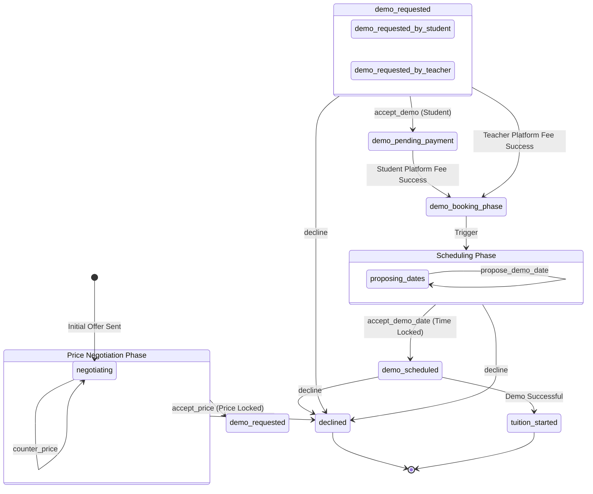

# Negotiation & Application State Architecture

This document outlines the complete architectural logic for how negotiations and application states are managed between Students and Teachers on the platform.

---

## 1. The Big Picture: Turn-Based State Machine

Negotiations function as a strict turn-based state machine. The state of a negotiation is stored within the `applications` collection in the database.

To prevent conflicting updates or double-submissions, the system uses a ping-pong mechanism governed by the `lastUpdatedBy` field. When a user takes an action (such as proposing a price or proposing a demo time), their action sets `lastUpdatedBy` to their role (`'student'` or `'teacher'`/`'tutor'`). The user interface reads this flag and explicitly locks the active user out from making further modifications until the opposing party responds and flips the turn back.

A complete negotiation is split into two distinct phases:
1.  **Phase 1: Price Negotiation** (Agreeing on the tuition fee)
2.  **Phase 2: Scheduling Negotiation** (Agreeing on the demo date and time)

---

## 2. Phase 1: Price Negotiation (The Money Phase)

The price negotiation phase begins the moment a user initiates an offer. To prevent unreasonable lowballing or extreme upselling, the system enforces mathematical boundaries based on who initiates the interaction. This is called the "Initiator-Based Anchor".

### A. Student-Initiated Offers
When a student initiates an offer to a teacher, the Teacher's Base Price becomes the anchor.
*   **Hard Floor:** The student cannot counter-offer below **60%** of the teacher's base price.
*   **Hard Ceiling:** The student cannot exceed **100%** of the teacher's base price.
*   *Validation:* The database dynamically stores these limits upon creation (`absoluteMin` = 60%, `absoluteMax` = 100%).

### B. Teacher-Initiated Offers
When a teacher initiates an offer to a student, the Student's Stated Budget becomes the anchor.
*   **Hard Floor:** The teacher cannot counter-offer below **100%** of the student's budget.
*   **Hard Ceiling:** The teacher cannot exceed **140%** of the student's budget.
*   *Validation:* The database stores (`absoluteMin` = 100%, `absoluteMax` = 140%).

### The Counter-Offer Loop
During this phase, users use the `counter_price` action to propose a new `currentOffer`. If the offer breaks the minimum or maximum mathematical bounds, the UI rejects it. Once a party is satisfied with the price, they fire the `accept_price` action, which permanently locks in the `finalPrice` and transitions the application to the Scheduling Phase.

---

## 3. Phase 2: Scheduling Negotiation (The Demo Phase)

Once the price is locked in, the system moves to scheduling the actual demo class. This phase uses the `propose_demo_date` and `accept_demo_date` actions to negotiate the timing.

### The Scheduling Loop
1.  **Proposing a Time:** The active party selects a date and time and submits it. The application updates the `proposedDate` and `proposedTime` fields and flips the `lastUpdatedBy` turn.
2.  **Counter-Proposing:** If the opposing party cannot make the proposed time, they overwrite the `proposedDate` and `proposedTime` with their own preferred slot and throw the turn back.
3.  **Accepting:** Once a party sees a proposed time that works for them, they fire `accept_demo_date`. The system takes the `proposedDate`/`proposedTime` and permanently locks them into `demoDate` and `demoTime`.
4.  **Finalizing:** The status advances to `demo_scheduled`.

---

## 4. Example Flows

### Example A: Student-Initiated Flow
1.  **Initiation:** A student sees a teacher who charges Rs. 1000. The student sends an initial request offering Rs. 700. (The system allows this because 700 is above the 600 absolute minimum floor).
2.  **Counter (Teacher):** The teacher receives the request but wants more. The teacher uses `counter_price` to propose Rs. 850.
3.  **Acceptance (Student):** The student agrees to Rs. 850 and clicks Accept. The `finalPrice` is locked at 850.
4.  **Timing Proposal (Student):** The system prompts the student to schedule. The student uses `propose_demo_date` for "Monday at 4:00 PM".
5.  **Timing Counter (Teacher):** The teacher is busy on Monday, so they use `propose_demo_date` for "Tuesday at 5:00 PM".
6.  **Scheduling Complete (Student):** The student agrees and uses `accept_demo_date`. The status becomes `demo_scheduled` for Tuesday at 5:00 PM.

### Example B: Teacher-Initiated Flow
1.  **Initiation:** A teacher sees a student with a budget of Rs. 1000. The teacher sends an offer for Rs. 1200. (The system allows this because 1200 is below the 1400 absolute maximum ceiling).
2.  **Acceptance (Student):** The student accepts Rs. 1200. The `finalPrice` is locked.
3.  **Timing Proposal (Teacher):** The teacher proposes "Wednesday at 6:00 PM".
4.  **Scheduling Complete (Student):** The student accepts the time. The status becomes `demo_scheduled`.

---

## 5. Application State Machine Diagram

The following diagram maps the flow of the `status` field throughout the entire lifecycle of an application.

