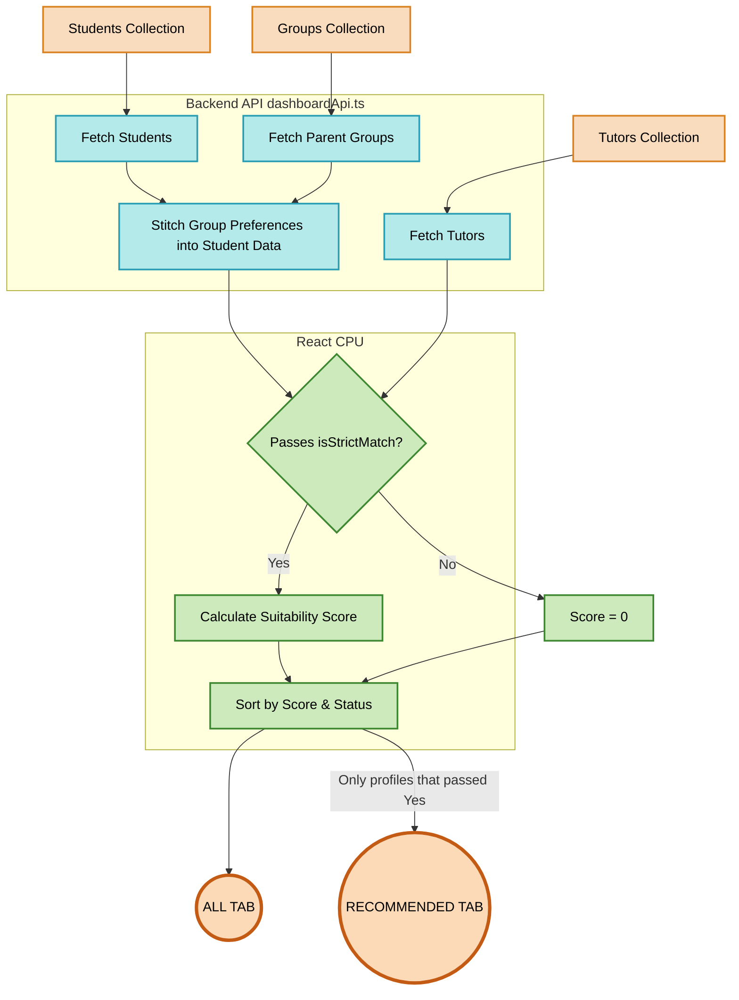

# Ranking & Matchmaking Architecture

Welcome! This document explains exactly how the platform matches Students with Teachers. We've designed this guide to be so simple that anyone can understand it, while also providing the exact technical database fields for developers.

---

## The Big Picture: How It Works

Imagine a giant funnel. When a user opens their dashboard, the platform pours all available profiles into this funnel. The funnel has two layers:

1. **The "All" Tab (The Open Market):** This shows everyone. It gives every profile a "Suitability Score" (like grading a test) and sorts them so the best matches float to the top.
2. **The "Recommended" Tab (The VIP Lounge):** This is highly exclusive. Before a profile can enter this tab, it must pass a strict security check (the `isStrictMatch` filter). If they fail even one critical requirement (like teaching the wrong grade), they are blocked from this tab entirely.

---

## 1. The Strict Filter (Who gets into "Recommended"?)

Before the system does any heavy math, it runs a fast Yes/No check called the **Strict Filter**. 

If a profile fails **any** of the following rules, they are instantly rejected from the Recommended tab:

| Rule | Explanation | Database Fields Used |
| :--- | :--- | :--- |
| **1. Category** | A Programming student will *never* see a School teacher. | `category` (Student & Teacher) |
| **2. Board** | If the student is CBSE, the teacher *must* teach CBSE. | `board` (Student) <-> `boards` (Teacher) |
| **3. Class** | If the student is 10th grade, the teacher *must* teach 10th grade. | `classLevel` (Student) <-> `classes` (Teacher) |
| **4. Gender Pref** | If a student requests a "Female" teacher, male teachers are blocked. | `teacherGenderPreference` (Group/Tuition Request) <-> `gender` (Teacher) |
| **5. Subjects** | The teacher *must* offer **100%** of the subjects the student asked for. | `subjects` (Student) <-> `subjects` (Teacher) |

> **Developer Note:** This check is powered by the `isStrictMatch()` function in `matching.ts`. To save battery and CPU on mobile phones, we run this fast filter *before* calculating scores!

---

## 2. The Point System (How do we calculate the Score?)

If a profile passes the strict filter (or if the user is looking at the "All" tab), the system calculates their **Suitability Score**. 

Points are awarded based on how well the Teacher and Student match:

- **+20 Points** for matching the Board.
- **+30 Points** for matching the Class/Grade.
- **+50 Points** for **EVERY** subject they have in common. (e.g., matching Math and Science = 100 points!)
- **+0 to +30 Points** based on Budget. If the student's budget exactly matches the teacher's fee, they get 30 points. As the price gap widens, the points decrease.

---

## 3. The Sorting Order (Who is #1?)

Once everyone has a score, the UI sorts the cards from top to bottom. The priority is:

1. **Active Conversations (VIPs):** Anyone you are actively negotiating with gets an invisible **+1000 points** to force them to the absolute top of your screen. (Declined people get -1000 points).
2. **Highest Score:** The highest Suitability Score comes next.
3. **Budget Tie-Breaker:** If two teachers both have a score of 80, the one whose fee is closest to the student's budget wins the tie.

---

## The Data Flow (Mermaid Diagram)

Here is a visual map of how data moves from the Firebase Database to the User's Screen:

---

## Developer Architecture Notes (Portal Differences)

Because Teachers and Students browse differently, the data pipelines are slightly mirrored:

### Teacher Portal Pipeline
- The API (`dashboardApi.ts`) fetches paginated **Students**.
- **The Stitching Magic:** Because `teacherGenderPreference` lives in the `groups` collection (not the student document), the API extracts the `groupDocId` of every student, does a secondary fetch for those groups, and stitches the group data directly into the student payload (`requestDoc`).
- The frontend then evaluates `isStrictMatch(studentGroup, activeTeacher)`.

### Student Portal Pipeline
- The API fetches all available **Tutors**.
- The frontend already has the logged-in Student's `activeGroup` data in memory.
- The frontend dynamically builds a `scoringContext` that merges the student's personal info with their group's `requestDoc` (which holds the gender preference).
- The frontend then evaluates `isStrictMatch(scoringContext, tutor)`.
