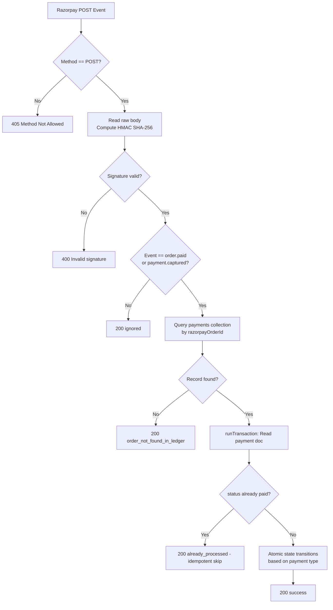

# Razorpay Webhook Architecture

This document describes the server-to-server Razorpay webhook integration for Mi-Tutora — covering both handler implementations, the 5-step processing pipeline, idempotency guarantees, atomic state transitions, and escrow creation math.

---

## 1. Purpose

The webhook handler guarantees **100% payment reconciliation** even when a user closes their browser before the client-side verification flow completes. Razorpay calls the registered endpoint directly from their servers on every successful payment event, independent of client activity.

---

## 2. Two Parallel Webhook Handlers

Both handlers implement the same core pipeline. Only **one** should be registered as the active webhook endpoint in the Razorpay dashboard.

| Handler | Location | Type | Handles `demo` payment type? |
| :--- | :--- | :--- | :---: |
| `handleRazorpayWebhook` | [`functions/src/webhooks/razorpayWebhook.ts`](../functions/src/webhooks/razorpayWebhook.ts) | Cloud Function `onRequest` (2nd Gen) | ❌ No |
| `POST /api/webhooks/razorpay` | [`web/src/app/api/webhooks/razorpay/route.ts`](../web/src/app/api/webhooks/razorpay/route.ts) | Next.js App Router | ✅ Yes |

> [!IMPORTANT]
> The **Next.js route** is the more complete implementation. It additionally handles `type === 'demo'` payment events, which set `status: 'demo_booking_phase'` and `demoPaymentPaid: true` on the application. The Cloud Function version does not handle demo payments and should only be used if the Next.js route is unavailable.

---

## 3. Processing Pipeline (5 Steps)



### Step 1 — Method Guard
Reject any non-POST request with `405 Method Not Allowed`.

### Step 2 — HMAC SHA-256 Signature Verification
```
rawBody          = req.text() (raw bytes — not parsed JSON)
expectedSig      = HMAC-SHA256(rawBody, RAZORPAY_WEBHOOK_SECRET).hex()
incomingSig      = request.headers['x-razorpay-signature']
```
If signatures don't match → `400 Invalid signature`. Forged or replayed requests are rejected.

### Step 3 — Event Filter
Only `order.paid` and `payment.captured` are processed. All other event types return `200 { status: 'ignored' }` — Razorpay requires a `200` acknowledgement even for unhandled events.

### Step 4 — Idempotency Lock
The handler uses `db.runTransaction()`:
- Reads the payment doc inside the transaction
- If `status === 'paid'` → skips all writes, returns `200 { status: 'already_processed' }`
- Prevents duplicate escrow creation and double application status updates on retry or duplicate delivery

### Step 5 — Atomic State Transitions
Based on the payment `type` field stored in the `payments` ledger record:

| Payment Type | `isRemoval` | Application Update | Additional Writes |
| :--- | :---: | :--- | :--- |
| `'demo'` | — | `status: 'demo_booking_phase'`, `demoPaymentPaid: true` | — |
| `'tuition'` | `true` | `status: 'declined'`, `feePaid: true` | — |
| `'tuition'` | `false` | `status: 'tuition_started'`, `feePaid: true` | Mark `pending_tuition_fees` as paid; create `tutor_payouts` escrow |

All writes within the state transition are executed inside the same `runTransaction` — fully atomic.

---

## 4. Payment Ledger Update Fields

On every successfully processed event, the `payments/{docId}` record is updated:

```json
{
  "status":           "paid",
  "razorpayPaymentId": "pay_XXXX",
  "verifiedVia":       "webhook",
  "verifiedAt":        "<ServerTimestamp>",
  "updatedAt":         "<ServerTimestamp>"
}
```

---

## 5. Escrow Creation (Tuition Payment — Non-Removal)

When a tuition payment is successfully verified and `isRemoval: false`, a `tutor_payouts` escrow document is created with a **deterministic document ID** to guarantee idempotency:

```
payoutDocId = 'payout_' + applicationId
```

### Escrow Math

```
grossAmount        = application.finalPrice || application.currentOffer || application.budget || 4000
platformFee        = round(grossAmount × 0.40)     // 40% platform commission
tutorShare         = round(grossAmount × 0.60)     // 60% tutor net
rewardAmount       = round(platformFee × 0.25)     // 25% of platform cut → referral reward
releaseEligibleAt  = application.startDate + 30 days (milliseconds)
```

### Escrow Fields Written to `tutor_payouts/{payout_appId}`

| Field | Value |
| :--- | :--- |
| `payoutDocId` | `'payout_' + applicationId` |
| `applicationDocId` | Foreign key to `applications` |
| `studentPaymentId` | Razorpay `pay_` ID from this event |
| `tutorDocId` | From application |
| `tutorName` | Denormalized from application |
| `parentDocId` | From application |
| `grossAmount` | Computed above |
| `platformFeeRate` | `0.40` |
| `platformFeeAmount` | Computed above |
| `tutorShareRate` | `0.60` |
| `tutorShareAmount` | Computed above |
| `referralReward` | Computed above |
| `monthNumber` | `1` |
| `status` | `'escrow_held'` |
| `startDate` | From application |
| `paidByStudentAt` | `ServerTimestamp` |
| `releaseEligibleAt` | `startDate + 30d` (ms) |
| `payoutMethod` | `'upi'` |
| `payoutVpa` | `''` (populated by `dailyPayouts` on Day 30) |
| `razorpayPayoutId` | `''` (populated on payout) |
| `utrNumber` | `''` (populated on payout) |
| `createdAt` | `ServerTimestamp` |
| `paidAt` | `null` |

The document is created with `{ merge: true }` — safe to retry without duplication.

---

## 6. Environment Variable

| Variable | Purpose |
| :--- | :--- |
| `RAZORPAY_WEBHOOK_SECRET` | Primary secret for HMAC signature verification. Falls back to `RAZORPAY_KEY_SECRET` if not set. Must match the secret configured in the Razorpay dashboard for the registered webhook endpoint. |

---

## 7. Differences Between the Two Handlers

| Behaviour | Cloud Function | Next.js Route |
| :--- | :---: | :---: |
| HMAC signature verification | ✅ | ✅ |
| Idempotency via `runTransaction` | ✅ | ✅ |
| Handles `order.paid` / `payment.captured` | ✅ | ✅ |
| Handles `type === 'demo'` payments | ❌ | ✅ |
| Sets `verifiedVia: 'webhook'` on payment | ✅ | ✅ |
| Sets `payoutVpa: ''` placeholder on escrow | ❌ | ✅ |
| Sets `paidAt: null` placeholder on escrow | ❌ | ✅ |

---

## 8. Codebase References

| File | Purpose |
| :--- | :--- |
| [`functions/src/webhooks/razorpayWebhook.ts`](../functions/src/webhooks/razorpayWebhook.ts) | Cloud Function webhook handler |
| [`web/src/app/api/webhooks/razorpay/route.ts`](../web/src/app/api/webhooks/razorpay/route.ts) | Next.js webhook handler (more complete) |
| [`web/src/app/api/payouts/process/route.ts`](../web/src/app/api/payouts/process/route.ts) | Admin payout processing — reads `tutor_payouts` created by webhook |
| [`functions/src/scheduled/dailyPayouts.ts`](../functions/src/scheduled/dailyPayouts.ts) | Day 30 scheduler — reads `escrow_held` records created by webhook |
