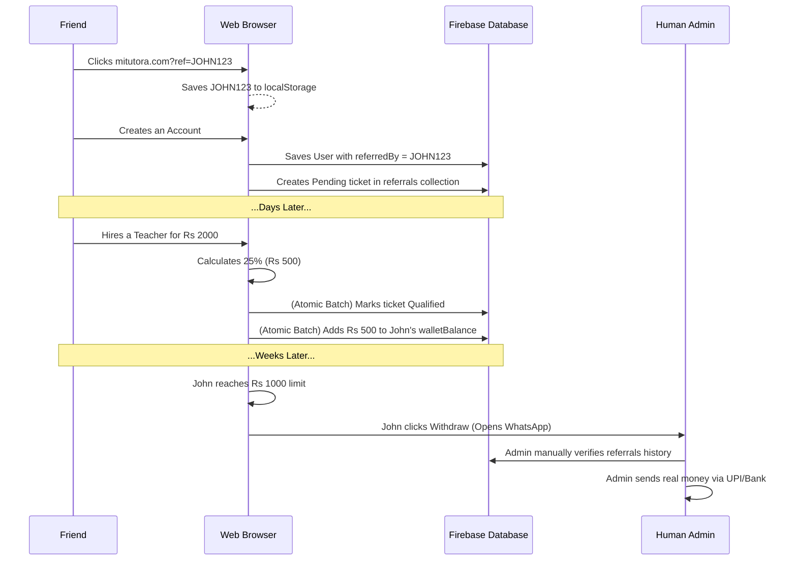

# Referral & Wallet Architecture

Welcome! This document explains how the Referral and Rewards system works. We've made this guide so simple that anyone can understand it, while also giving developers the exact database fields used behind the scenes.

---

## The Big Picture: How It Works

Imagine you are a player in a game. 
1. **The Code:** After completing your formal Profile Setup, the system generates a unique secret code (your Referral Code) using your professional identity.
2. **The Link:** You share a link with your friend.
3. **The Cookie:** When your friend clicks the link, the website "remembers" your code in their browser cookie.
4. **The Signup:** When your friend signs up, the website permanently links your account to theirs.
5. **The Reward:** When your friend finally hires a teacher (or gets hired), the system calculates 25% of the tuition fee and drops it into your Wallet!
6. **The Cash Out:** Once you hit Rs 1,000, you hit "Withdraw" and text the Admin to get your real money.

---

## 1. The Database Fields (Where does data live?)

Here is exactly where all the referral data is stored in the Firebase Database:

| Step | What happens? | Collection | Fields Used |
| :--- | :--- | :--- | :--- |
| **Identity** | A user's total money, code, and formal name. | `users` | `referralCode` (String), `walletBalance` (Number), `name` (Formal Profile Name) |
| **Signup** | When a new user joins using a link. | `users` | `referredBy` (UID of referrer), `referrerName` (Formal Name of referrer) |
| **Tracking** | A ticket proving the referral happened. | `referrals` | `referrerId`, `referredId`, `status` ("pending" or "qualified"), `rewardAmount` |
| **Trigger** | The moment the 25% reward is calculated. | `applications` | `finalPrice` or `budget` (Number), `status` (changes to "tuition_started") |

---

## 2. The Link & Cookie (How we never lose a referral)

When someone clicks `mitutora.com?ref=JOHN123`:
- A global tracker (`ReferralTracker.tsx`) instantly catches the `JOHN123` code and hides it inside the browser's `localStorage` (like a cookie).
- Even if the user closes the website and comes back a week later to sign up, the website checks `localStorage`, finds `JOHN123`, and automatically gives John the credit!

---

## 3. Real-Time Tracking (How it feels like magic)

When a friend signs up using your link, they appear on your dashboard **instantly**. 
- The dashboards use a Firebase `onSnapshot` websocket listener to continuously monitor the `referrals` collection.
- You do not need to refresh the page. The moment their account is created, your "Your Referrals" list updates in real-time.

---

## 4. The 25% Magic Math (How you get paid)

Because we run on a free database, we don't use expensive background servers to calculate money. Instead, the magic happens exactly when a Student clicks **"Hire Teacher"**.

1. The Student and Teacher agree on a price (e.g., Rs 2,000).
2. The Student clicks "Hire".
3. The app (`executeAppointTutor` in `useDashboardActions.ts`) calculates 25% of Rs 2,000 = Rs 500.
4. The app checks if the Student or Teacher were referred by anyone.
5. In one lightning-fast, secure database move (a "Batch Write"), it marks the referral as "Qualified" and adds Rs 500 to the referrer's `walletBalance`.

---

## 5. The WhatsApp Security Firewall

Because the math happens in the browser, a hacker could theoretically try to trick the system into giving them Rs 1,000,000. 

**How do we stop them?** By using a human firewall!
- The system does **not** have an automatic bank payout button.
- You can only withdraw when you reach Rs 1,000.
- When you click "Withdraw", it simply opens a **WhatsApp chat** with the platform Admin.
- If a hacker changes their balance to 1 Million, all they can do is send a WhatsApp text. The Admin will check the database history, see they lied, and block them!

---

## The Data Flow (Mermaid Diagram)

Here is a visual map of how a referral travels from a Link to a Wallet:

