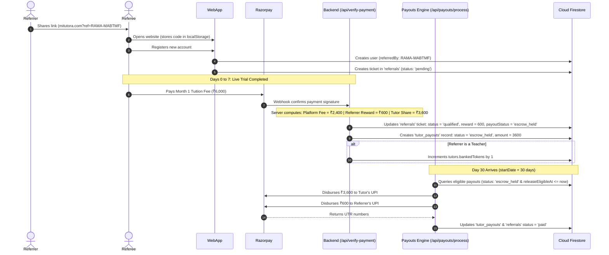

# Referral & Rewards Architecture

This document explains the referral and rewards system on the Mi-Tutora platform, covering the attribution tracking, the mathematical incentive calculation, role-based rewards, and the secure backend qualification engine.

---

## 1. Executive Summary & The Referral Lifecycle

1. **The Referral Code:** Upon registration, every user is assigned a unique personal referral code (e.g. `RAMA-MABTMF`) generated via `generateReferralCode()`.
2. **The Link & Cookie:** The user shares their invite link (`mitutora.com?ref=CODE`). A global listener (`ReferralTracker.tsx`) caches this code in `localStorage`.
3. **Account Attribution:** When the referee registers, a permanent record is established in the `users` collection (`referredBy: CODE`) and a tracking ticket is created in the `referrals` collection with `status: 'pending'`.
4. **The Settlement Trigger (Day 7 Payment):** When the referred user completes their 7-day trial and pays their first-month tuition fee via Razorpay (`/api/verify-payment`), the referral status advances from `'pending'` to `'qualified'`. The reward amount is calculated and placed in **escrow** (`payoutStatus: 'escrow_held'`).
5. **Role-Based Reward Distribution:**
   - **If Referrer is a Student/Parent:** Receives **Cash** ($25\%$ of platform commission) held in escrow until Day 30, then deposited automatically via UPI.
   - **If Referrer is a Teacher:** Receives **1 Banked Token** credited to `tutors.bankedTokens` to unlock extra weekly proposals.
6. **Synchronized Day 30 Automated UPI Payout:** On Day 30 (`startDate + 30 days`), the platform's automated payout engine disburses the referral cash directly to the student referrer's saved UPI ID via Razorpay Payouts simultaneously alongside the tutor's 60% fee. There is **zero minimum threshold** (no waiting for ₹1,000) and no manual WhatsApp messaging required.

---

## 2. The Referral Reward Math Formula

The platform operates on a **40% first-month commission model**. The referral reward is strictly funded out of the platform's commission margin:

$$\text{Gross Tuition Fee } (G) = \text{Amount paid by student on Day 7}$$
$$\text{Platform Commission } (P) = G \times 0.40 \quad (40\% \text{ of gross})$$
$$\text{Referral Reward } (R) = P \times 0.25 = G \times 0.10 \quad (25\% \text{ of platform margin} = 10\% \text{ of gross})$$
$$\text{Platform Retained Margin } = P - R = G \times 0.30 \quad (30\% \text{ net retained revenue})$$

### Concrete Calculation Examples

| Monthly Tuition Fee | Platform Fee (40%) | Student Referrer Reward (Cash) | Teacher Referrer Reward (Tokens) | Platform Net Margin |
| :---: | :---: | :---: | :---: | :---: |
| **₹4,000** | ₹1,600 | **₹400** | +1 Banked Token | ₹1,200 |
| **₹6,000** | ₹2,400 | **₹600** | +1 Banked Token | ₹1,800 |
| **₹8,000** | ₹3,200 | **₹800** | +1 Banked Token | ₹2,400 |
| **₹10,000** | ₹4,000 | **₹1,000** | +1 Banked Token | ₹3,000 |

> **Dashboard Transparency:**  
> This formula matches the exact guarantee displayed on the student dashboard ([`student/page.tsx:L2611`](../web/src/app/dashboard/student/page.tsx#L2611)):  
> *"Earn 25% of the initial company margin (approx. 10% of total course value) when your friend books their first class!"*

---

## 3. Database Schema & State Transitions

### Database Collections Involved

| Step | What happens? | Collection | Fields Used |
| :--- | :--- | :--- | :--- |
| **Identity** | User's unique code & payout UPI | `users` | `referralCode`, `upiId`, `name` |
| **Attribution** | Link between referee and referrer | `referrals` | `referrerId`, `referrerName`, `referredUserId`, `referredUserName`, `referralType`, `status` (`'pending'` \| `'qualified'`), `reward`, `rewardType`, `payoutStatus` (`'escrow_held'` \| `'ready_for_payout'` \| `'processing'` \| `'paid'` \| `'action_required_missing_upi'`), `releaseEligibleAt`, `payoutVpa`, `utrNumber`, `paidAt` |
| **Trigger** | Day 7 tuition payment settlement | `payments` | `applicationDocId`, `status` (`'paid'`), `type` (`'tuition'`) |
| **Automated Payout** | Direct Day 30 transfer to referrer's UPI | `referrals` + Razorpay Payouts API | `payoutVpa`, `utrNumber`, `paidAt` (Disbursed via `/api/payouts/process`) |

---

## 4. End-to-End Sequence Diagram

---

## 5. Security & Anti-Fraud Locks

1. **Server-Side Authorization:** Referral rewards are never calculated on the frontend. The math is strictly executed inside the atomic database transaction in `/api/verify-payment` after validating cryptographic Razorpay HMAC signatures.
2. **Self-Referral Prevention:** Users cannot enter their own referral code during registration.
3. **Single Qualification Lock:** The backend query explicitly filters for `status == 'pending'`. Once marked `'qualified'`, a referral can never trigger a second reward.
4. **Escrow Safety Lock:** Funds are held in escrow until Day 30 (`startDate + 30 days`), preventing any payout leakage if a class is discontinued during the 7-day trial.
5. **Direct UPI Validation:** Referrer UPI IDs are validated via regex format check (`/^[\w.\-_]{2,256}@[a-zA-Z]{2,64}$/`) before disbursement. If missing, the status safely transitions to `'action_required_missing_upi'` without failing.

