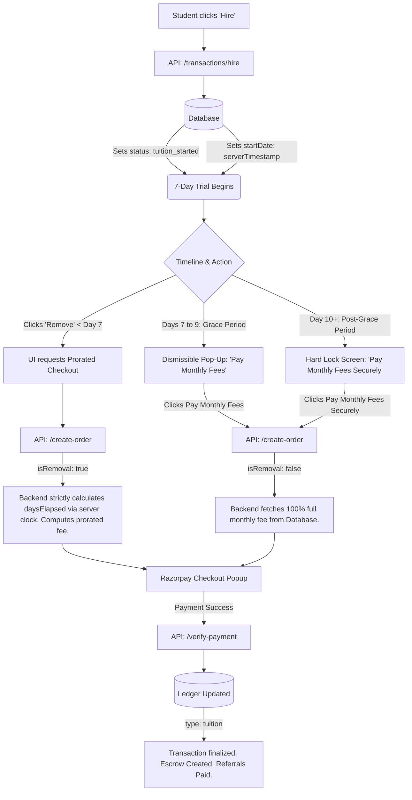

# Student Fee Payment & Cancellation Architecture

This document maps out the precise business logic, the Razorpay integration, and the exact workflow for how students pay for tuitions, including the 7-day trial and the secure backend mathematical locks.

---

## 1. The "Hire Teacher" Lifecycle (Flow Diagram)

The following diagram illustrates the exact technical journey from the moment a student decides to hire a teacher, through the 7-day trial, and finally into the secure Razorpay payment gateway.

---

## 2. Payment Gateway Integration (Razorpay)

The payment system is deeply integrated to protect against client-side tampering while elegantly handling three distinct types of transactions.

### A. Order Generation (`/api/create-order`)
When a student initiates a payment, the frontend passes `role: 'student'` and an `isRemoval` flag. 
*   **Security Lock:** The backend completely ignores the price sent by the frontend. It fetches the application data directly from Firestore.
*   **The Prorated Math Engine:** If `isRemoval` is true, the backend calculates the difference between Google's atomic server time (`admin.firestore.Timestamp.now().toMillis()`) and the exact `startDate`. 
    *   If it is under 7 days, it mathematically prorates the monthly fee exactly.
    *   If it is 7 days or more, it rejects the discount and charges the 100% full fee.
*   **Ledger Tagging:** Before sending the order to Razorpay, the system creates a pending entry in the `payments` collection tagged securely as `type: 'tuition'`.

### B. Payment Verification (`/api/verify-payment`)
When Razorpay successfully charges the card, it pings this secure webhook.
*   The system cross-references the `razorpayOrderId` with the `payments` ledger.
*   **Referral Engine Trigger:** If the payment is a full tuition fee, the system automatically checks for a `pending` referral. 
    *   If a student referred them, they earn **25% of the platform's 40% margin** (approx. 10% of total course value) as wallet cash.
    *   If a teacher referred them, they earn 1 Banked Token (Free Request).
*   **Auto-Decline:** Finally, all competing tuition requests for that specific student are automatically marked as `declined` so the queue stays clean.

---

## 3. The Business Logic Phases

### Phase 1: The 7-Day Trial Period
**Trigger:** The teacher is hired and the application status changes to `tuition_started`. The system begins counting `daysElapsed` starting from the `startDate`.

*   **Status:** The student receives classes but has not paid the monthly fee yet (`feePaid: false`).
*   **The Admin Tracker:** The moment the student hires the teacher, a record is added to the `pending_tuition_fees` database collection to track unpaid dues.
*   **Cancellation Policy (Prorated):** 
    *   If the student decides they do not like the teacher and clicks "Remove Teacher" **before** 7 days have passed (`daysElapsed < 7`).
    *   They must pay a **prorated fee** calculated exactly for the number of days they attended: `(Monthly Fee ÷ Days in Month) × Days Elapsed`.
    *   Once this prorated exit-fee is paid via Razorpay, the teacher is officially removed.

### Phase 2: The 3-Day Grace Period (Days 7 to 9)
**Trigger:** 7 full days have elapsed (`daysElapsed >= 7` but `< 10`) and the fee is still unpaid (`feePaid: false`).

*   **Status:** The trial period has officially ended, but the student is in an active 3-day grace period.
*   **Student View (Dismissible Pop-Up):**
    *   Every time the student opens or refreshes the portal, an amber **"Monthly Tuition Fee Due"** reminder pop-up appears displaying the tutor name, monthly fee, and active grace window.
    *   The student can click **"Remind Me Later"** or **`✕`** to dismiss the pop-up and freely browse and use all dashboard tabs without lockout.
    *   Clicking **"Pay Monthly Fees"** opens the Root-Level Payment Modal to settle fees via Razorpay.
*   **Teacher View:** The teacher sees an amber status indicating the student's trial is completed and they are in their 3-day grace period awaiting fee collection.
*   **Late Cancellation Penalty:** If the student attempts to click "Remove Teacher" at this stage without having paid, the platform backend denies the prorated discount. They are forced to pay the 100% full monthly fee as a penalty to clear their dues before the teacher is removed.

### Phase 3: The Hard Lock (Day 10+)
**Trigger:** 10 full days have elapsed (`daysElapsed >= 10`) and the fee is still unpaid (`feePaid: false`).

*   **Status:** The 3-day grace period has expired without payment.
*   **Student View (Full Account Lockout):**
    *   The entire main dashboard area is replaced with a dedicated red **"Account Locked"** screen.
    *   **Sidebar Navigation Locked:** All sidebar tabs (Dashboard, New Tuition, Requests & Offers, Notifications, My Teachers, Referrals) display a lock icon (`🔒`), are dimmed with `opacity-50 cursor-not-allowed`, and disabled. Clicking any tab shows a toast warning: *"Account locked. Please clear pending tuition fees to unlock your dashboard."*
    *   The student must click **"Pay Monthly Fees Securely"** on the lock card, which mounts the root-level payment modal and opens the Razorpay checkout overlay.
*   **Teacher View:** The teacher sees a red alert on their dashboard instructing them to halt tuitions until the student pays the platform.

### Phase 4: Post-Payment (Escrow Holding & Strict Zero Refund)
**Trigger:** The student has successfully paid the full monthly fee via Razorpay (`feePaid: true`).

*   **Status:** The transaction for the month is finalized and secure. The `pending_tuition_fees` tracking document is resolved.
*   **Financial Split & Escrow Custody:** The platform retains its **40% commission**, and atomically logs an escrow record in `tutor_payouts` for the remaining **60% tutor share**. The funds are safely held until Day 30 (`startDate + 30 days`).
*   **Automated Day 30 Payout:** Upon reaching Day 30, the platform triggers the Razorpay Payouts API to transfer the 60% balance directly to the teacher's UPI ID.
*   **First-Month Only Intermediation:** The platform fee and escrow process occur strictly for Month 1. For Month 2 onwards, parent and teacher coordinate classes and tuition fees directly offline without platform cuts.
*   **Cancellation Policy (Zero Refund):** 
    *   If the student clicks "Remove Teacher" at any point **after** paying the monthly fees, the teacher is immediately removed from the group, stopping future classes.
    *   The student receives **NO REFUND** for the remainder of the month. The platform policy is strict: once the post-trial monthly fee is submitted, it is locked in.

---

## 4. Platform Security Rules

**Account Deletion Lock:** To prevent bad actors from evading payment dues or destroying active tuition agreements by deleting their account, the platform enforces a strict **server-side barrier** via the `deleteUserAccount` Cloud Function (`functions/src/callable/deleteAccount.ts`) and `/api/auth/delete-account`. If a user attempts to delete their account while any active tuition exists (`status === 'tuition_started'`), the server strictly rejects the request with a `FAILED_PRECONDITION` error, protecting both unpaid fees and Day 30 escrow custody.
