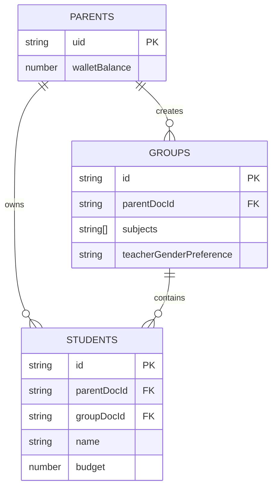
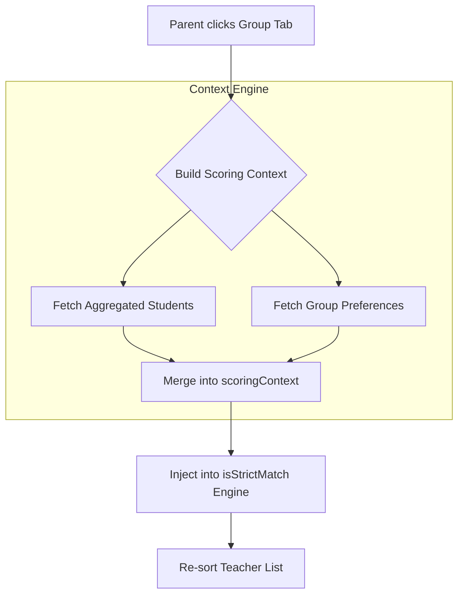

# Student Grouping Architecture

This document outlines the architectural logic behind how student profiles are organized, grouped, and fed into the matchmaking engine on the platform.

---

## 1. The Big Picture: Why Groups?

In many tutoring platforms, a parent creates a student profile and requests a teacher for that specific student. However, our platform allows a single teacher to teach multiple siblings or friends simultaneously in a single batch.

To support this without breaking the matchmaking engine, the system separates the concept of a **Student** (the person) from a **Group** (the class requirements).

*   **The Parent:** The account holder who logs in and pays the bills.
*   **The Student:** The individual person taking the class.
*   **The Group:** The "Class". It holds the shared requirements (e.g., Mathematics, 10th Grade, Female Teacher preferred) and binds one or more students to those requirements.

Teachers are matched against **Groups**, not individual students.

---

## 2. The Database Hierarchy

The architecture is driven by three distinct collections in Firestore, tied together by foreign keys.

*   **`parents` Collection:** Represents the overarching account. Contains the wallet balance and daily usage limits.
*   **`students` Collection:** Represents the individual learners. Each document contains personal details (name, age) and a crucial `groupDocId` field.
*   **`groups` Collection:** Represents the shared requirements. Contains arrays of requested subjects, combined budgets, and teacher preferences.

### The Glue (`groupDocId`)
The `groupDocId` field on the `students` document is the physical link. If two siblings (Alice and Bob) both have `groupDocId: "group_math_101"`, the system knows they are taking that class together.

---

## 3. The Frontend Aggregation Engine

To minimize database reads and keep the UI blazing fast, the frontend dynamically aggregates the physical students into logical groups using React's `useMemo`.

### How Aggregation Works
1.  **Bucketing:** The system loops through every student owned by the parent and buckets them by their `groupDocId`.
2.  **Name Combining:** If a group has multiple students, the UI dynamically generates a plural name (e.g., `"Group: Alice, Bob"`). If it is a solo student, it just uses their name (`"Alice"`).
3.  **Budget Summing:** The system mathematically sums the individual `budget` of each student into a single `totalBudget` for the group. (e.g., Alice's Rs. 500 + Bob's Rs. 500 = Group Budget of Rs. 1000).
4.  **Virtual Groups:** If a student was created before groups existed and lacks a `groupDocId`, the engine safely wraps them in a virtual group called `indv_{student_id}` so the UI doesn't crash.

---

## 4. Dynamic Matchmaking (The Scoring Context)

The most powerful feature of the grouping architecture is how it instantly alters the teacher recommendations in real-time.

When a parent clicks a different Group tab in the UI:
1.  The UI pulls the aggregated physical people (`activeGroup`).
2.  The UI pulls the shared database preferences (`activeGroupDoc`).
3.  It merges both objects into a single master object called the `scoringContext`.

This `scoringContext` is immediately fed into the `isStrictMatch()` algorithm. Because the context changed, the entire list of teachers instantly re-evaluates, re-scores, and re-sorts itself to perfectly match the newly selected group's exact needs.

---

## 5. Legacy Backward Compatibility

To ensure older accounts do not break under the new architecture, the system employs a cascading fallback mechanism.

When building the `scoringContext`, the system attempts to find the preferences in the modern `groups` collection. If it cannot find them, it automatically falls back to searching the legacy `tuitionRequests` collection using the group's ID. This allows legacy users to continue navigating the app seamlessly while new users utilize the upgraded database structure.

---

## 6. Architecture Diagrams

### Entity-Relationship (ER) Diagram
This maps the relational structure in the database.

### Data Flow Diagram (Context Engine)
This maps how a UI click flows into the Matchmaking Engine.

