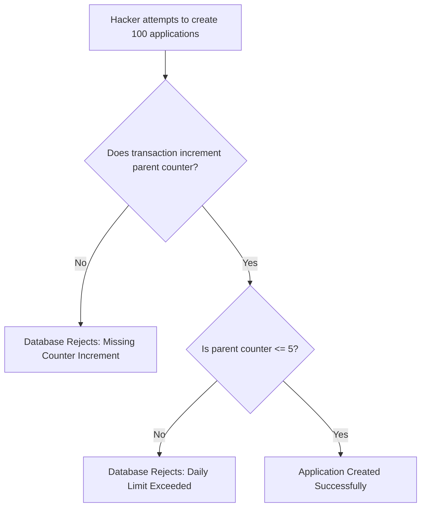
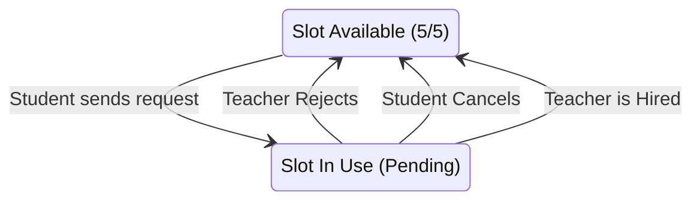
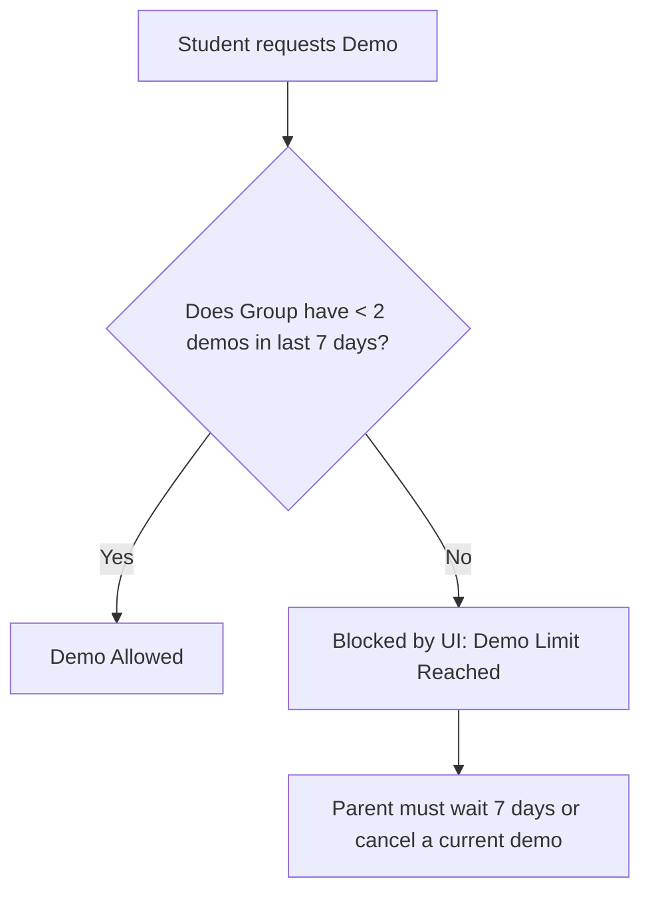

# Student Queue Architecture

This document explains the exact rules and technical architecture behind how the Student Portal manages tuition requests and demo scheduling.

To ensure teachers are not spammed with fake requests, and to prevent users from hoarding free trial classes, the platform uses a strict, three-layered defense system.

---

## The Big Picture: The Three Layers

Think of a Parent as someone visiting a school, and their "Groups" as the specific subjects they want to learn (for example, a Math Group and a Science Group). 

The system protects the platform using three distinct layers:

1. **Layer 1: The Daily Ticket Limit (Parent Level).** The Parent gets exactly 5 tickets when they log in every day. They cannot get more tickets, no matter how many Groups they create.
2. **Layer 2: The Concurrent Queue (Group Level).** A specific Group can only wait for up to 5 teachers to respond at the same time. If a teacher declines, the slot is freed up.
3. **Layer 3: The Demo Limit (Group Level).** A specific Group can only actively test out 2 teachers in a given week.

---

## Layer 1: The 5-Per-Day Security Lock (Backend Enforced)

This is the ultimate security measure that protects the platform from hackers and malicious scripts. It ensures that a single user account can never spam the database.

### How it works
Every Parent account has a hard limit of 5 outbound requests per calendar day. Because this limit is tracked on the Parent document, a hacker cannot bypass it by creating dozens of fake Student Groups. 

### Technical Implementation
This layer is enforced strictly at the database level using **Cross-Document Batch Enforcement** in `firestore.rules`. 
- **Collections Used:** `parents` and `applications`
- **The Lock:** The database rules mathematically prevent the `dailyUsage.count` on the parent document from ever exceeding 5. 
- **The Chain:** The database rules completely reject any attempt to create an `application` unless the user is simultaneously incrementing their parent daily counter in the exact same transaction. 

---

## Layer 2: The 5-Concurrent Request Queue (Frontend UX)

While Layer 1 stops hackers, Layer 2 ensures that genuine students are serious about their active requests. A specific Student Group can only juggle 5 pending requests at any given moment.

### How it works
1. **Consuming a Slot:** When a student requests a teacher, they occupy 1 slot for that Group.
2. **Refunds:** The slot is immediately freed up if:
   - The Teacher declines the request.
   - The Student clicks "Cancel Request".
   - The request completes successfully (the teacher is hired).

### Technical Implementation
This layer is evaluated locally on the frontend. It acts as a UX guide rail to prevent the user from blindly clicking "Request" on every teacher in the list.
- **Collections Used:** `applications` (Frontend SWR Cache)
- **Fields Filtered:** 
  - `groupDocId`: Strictly filtered to the currently active group.
  - `status`: Checks if the status matches any "Pending" state (e.g., `negotiating`, `pending`, `demo_requested_by_student`).

---

## Layer 3: The 2-Demo Anti-Spam Limit (Frontend UX)

While students can have 5 pending requests, we impose an even stricter limit on actual Demo Classes to prevent free-trial hoarding.

### How it works
A single Student Group is only allowed to have **2 active or recent demos within a rolling 7-day window**. 
If they try to request a 3rd demo, the UI blocks them and forces them to either complete their current demos or explicitly cancel one of them. 

### Technical Implementation
Like Layer 2, this is evaluated locally on the frontend.
- **Collections Used:** `applications` (Frontend SWR Cache)
- **Fields Filtered:**
  - `groupDocId`: Strictly filtered by the active group.
  - `status`: Checks for demo-specific phases (e.g., `demo_booking_phase`, `demo_scheduled`).
- **The Time-Window Math:** The system checks the `updatedAt` timestamp. If less than 7 days have passed, it counts toward the 2-demo limit. Once 7 days pass, the demo slot naturally expires and frees up.

---

## Layer 4: Serverless Queue Pruning & Auto-Decline Trigger (`onApplicationWritten`)

To guarantee database consistency and eliminate orphaned active queue slots, queue state changes are governed server-side by the 2nd Gen Firestore trigger `onApplicationWritten` (`functions/src/triggers/onApplicationWritten.ts`):

1. **Auto-Declining Competing Leads:**
   The moment any application transitions to `tuition_started` (a tutor is hired), this background trigger searches for all other open applications associated with that `groupDocId` and automatically transitions them to `declined` with `reason: 'student_hired_another_tutor'`.
2. **Queue Cleanup & Slot Liberation:**
   The trigger updates the respective tutors' `pendingRequests` arrays and resets the student's concurrent request count, ensuring slots are immediately liberated across the marketplace.
3. **Event-Driven Idempotency:**
   Because this runs as an asynchronous Cloud Function trigger, network drops or closed browser tabs on the parent's device cannot interrupt the queue cleanup process.

---

## Note on Initiator Roles

It is important to note that these limits primarily apply to **Student-Initiated** actions. 
If a Teacher spends their own weekly tokens to send an inbound offer to a Student, it acts as a "free lead" for the Student and does not consume the Student's 5-Per-Day limit.
