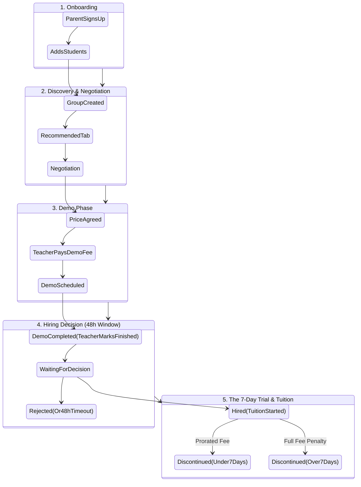

# Platform Business & Technical Architecture

Welcome! This document explains how the platform works from both a business perspective and a technical perspective. We've designed this to be easy to understand for everyone, while still listing the exact database collections developers need.

---

## The Big Picture: How the Platform Works

At its core, the platform connects **Students/Parents** with **Teachers**. The journey goes through five main phases:

1. **Onboarding & Grouping:** Parents create profiles and add their kids.
2. **Discovery & Negotiation:** Teachers and Students find each other and haggle on price.
3. **Demo Phase:** The teacher pays a fee and a trial class is scheduled and completed.
4. **Hiring Decision:** The student has a strict 48-hour window to hire or reject the teacher.
5. **The 7-Day Trial & Tuition:** The final decision and payment phase.

Here is a visual map of the entire business flow:

---

## 1. Student Onboarding & The "Group" Logic

When a Parent signs up, they create a profile and add their children (Students). 

**The Business Rule:** Every student *must* belong to a "Group". 
- If a parent adds 1 student, they are placed in a solo group.
- If a parent adds 3 students, the parent can put all 3 in a single group (so they are taught together) or split them into different groups.

**Database Architecture:**
- **Collections used:** `parents`, `students`, `groups`
- **How it connects:** The system creates a `groupDocId` in the `groups` collection. Every student inside that group has this `groupDocId` saved on their profile. 
- **Why?** Because Teachers don't apply to individual students; they apply to the **Group**. This makes batch-teaching seamless.

---

## 2. Discovery & 2-Way Negotiation

**The Business Rule:** Teachers see matching Student Groups in their "Recommended" tab. Both the Teacher and the Student can start negotiating the tuition fee.

**Database Architecture:**
- **Collections used:** `applications`
- **How it connects:** When someone clicks "Send Offer", an `applications` document is created.
- **The 2-Way Negotiation:** 
  - Both portals (Teacher and Student) can negotiate and they share the exact same `currentOffer` field in the database.
  - If a Teacher asks for Rs 4000, they update `currentOffer: 4000`. 
  - If the Student counters with Rs 3000, they update `currentOffer: 3000`. 
  - This ping-pong continues seamlessly across both portals until one side clicks "Accept".

---

## 3. The Demo Fee & Demo Completion

**The Business Rule:** Once a price is agreed upon, the Teacher MUST pay a small "Demo Fee" to the platform before the demo class can be scheduled. After the demo occurs, the teacher must manually mark it as finished.

**Database Architecture:**
- **Fields used:** `status`, `demoPaymentPaid`
- **How it connects:** 
  1. Once accepted, the application `status` changes to `demo_pending_payment`.
  2. The Teacher pays the fee (which is dynamically calculated based on the category).
  3. `demoPaymentPaid` is set to `true`, and the status moves to `demo_booking_phase`.
  4. They propose a date/time and it becomes `demo_scheduled`.
  5. The teacher conducts the demo and explicitly clicks "Mark Demo as Finished", moving the status to `waiting_for_parent_decision`.

---

## 4. The 48-Hour Decision Window

**The Business Rule:** Once the teacher marks the demo as finished, the student has exactly 48 hours to make a decision to hire or reject the teacher.

**Technical Logic:** 
- A strict 48-hour timeout is enforced.
- If the student ignores their dashboard for 48 hours after the teacher clicked "Mark Demo as Finished", the system automatically declines the request to free up the teacher's schedule.

---

## 5. The 7-Day Trial & Payment Logic

**The Business Rule:** Once the student clicks "Hire", the status becomes `tuition_started` and a 7-day countdown begins. The Parent has a safety window to discontinue the tuitions before the full monthly fee is locked in.

**Scenario A: Discontinuation UNDER 7 days**
- **Business Rule:** The Parent only pays for the exact number of days they used.
- **Technical Logic:** The system calculates the days elapsed. If it is less than 7, it calculates a `proratedFee` (Monthly Fee divided by Days in Month, multiplied by Days Elapsed). The Parent pays this small amount to disconnect.

**Scenario B: Discontinuation AFTER 7 days**
- **Business Rule:** If the Parent tries to cancel the teacher *after* the 7-day safety window, they are penalized and must pay the **FULL** monthly fee to cancel.
- **Technical Logic:** If 7 or more days have elapsed, the proration calculation is ignored. The system forces the payment of the `finalPrice` (the full monthly fee) to discontinue.

**Scenario C: Hired and Locked!**
- **Auto-Rejection Automation:** The moment the student hired the teacher, the system automatically found every *other* teacher who was negotiating with this group, and changed their status to `declined` with the reason `student_hired_another_tutor`. This keeps the database clean.

---

## Anti-Spam Safety Rules
To prevent abuse, the system has strict automated limits built-in to the architecture:
1. **Student Demo Limit:** A student can only have a maximum of **2 active demos** in a 7-day period. (This prevents parents from endlessly collecting free trial classes).
2. **Teacher Request Limit:** A teacher on the Basic plan can only send **5 requests per day**. (This prevents spamming students).
