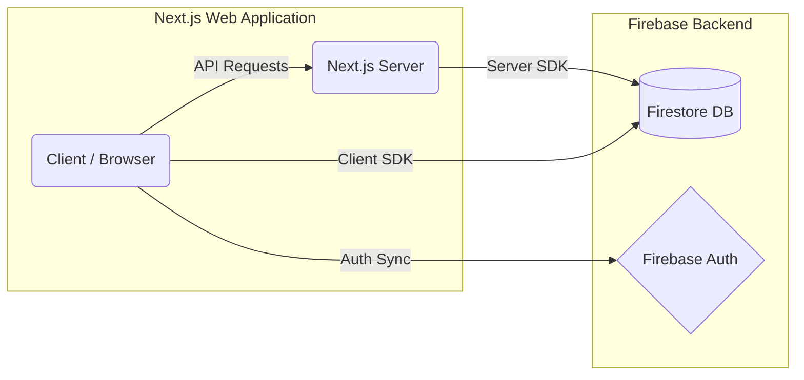
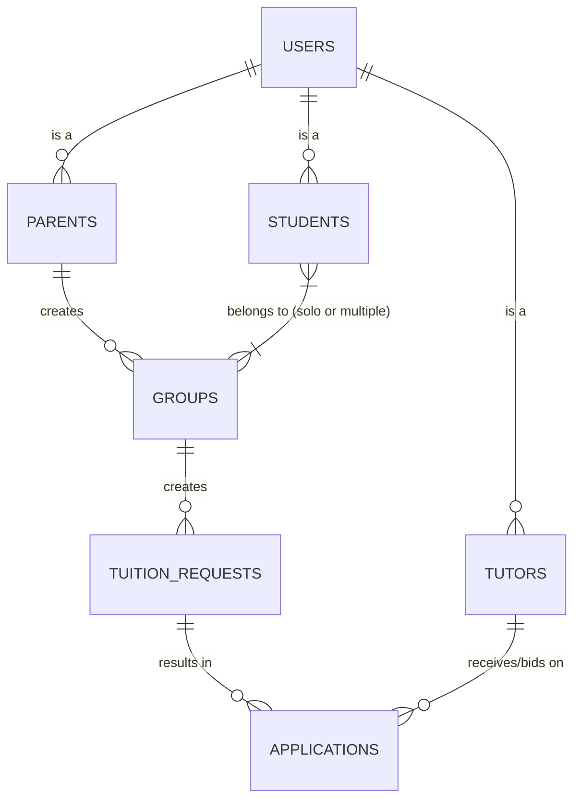
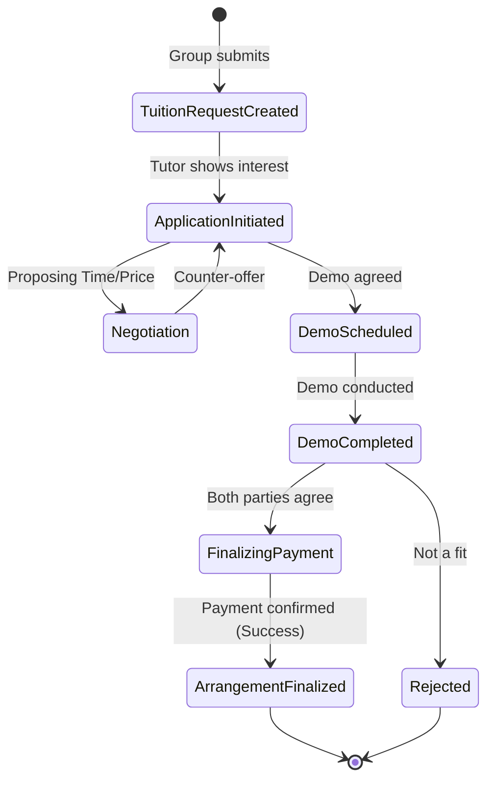

# Project Architecture & Documentation

## 1. Project Overview

This platform is an educational marketplace designed to connect **Tutors, Students, and Parents**. It facilitates the process of finding tutors, requesting tuitions, managing applications, and forming tutoring groups. 

The application streamlines the entire lifecycle: from the initial search and tuition request, through negotiation and demo scheduling, to the finalization of the tutoring arrangement.

## 2. High-Level System Architecture

The system utilizes a modern, serverless architecture optimized for performance, SEO, and real-time data sync.



*   **Frontend/Backend Layer**: Built with **Next.js 16 (App Router)**. It leverages Server Components for data fetching and SEO, and Client Components for interactive UI elements. API Routes or Server Actions handle sensitive operations.
*   **Database**: **Firebase Firestore**, a NoSQL document database, providing real-time data synchronization and scalable document storage.
*   **Authentication**: Managed by **Firebase Authentication** (implicitly required for secure access to Firestore rules and user management).
*   **Hosting/Deployment**: Configured for deployment on **Netlify** (indicated by `netlify.toml`), though fully compatible with Vercel.

## 3. Technology Stack & UI Architecture

*   **Core Framework**: React 19, Next.js 16
*   **Styling**: Tailwind CSS v4 is the primary utility-first CSS framework.
*   **UI Components**: Heavily relies on **Radix UI** primitives for accessible, headless components (Dialogs, Menus, Accordions). **Emotion/MUI** is also present for specific complex components.
*   **Animations**: **Framer Motion** (`motion`) and `tw-animate-css` are used for micro-interactions and page transitions.
*   **Complex Interactions**: Drag-and-drop functionality is powered by `@hello-pangea/dnd` and `react-dnd`.
*   **Data Visualization**: `recharts` for displaying statistics and analytics.
*   **Form Handling**: `react-hook-form` for robust client-side form validation.

## 4. Core Data Model & Database Schema

The Firestore database is designed to handle multiple user roles and the complex lifecycle of a tutoring arrangement.



### Primary Collections:
*   **`users`**: Base collection for all authenticated identities. Stores roles, FCM tokens, and wallet balances.
*   **`tutors`**: Detailed profiles for educators (subjects, experience, pricing, location, rating).
*   **`students`**: Learner profiles (class level, goals, subjects, budget).
*   **`parents`**: Guardian profiles linked to students.
*   **`groups`**: Created by parents (or students) to group learners together. Even a solo student is represented as a group of one.
*   **`tuition_requests`**: Inquiries created by groups detailing their requirements (budget, subjects, preferred time).
*   **`applications`**: The active negotiation state between a tutor and a group for a specific request. Tracks proposed prices, demo dates, and status.
*   **`admin_activity` & `notifications`**: System logging and user alerts.
*   **`global_config`**: App-wide feature flags (e.g., enabling payments, recommendations, marketplace).

## 5. Key Workflows & System Behaviors

### The Application Lifecycle



1.  **Request Generation**: A group creates a `tuition_request` specifying their needs.
2.  **Application / Bidding**: Tutors can view requests and initiate an `application`, establishing a connection.
3.  **Negotiation & Demo**: The `application` document tracks the negotiation of price, timings, and the scheduling of a demo session.
4.  **Finalization**: Upon a successful demo and agreement (payment confirmation), the application is marked complete, and the arrangement is finalized.

## 6. Directory Structure

```text
mushi/
├── db_analyzer/           # Scripts and tools for analyzing Firestore schema
│   ├── analyze.js
│   └── schema_report.md   # Auto-generated snapshot of the DB structure
├── docs/                  # Project documentation (You are here)
├── web/                   # The main Next.js Application
│   ├── public/            # Static assets
│   ├── src/
│   │   ├── api/           # Backend API routes / endpoints
│   │   ├── app/           # Next.js App Router pages (auth, dashboard, etc.)
│   │   ├── components/    # Reusable React components
│   │   ├── styles/        # Global CSS and Tailwind configs
│   │   └── utils/         # Helper functions and constants
│   ├── package.json       # App dependencies
│   └── tailwind.config.ts # Tailwind UI styling configuration
├── negotitation_plan.md   # Strategy document for the negotiation feature
├── ranking_plan.md        # Strategy document for tutor ranking algorithm
└── whatsapp_automation_options.md # Plans for WhatsApp integration
```

## 7. Strategic & Planned Features (Roadmap)

Based on internal planning documents, the following major features are in focus:

1.  **Advanced Negotiation Flow (`negotitation_plan.md`)**: Enhancing the `applications` lifecycle to allow seamless back-and-forth haggling on price and timings before finalizing a group.
2.  **Tutor Ranking System (`ranking_plan.md`)**: Implementing an algorithm to rank tutors in the marketplace based on ratings, successful applications, and profile completeness to improve search quality.
3.  **WhatsApp Automation (`whatsapp_automation_options.md`)**: Integrating WhatsApp APIs to send critical notifications (e.g., demo scheduled, payment received) to parents and tutors who are more active on WhatsApp than email/app notifications.
